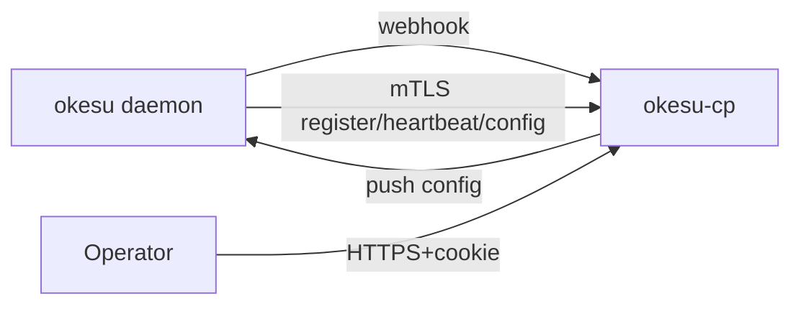
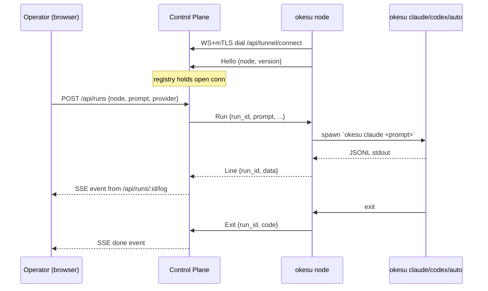

# Okesu — Installation Guide

This guide covers deploying both the **daemon agents** (`okesu`) and the **Control Plane** (`okesu-cp`) — together or independently. It tracks the implementation as it ships; sections are added per phase.

## Table of Contents

1. [Components](#1-components)
2. [Prerequisites](#2-prerequisites)
3. [Build from source](#3-build-from-source)
4. [Quick start — single host](#4-quick-start--single-host)
5. [Container build & run](#5-container-build--run)
6. [Control Plane production deployment](#6-control-plane-production-deployment)
7. [Daemon agent production deployment](#7-daemon-agent-production-deployment)
8. [Connecting an agent to the Control Plane](#8-connecting-an-agent-to-the-control-plane)
9. [Networking & firewall](#9-networking--firewall)
10. [Operations](#10-operations)
11. [Troubleshooting](#11-troubleshooting)
12. [Lifecycle: updating daimons, binaries & node metadata (Phase 7)](#12-lifecycle-updating-daimons-binaries--node-metadata-phase-7)
13. [OCI deployment shape (Phase 8)](#13-oci-deployment-shape-phase-8)

---

## 1. Components

| Binary | Role |
|---|---|
| `okesu` | The daemon (and CLI). Runs autonomous agentic loops on a schedule. Emits JSONL events. |
| `okesu-cp` | Control Plane HTTP server. UI, webhook receiver, mTLS management plane. |

The Control Plane is **optional**. Daemons run perfectly without it (events go to stdout/file). The CP becomes useful when you operate more than a handful of agents or want a unified dashboard, hot config push, and finding aggregation.



---

## 2. Prerequisites

### To build

- Go ≥ 1.23 (`go version`)
- Node.js ≥ 18 + npm (only needed if rebuilding the CP web UI)

### To run a daemon

- Linux (any modern distro). macOS works for development but most security collectors are Linux-specific.
- One of:
  - `ANTHROPIC_API_KEY` (for `provider: claude`)
  - `OPENAI_API_KEY` (for `provider: codex`)
- Optional: `oci-cli` for the centralized OCI agents (`oci-posture`, `oci-threat-intel`, `compliance-auditor`, `cost-watcher`)
- Optional: `osquery`, `bpftool`, `nftables` for richer per-instance telemetry

### To run the Control Plane

- Linux server (or container)
- A persistent volume for the SQLite database (`/var/lib/okesu-cp/`)
- Two TCP ports — one for the UI, one for the management plane (defaults `:8443` and `:8444`)
- Optional: a real TLS certificate (Let's Encrypt, internal CA) for the user-facing UI port. The mgmt plane is always self-signed by the auto-generated internal CA.

---

## 3. Build from source

```bash
git clone https://github.com/section9labs/okesu.git
cd okesu

# Build the daemon
go build -o okesu ./cmd/okesu

# (Optional) Rebuild the Control Plane web UI
cd web
npm install
npm run build      # writes to ../controlplane/ui/dist/
cd ..

# Build the Control Plane (UI is embedded into the binary)
go build -o okesu-cp ./cmd/cp
```

Both binaries are statically linked Go (no CGO). The CP binary is ~17 MB and includes the React UI as `embed.FS`.

---

## 4. Quick start — single host

Goal: see a daemon emit events, the CP receive them via webhook, and a browser show the live stream. Everything on `localhost`.

```bash
# 1. Start the Control Plane
./okesu-cp serve \
  --listen :8443 \
  --mgmt-listen :8444 \
  --db ./cp.db \
  --admin-password "yourpass" \
  --webhook-secret "shared-1"

# Output:
# okesu-cp UI/webhook listening on https://:8443 (db=./cp.db)
# okesu-cp mgmt plane listening on https://:8444 (mTLS, ca=./ca.crt)
```

Open https://localhost:8443 and accept the self-signed cert. Log in with `admin@local` / `yourpass`.

In a second shell, run a daemon. Edit `examples/agents/edr.md` to enable the webhook sink and point it at your CP:

```yaml
outputs:
  - type: stdout
  - type: webhook
    url: "https://localhost:8443/api/webhooks/events"
    secret: "shared-1"
    retries: 3
    bufferCap: 512
```

Then:

```bash
ANTHROPIC_API_KEY="sk-ant-..." \
  ./okesu daemon --agent edr --interval 30s
```

Events appear live on the **Live Events** page in the browser.

To also exercise the management plane (Phase 2):

```bash
# Issue a client cert for the agent
./okesu-cp issue-cert --agent edr --out /etc/okesu --db ./cp.db

# In the agent file, add:
#   management:
#     url: https://localhost:8444
#     certDir: /etc/okesu
#     heartbeatSec: 30
#     pollSec: 60

# Restart the daemon — it now registers, heartbeats, and polls config.
# The agent appears on the Agents page in the UI.
```

---

## 5. Container build & run

Two images ship with the repo:

- `Dockerfile` — the **daemon** image (`okesu`).
- `Dockerfile.cp` — the **Control Plane** image (`okesu-cp`), distroless, ~24 MB.

### 5.1. Daemon image

```bash
docker build -t okesu:dev .

# Run any agent in the container
docker run --rm -it \
  -e ANTHROPIC_API_KEY="$ANTHROPIC_API_KEY" \
  okesu:dev daemon --agent edr --interval 30s

# OCI agents need an OCI config + tenancy OCID
docker run --rm -it \
  -e ANTHROPIC_API_KEY="$ANTHROPIC_API_KEY" \
  -v ~/.oci:/home/okesu/.oci:ro \
  -e OCI_TENANCY_OCID="ocid1.tenancy.oc1..." \
  okesu:dev daemon --agent oci-posture
```

### 5.2. Control Plane image (Phase 11)

```bash
docker build -f Dockerfile.cp -t okesu-cp:dev .

# Quick start — self-signed cert auto-generated, data persisted in a volume.
docker run --rm -it -p 8443:8443 -p 8444:8444 \
  -e OKESU_CP_ADMIN_PASSWORD=changeme \
  -e OKESU_CP_WEBHOOK_SECRET=shared-secret-1 \
  -v okesu-cp-data:/var/lib/okesu \
  okesu-cp:dev

# Visit https://localhost:8443 → login admin@local / changeme
```

Production: build versioned images and push to your registry. The image runs
as the non-root `nonroot` user (UID 65532) on a `distroless/static` base, so
it has no shell. To debug, exec into it via `docker run --rm -it --entrypoint
/usr/local/bin/okesu-cp okesu-cp:dev help` rather than `bash`.

The data volume holds: `cp.db` (SQLite), the auto-generated CA + server
certs, the daemon-binary inventory, and any agent files placed in
`/var/lib/okesu/agents`. Lose the volume and you lose user accounts, audit
history, and every deployed daemon's mgmt-plane trust (their client certs
were signed by the CA in this volume).

---

## 6. Control Plane production deployment

### 6.0. Quick install with `install-cp.sh` (Phase 11)

The fastest production-shaped install on a single Linux host:

```bash
# 1. Build the binary on a build host (or download a release artifact).
go build -o okesu-cp ./cmd/cp

# 2. Drop it on the target host and run install-cp.sh as root.
sudo ./scripts/install-cp.sh ./okesu-cp \
  --admin-password "$(openssl rand -base64 24)" \
  --cert /etc/letsencrypt/live/cp.example.com/fullchain.pem \
  --key  /etc/letsencrypt/live/cp.example.com/privkey.pem
```

What the script does (idempotent, safe to re-run):

- Creates a system user `okesu-cp` with no shell.
- Creates `/var/lib/okesu-cp/{binaries,agents,certs}` and `/var/log/okesu-cp`.
- Installs the binary to `/usr/local/bin/okesu-cp`.
- Drops `/etc/systemd/system/okesu-cp.service` (ProtectSystem=strict, PrivateTmp,
  CapabilityBoundingSet=CAP_NET_BIND_SERVICE only).
- Writes a starter `/etc/default/okesu-cp` env file with every supported
  variable commented; does not overwrite an existing one.
- `systemctl enable --now okesu-cp` and prints next-step instructions.

Without `--cert/--key` the CP generates a self-signed cert on first boot —
fine for evaluation, **not for production**. Re-run with `--cert/--key` later
to swap in a real cert (the script preserves the DB and CA across upgrades).

### 6.1. Recommended layout

```
/usr/local/bin/okesu-cp                  ← binary
/etc/okesu-cp/
  config.env                             ← environment variables (mode 0600)
  tls/
    server.crt, server.key               ← OPTIONAL: real cert for the UI
                                           (else self-signed is auto-generated)
/var/lib/okesu-cp/
  cp.db, cp.db-wal, cp.db-shm            ← SQLite database
  ca.crt, ca.key                         ← auto-generated mTLS CA
  mgmt-server.crt, mgmt-server.key       ← auto-generated, signed by CA
  server.crt, server.key                 ← auto-generated user-facing cert
                                           (only if --cert/--key not provided)
/var/log/okesu-cp/                       ← optional, journald usually suffices
```

### 6.2. Environment file

`/etc/okesu-cp/config.env` (mode 0600, owned by the okesu-cp service user):

```ini
# Required on first run; ignored on subsequent runs (admin already exists).
OKESU_CP_ADMIN_PASSWORD=change-me-please

# HMAC secret shared with daemon agents for webhook signing.
OKESU_CP_WEBHOOK_SECRET=long-random-string-32-bytes-min

# Optional overrides (defaults shown):
# OKESU_CP_LISTEN=:8443
# OKESU_CP_MGMT_LISTEN=:8444
# OKESU_CP_DB=/var/lib/okesu-cp/cp.db
# OKESU_CP_ADMIN_EMAIL=admin@local
```

The legacy `OKESU_CP_*` env vars and matching CLI flags still work, but
they trigger a deprecation log line at boot. **Phase 8g (below) is the
recommended production path** — secrets stay out of the env block, and
non-secret config moves to a YAML file that can ship through CI/CD.

### 6.2.1. YAML config + `--secrets-source` (Phase 8g — recommended for production)

Production deployments use:

```bash
okesu-cp serve \
  --config /etc/okesu/cp.yaml \
  --secrets-source file:///run/credentials/okesu-cp.service
```

- `--config` points at a YAML file containing every non-secret setting
  (DSN hostnames, regions, bucket names, OIDC issuer URL, …). Secret
  fields use `"${secret:NAME}"` references that the CP resolves at
  boot. The file is safe to commit to git, ship through CI/CD, share
  between operators.
- `--secrets-source` selects the `ports.Secrets` adapter. **No secret
  value ever appears on the CLI or in `OKESU_CP_*` env vars in
  production.**

**Available secret sources:**

| Source                                              | Use when                                              |
|-----------------------------------------------------|-------------------------------------------------------|
| `env` (default)                                      | dev — secrets in `OKESU_SECRET_*` env vars            |
| `file:///etc/okesu/secrets`                          | systemd `LoadCredential=` — secrets injected at start |
| `file:///run/credentials/okesu-cp.service`           | Same, with the systemd-managed default path         |
| `oci-vault://<compartment-ocid>?region=us-ashburn-1` | OCI Vault (Phase 8e.next — pending tenancy validation) |

**Canonical secret names** (slash-separated, mirrors OCI Vault folders):

```
cp/admin-password         clickhouse/password
cp/webhook-secret         kafka/sasl-password
cp/session-key            blob/secret-key
cp/oidc/client-secret
```

**Example `/etc/okesu/cp.yaml`** — single-host SQLite + local-disk
deployment with `LoadCredential=`:

```yaml
listen: ":8443"
mgmt_listen: ":8444"
db: "/var/lib/okesu-cp/cp.db"
admin_email: "admin@local"
admin_password:  "${secret:cp/admin-password}"
session_key:     "${secret:cp/session-key}"
webhook_secret:  "${secret:cp/webhook-secret}"
event_ttl_days: 30
```

**Example `/etc/okesu/cp.yaml`** — full OCI shape (Postgres + ClickHouse
+ Streaming + Cache + Object Storage). The complete reference lives at
`deploy/oci/cp.example.yaml`:

```yaml
db: "postgres://okesu@db.adb.us-ashburn-1.oraclecloud.com:5432/cpdb?sslmode=require"

events_store: "clickhouse"
clickhouse_addrs: ["clickhouse-0.okesu.svc:9000", "clickhouse-1.okesu.svc:9000"]
clickhouse_database: "okesu_events"
clickhouse_username: "okesu"
clickhouse_password: "${secret:clickhouse/password}"
clickhouse_secure:   true

queue: "kafka"
kafka_brokers: ["streampool-xxxxx.streaming.us-ashburn-1.oci.oraclecloud.com:9092"]
kafka_sasl_username: "<tenancy>/<username>/<stream-pool-ocid>"
kafka_sasl_password: "${secret:kafka/sasl-password}"
kafka_use_tls:       true

pubsub_url: "redis://cache.us-ashburn-1.oci.oraclecloud.com:6379/0"

blob_url:        "<namespace>.compat.objectstorage.us-ashburn-1.oraclecloud.com"
blob_access_key: "your-customer-key-access-id"
blob_secret_key: "${secret:blob/secret-key}"
blob_bucket:     "okesu-prod"
blob_region:     "us-ashburn-1"

admin_password:  "${secret:cp/admin-password}"
session_key:     "${secret:cp/session-key}"
webhook_secret:  "${secret:cp/webhook-secret}"
```

The CP picks adapters from this YAML alone — switching from SQLite to
Postgres, or from local disk to S3, is a config edit, not a code change.
See §13 (OCI deployment shape) and `deploy/oci/README.md` for which
adapter slots map to which OCI service.

### 6.3. systemd unit

`/etc/systemd/system/okesu-cp.service`:

```ini
[Unit]
Description=Okesu Control Plane
After=network-online.target
Wants=network-online.target
StartLimitIntervalSec=300
StartLimitBurst=5

[Service]
Type=simple
User=okesu-cp
Group=okesu-cp
ExecStart=/usr/local/bin/okesu-cp serve \
  --config /etc/okesu/cp.yaml \
  --secrets-source file:///run/credentials/okesu-cp.service
Restart=on-failure
RestartSec=10s

# Phase 8g — secrets injected at start, removed from /run on stop.
# Each LoadCredential entry maps a canonical secret name to a file
# under /run/credentials/okesu-cp.service/. The CP reads them by name
# via the file:// secrets adapter — no environment variable, no flag,
# no /proc/PID/environ exposure.
LoadCredential=cp/admin-password:/etc/okesu/secrets/cp/admin-password
LoadCredential=cp/webhook-secret:/etc/okesu/secrets/cp/webhook-secret
LoadCredential=cp/session-key:/etc/okesu/secrets/cp/session-key
# Add as needed for your config:
# LoadCredential=clickhouse/password:/etc/okesu/secrets/clickhouse/password
# LoadCredential=kafka/sasl-password:/etc/okesu/secrets/kafka/sasl-password
# LoadCredential=blob/secret-key:/etc/okesu/secrets/blob/secret-key
# LoadCredential=cp/oidc/client-secret:/etc/okesu/secrets/cp/oidc/client-secret

# Filesystem hardening
WorkingDirectory=/var/lib/okesu-cp
ReadWritePaths=/var/lib/okesu-cp /var/log/okesu-cp /tmp
ProtectSystem=strict
ProtectHome=yes
PrivateTmp=yes
NoNewPrivileges=yes
CapabilityBoundingSet=

StandardOutput=journal
StandardError=journal
SyslogIdentifier=okesu-cp

[Install]
WantedBy=multi-user.target
```

Bootstrap:

```bash
sudo useradd --system --create-home --home-dir /var/lib/okesu-cp okesu-cp
sudo install -m 0755 ./okesu-cp /usr/local/bin/okesu-cp
sudo install -d -m 0755 /etc/okesu
sudo install -d -m 0700 -o okesu-cp -g okesu-cp /etc/okesu/secrets/cp /var/lib/okesu-cp

# Drop the canonical secrets, mode 0600. Names match the LoadCredential mapping.
echo -n "$(openssl rand -base64 24)" | sudo install -m 0600 /dev/stdin /etc/okesu/secrets/cp/admin-password
echo -n "$(openssl rand -hex 32)"    | sudo install -m 0600 /dev/stdin /etc/okesu/secrets/cp/webhook-secret
echo -n "$(openssl rand -base64 32)" | sudo install -m 0600 /dev/stdin /etc/okesu/secrets/cp/session-key

# Drop the YAML config. Use the canonical example as a starting point.
sudo install -m 0644 deploy/oci/cp.example.yaml /etc/okesu/cp.yaml

sudo systemctl daemon-reload
sudo systemctl enable --now okesu-cp
sudo journalctl -fu okesu-cp
```

For dev / quick-start without `LoadCredential=`, drop `--secrets-source`
to the env-only fallback and keep secrets in `/etc/okesu-cp/config.env`
as before. The legacy `EnvironmentFile=/etc/okesu-cp/config.env` path
still works — see §6.2 above.

### 6.4. Container image

`Dockerfile.cp` is a multi-stage build (node → go → distroless). See §5.2.

The image runs the CP as UID 65532 on `gcr.io/distroless/static-debian12`.
There's no shell, so `docker exec -it … /bin/sh` won't work — use
`okesu-cp <subcommand>` directly via `docker run --entrypoint`.

### 6.5. Helm chart (Phase 11)

`deploy/helm/okesu-cp/` ships with the repo. SQLite means **single-replica**
only; the chart has `replicas: 1` baked in and uses `Recreate` strategy so
upgrades cleanly release the DB lock.

```bash
helm install okesu-cp deploy/helm/okesu-cp \
  --set image.tag=v1.0.0 \
  --set adminPassword="$(openssl rand -base64 24)" \
  --set webhookSecret="$(openssl rand -hex 32)" \
  --set persistence.size=10Gi \
  --set ingress.enabled=true \
  --set ingress.hostname=cp.example.com \
  --set ingress.tls.enabled=true
```

Notable values (full list in `values.yaml`):

| Value | Purpose |
|---|---|
| `image.tag` | Pin to a release tag — falls back to `Chart.AppVersion` if blank |
| `adminPassword` | First-boot admin password (Secret). Subsequent changes happen in the UI |
| `webhookSecret` | Required if any daemon will POST findings (Secret) |
| `sessionKey` | Pin a 32-byte session signing key so it survives upgrades — auto-generated when blank |
| `eventTTLDays` | Auto-prune events older than N days (0 = keep forever) |
| `oidc.*` | Oracle Identity Domains / OIDC SSO (issuer URL, client id/secret, role map) |
| `persistence.size` | PVC size for `cp.db` + CA + cert state |
| `persistence.existingClaim` | Reuse a pre-bound PVC instead of creating one |
| `ingress.mgmtHostname` | Expose the mTLS mgmt plane via Ingress (controller must support TLS pass-through; otherwise daemons can't present a client cert) |

After install:

```bash
kubectl rollout status deploy/okesu-cp
kubectl port-forward svc/okesu-cp 8443:8443
# https://localhost:8443 → admin@local / <adminPassword>
```

### 6.6. Backup & restore (Phase 11)

The CP's complete state — DB, CA, mgmt server cert — is in `/var/lib/okesu-cp`.
`scripts/cp-backup.sh` produces a portable tarball using SQLite's online
`.backup` API (safe to run while `okesu-cp` is up):

```bash
sudo ./scripts/cp-backup.sh                            # → okesu-cp-backup-<ts>.tar.gz
sudo ./scripts/cp-backup.sh --out backups/daily.tgz    # custom path
sudo ./scripts/cp-backup.sh --include-server-cert      # also bundle the user-facing TLS cert
```

Restore is the reverse — refuses to overwrite a populated data dir without
`--force` so you don't accidentally clobber live state:

```bash
sudo systemctl stop okesu-cp
sudo ./scripts/cp-restore.sh okesu-cp-backup-2026-04-25T20-30-00Z.tar.gz
sudo systemctl start okesu-cp
```

What the bundle contains:

- `cp.db` — full SQLite dump (online snapshot, consistent point-in-time)
- `certs/ca.{crt,key}` — the mTLS CA. **Critical** to preserve — every deployed
  daemon's mgmt-plane client cert was signed by this; losing it forces re-issuing
  certs to the entire fleet.
- `certs/mgmt-server.{crt,key}` — the mgmt-plane server cert
- `certs/server.{crt,key}` — only when `--include-server-cert` was passed
  (user-facing TLS is usually managed externally — cert-manager, ACME, etc.)
- `manifest.txt` — created_at, source host, DB size, used by the restore script
  to reject non-okesu archives

Schedule with cron / systemd timers:

```ini
# /etc/systemd/system/okesu-cp-backup.service
[Service]
Type=oneshot
ExecStart=/opt/okesu/scripts/cp-backup.sh --out /var/backups/okesu/cp-%i.tgz
```

### 6.8. Real TLS for the UI port

The auto-generated self-signed cert is fine for internal use, but operators will see browser warnings. To use a real cert (Let's Encrypt, internal CA, etc.):

```ini
# In /etc/okesu-cp/config.env or as flags:
OKESU_CP_CERT=/etc/letsencrypt/live/cp.example.com/fullchain.pem
OKESU_CP_KEY=/etc/letsencrypt/live/cp.example.com/privkey.pem
```

The mgmt-plane port (`8444`) **always** uses the internal CA-signed cert — daemons verify it via the `ca.crt` issued by `okesu-cp issue-cert`. Don't replace it with a public cert; that would break the mTLS chain.

---

## 7. Daemon agent production deployment

### 7.1. systemd template unit

The repo includes `systemd/okesu-agent@.service` — a template unit so you can run multiple agents per host:

```bash
sudo install -m 0755 ./okesu /usr/local/bin/okesu
sudo install -m 0644 systemd/okesu-agent@.service /etc/systemd/system/
sudo useradd --system --create-home --home-dir /var/lib/okesu okesu
sudo install -d -m 0755 -o okesu -g okesu /etc/okesu/agents /var/lib/okesu /var/log/okesu

# Drop in agent files
sudo cp examples/agents/edr.md /etc/okesu/agents/
sudo cp examples/agents/instance-integrity.md /etc/okesu/agents/

# Per-agent secrets
sudo install -m 0600 -o okesu -g okesu /dev/null /etc/okesu/agents/edr.env
sudo tee /etc/okesu/agents/edr.env > /dev/null <<EOF
ANTHROPIC_API_KEY=sk-ant-...
EOF

sudo systemctl daemon-reload
sudo systemctl enable --now okesu-agent@edr
sudo journalctl -fu okesu-agent@edr
```

The instance name (`@edr`) selects which file under `/etc/okesu/agents/` to load.

### 7.2. Agent file paths searched

`okesu daemon --agent NAME` searches in this order, stopping at the first match:

```
1. ./.claude/agents/<NAME>.md       (project-local)
2. ./.codex/agents/<NAME>.md        (project-local)
3. ~/.claude/agents/<NAME>.md       (user-global)
4. ~/.codex/agents/<NAME>.md        (user-global)
```

For systemd deployments the unit's `WorkingDirectory` puts `/var/lib/okesu/<name>/.claude/agents/` first, so place agent files there. The repo's example unit symlinks `/etc/okesu/agents/` into the search path.

### 7.3. Hot config reload

```bash
# Re-parse the agent file from disk (no process restart):
sudo systemctl kill --signal=SIGHUP okesu-agent@edr
```

The daemon hot-applies `maxTurns` and `effort` changes. Schedule and collector changes still require a restart.

---

## 8. Connecting an agent to the Control Plane

There are two independent integration points:

1. **Webhook output** — daemon → CP, one-way event push (signed with HMAC-SHA256)
2. **Management plane** — bidirectional via mTLS: agent registers/heartbeats, CP pushes desired config

You can enable either, both, or neither.

### 8.1. Webhook (recommended first)

Generate a long-random shared secret on the CP:

```bash
# In /etc/okesu-cp/config.env on the CP:
OKESU_CP_WEBHOOK_SECRET=$(openssl rand -hex 32)
```

In the daemon's agent file (`/etc/okesu/agents/edr.md`) add to `outputs:`:

```yaml
outputs:
  - type: stdout
  - type: file
    path: /var/log/okesu/edr.jsonl
    maxBytes: 104857600
  - type: webhook
    url: "https://cp.example.com:8443/api/webhooks/events"
    secret: "${OKESU_WEBHOOK_SECRET}"
    events:
      - finding
      - action_taken
      - action_denied
      - api_unavailable
      - error
    retries: 3
    bufferCap: 512
```

Add to `/etc/okesu/agents/edr.env`:

```ini
OKESU_WEBHOOK_SECRET=...same value as on the CP...
```

Restart the agent. The `Live Events` page in the CP UI fills up.

### 8.2. Management plane (mTLS)

#### On the Control Plane

Issue a client cert for each agent name:

```bash
sudo -u okesu-cp /usr/local/bin/okesu-cp issue-cert \
  --agent edr \
  --out /tmp/edr-certs \
  --db /var/lib/okesu-cp/cp.db

ls /tmp/edr-certs/
# ca.crt  client.crt  client.key
```

Securely transfer those three files to the agent host. The CN of the client cert is the agent's identity — the daemon cannot register or heartbeat under a different name.

#### On the agent host

```bash
sudo install -d -m 0755 -o okesu -g okesu /etc/okesu/edr-mgmt-certs
sudo install -m 0644 -o okesu -g okesu ca.crt        /etc/okesu/edr-mgmt-certs/
sudo install -m 0644 -o okesu -g okesu client.crt    /etc/okesu/edr-mgmt-certs/
sudo install -m 0600 -o okesu -g okesu client.key    /etc/okesu/edr-mgmt-certs/
```

Add to the agent file:

```yaml
management:
  url: https://cp.example.com:8444
  certDir: /etc/okesu/edr-mgmt-certs
  heartbeatSec: 30
  pollSec: 60
```

Restart the agent. The `Agents` page in the CP shows it as healthy. Operators can now push `max_turns` / `effort` / `suspended` overrides via the UI; the daemon picks them up on the next config poll (default 60s).

### 8.3. Sharing certs across many agents on the same host

Each agent name needs its own cert (CN = agent name). For a host running `edr` + `instance-integrity` + `instance-threat`, issue three cert bundles. Keep them in separate `certDir` paths so RBAC stays per-agent.

---

## 8c. Node SSH deploy (Phase 5)

The Control Plane can bootstrap daemon agents on remote hosts over a single SSH connection. The flow is one-shot — the SSH key is used for the deploy and never persisted. Long-term agent management runs over the daemon's own mTLS management plane (§8.2).

### What the deploy does

For each target node and each agent name, the CP:

1. Connects via SSH using the operator-supplied private key
2. Verifies the host has `systemd` and reports its OS / architecture
3. Creates the `okesu` system user and directories under `/etc/okesu/` and `/var/lib/okesu/`
4. Uploads the daemon binary to `/usr/local/bin/okesu` (0755)
5. Writes the systemd template unit to `/etc/systemd/system/okesu-agent@.service`
6. Uploads the agent markdown file to `/etc/okesu/agents/<name>.md`
7. Writes per-agent secrets to `/etc/okesu/agents/<name>.env` (0600, owner `okesu`)
8. Issues a fresh mTLS client cert via the CP's CA (CN = agent name) and drops `client.crt`, `client.key`, `ca.crt` under `/etc/okesu/<name>-mgmt-certs/` with key at 0600
9. Runs `systemctl daemon-reload && systemctl enable --now okesu-agent@<name>`

Every step is idempotent — re-running a deploy after a failure is safe.

### Configure the CP for deploys

Two paths must be set on the CP host:

```ini
# In /etc/okesu-cp/config.env or as flags
OKESU_CP_DAEMON_BINARY=/usr/local/share/okesu/okesu
OKESU_CP_AGENT_FILES_DIR=/usr/local/share/okesu/agents
```

Place the daemon binary at the configured path:

```bash
sudo install -d -m 0755 /usr/local/share/okesu/agents
sudo install -m 0755 ./okesu /usr/local/share/okesu/okesu
sudo cp examples/agents/*.md /usr/local/share/okesu/agents/
sudo systemctl restart okesu-cp
```

The CP scans the agent files dir on each request and exposes the list at `GET /api/nodes/library`.

### Deploy from the UI

1. Open the **Nodes** page in the CP
2. Click **Add Node**, fill in `name`, `hostname`, `ssh_user`, `ssh_port`. Click **Create & Deploy**
3. The deploy drawer opens. Select agents to install, paste the SSH private key (PEM), provide API keys (Anthropic / OpenAI as needed)
4. Tick **Wire up webhook output** to forward findings to the CP, and **Issue mTLS client certs** to register the daemons with the CP's management plane
5. Click **Start Deploy**. Live logs stream from the CP back to the browser

The node enters `deploying` status. On success it moves to `ready`; on failure to `failed` with a `status_message` you can read from the API.

### Deploy via the REST API

```bash
# Register a node
curl -k -b cookies.txt -X POST https://cp.example.com:8443/api/nodes \
  -H 'Content-Type: application/json' \
  -d '{"name":"prod-web-01","hostname":"10.0.1.42","ssh_user":"root","ssh_port":22}'
# → {"id":1, ...}

# Kick off a deploy
curl -k -b cookies.txt -X POST https://cp.example.com:8443/api/nodes/1/deploy \
  -H 'Content-Type: application/json' \
  -d "$(jq -n --arg key "$(cat ~/.ssh/id_ed25519)" '{
    agents: ["edr","instance-integrity"],
    private_key: $key,
    anthropic_api_key: env.ANTHROPIC_API_KEY,
    include_webhook: true,
    include_mgmt_cert: true
  }')"
# → {"job_id":"a3c808b7...", ...}

# Stream the deploy log
curl -k -b cookies.txt -N "https://cp.example.com:8443/api/jobs/a3c808b7.../log"

# Check final status
curl -k -b cookies.txt "https://cp.example.com:8443/api/jobs/a3c808b7..."
```

### Endpoints (Phase 5)

| Method | Path | Auth | Purpose |
|---|---|---|---|
| GET | `/api/nodes` | viewer+ | List all nodes |
| GET | `/api/nodes/{id}` | viewer+ | One node |
| GET | `/api/nodes/library` | viewer+ | Agent files available to deploy |
| POST | `/api/nodes` | operator+ | Register a node |
| DELETE | `/api/nodes/{id}` | operator+ | Remove a node |
| POST | `/api/nodes/{id}/deploy` | operator+ | Kick off a deploy job |
| GET | `/api/jobs/{id}` | viewer+ | Job snapshot with log buffer |
| GET | `/api/jobs/{id}/log` | viewer+ | SSE stream of live deploy logs |

### Local end-to-end testing

The repo ships a disposable SSH-target Docker fixture under [`test/sshtarget/`](test/sshtarget/) for verifying the full deploy flow without touching real infrastructure:

```bash
# Build the daemon + CP, plus the test target
go build -o ./okesu     ./cmd/okesu
go build -o ./okesu-cp  ./cmd/cp
( cd web && npm install && npm run build )
./test/sshtarget/build.sh
docker run -d --name okesu-sshtarget-test -p 18022:22 okesu-sshtarget:test

# Run the CP pointing at the local binary + sample agents
./okesu-cp serve \
  --db ./cp.db --admin-password test123 --webhook-secret shared1 \
  --listen :8443 --mgmt-listen :8444 \
  --daemon-binary "$(pwd)/okesu" \
  --agent-files-dir "$(pwd)/examples/agents"
```

Then in the UI: register a node with `hostname=localhost`, `ssh_port=18022`, `ssh_user=root`, paste `test/sshtarget/keys/id_ed25519`, and watch the deploy logs. The container's `systemctl` is mocked, so `enable --now` exits zero — useful for verifying that every deploy step runs and writes correct files, but the daemon itself won't actually start. See [`test/README.md`](test/README.md) for full details.

### Considerations

- **SSH key handling.** The private key is used in-memory for the duration of the deploy, then garbage collected. It is never written to disk or the database. Re-deploys require re-pasting the key.
- **Host key verification.** v1 trusts on first use (TOFU). For production, supply an expected host key fingerprint when registering the node — feature reserved for v2.
- **sudo / root.** Most steps need root. The bootstrap script tries `sudo bash -c …` first, then falls back to plain `bash -c …` for users who SSH in as root. Targets with passwordless sudo are recommended.
- **Architecture.** The deploy uploads whatever binary is at `--daemon-binary`. Cross-arch deploys (CP on amd64 deploying to arm64 nodes) require you to maintain per-arch binaries and switch the path before each deploy. Multi-arch detection is planned for a later phase.
- **Re-deploy.** Click Deploy again on an existing node to upgrade or change which agents run there. Existing services are restarted; idempotent.

---

## 8d. Reverse tunnel + ad-hoc agent runs (Phase 6)

In addition to the daemon-mode agents that run on a schedule, the Control Plane can launch **one-shot Claude/Codex agents on demand** against a registered Node and stream the JSONL output live to the operator's browser.

The mechanism is a long-lived WebSocket-over-mTLS connection that the Node initiates *outbound* to the CP — works through NAT/firewalls without inbound rules.

### Architecture



### Provision a Node

On the CP host, issue a node cert (CN = node name) and ship the bundle to the target:

```bash
sudo -u okesu-cp /usr/local/bin/okesu-cp issue-node-cert \
  --node prod-web-01 \
  --out /tmp/prod-web-01-tunnel \
  --db /var/lib/okesu-cp/cp.db

# Copy the three files to the target host:
scp /tmp/prod-web-01-tunnel/* root@10.0.1.42:/etc/okesu/node-certs/
sudo chmod 700 /etc/okesu/node-certs
sudo chmod 600 /etc/okesu/node-certs/client.key
```

### Run the tunnel client

On the Node host (typically a daemon agent host already deployed via §8c, but it can be any host with the okesu binary):

```bash
sudo -u okesu /usr/local/bin/okesu node \
  --cp-url https://cp.example.com:8444 \
  --cert-dir /etc/okesu/node-certs \
  --name prod-web-01
```

A systemd unit for `okesu node` is recommended for production. The client auto-reconnects with exponential back-off (capped at 60s) on network errors.

```ini
# /etc/systemd/system/okesu-node.service
[Unit]
Description=Okesu reverse tunnel client
After=network-online.target
Wants=network-online.target

[Service]
Type=simple
ExecStart=/usr/local/bin/okesu node \
  --cp-url https://cp.example.com:8444 \
  --cert-dir /etc/okesu/node-certs \
  --name %H
Restart=on-failure
RestartSec=10s
User=okesu
Group=okesu
EnvironmentFile=-/etc/okesu/node.env

[Install]
WantedBy=multi-user.target
```

`/etc/okesu/node.env` should hold the API keys the Node will use when it spawns Claude/Codex children:

```ini
ANTHROPIC_API_KEY=sk-ant-...
OPENAI_API_KEY=sk-...
```

API keys are **not** transmitted over the tunnel — the Node uses its own environment. The CP only sends prompts and provider/agent selectors.

### Use it from the UI

1. Open the **Run Agent** page in the CP
2. Pick a connected Node, a provider (`auto` / `claude` / `codex`), optionally an agent file from the deployed library, and enter a prompt
3. Click **Run**. The console panel streams the JSONL events as they arrive — text deltas, tool calls, tool results, and the final `done` event with token usage

### REST API

| Method | Path | Auth | Purpose |
|---|---|---|---|
| GET | `/api/nodes/connected` | viewer+ | Names of nodes with an active tunnel |
| GET | `/api/runs` | viewer+ | Recent runs (most recent 50) |
| GET | `/api/runs/{id}` | viewer+ | Run snapshot (status, exit code, line buffer) |
| GET | `/api/runs/{id}/log` | viewer+ | SSE stream of log lines |
| POST | `/api/runs` | operator+ | Start a run on a connected node |

```bash
# Check who's connected
curl -k -b cookies.txt https://cp.example.com:8443/api/nodes/connected

# Start a run
curl -k -b cookies.txt -X POST https://cp.example.com:8443/api/runs \
  -H 'Content-Type: application/json' \
  -d '{"node":"prod-web-01","provider":"claude","prompt":"audit /etc for new setuid binaries"}'

# Stream the log
curl -k -b cookies.txt -N https://cp.example.com:8443/api/runs/<run_id>/log
```

### Wire protocol

The tunnel is JSON frames over a single WebSocket connection. Frame envelope:

```json
{"type": "<msg-type>", "<payload-name>": { ... }}
```

| Direction | Type | Payload | Purpose |
|---|---|---|---|
| Node → CP | `hello` | `{node, version}` | Identifies the node on connect |
| CP → Node | `run` | `{run_id, provider, model, agent, prompt, ...}` | Start a run |
| CP → Node | `cancel` | `{run_id}` | Reserved — not yet wired in v1 |
| CP → Node | `ping` | — | Keepalive |
| Node → CP | `pong` | — | Keepalive ack |
| Node → CP | `line` | `{run_id, stream, data}` | One stdout/stderr line |
| Node → CP | `exit` | `{run_id, code, error}` | Child terminated |

A future migration to typed gRPC streaming is straightforward — keep this version simple and dependency-light.

### Considerations

- **One connection per node name.** Re-connecting with the same CN evicts the prior connection. This is the usual pattern after a network blip.
- **No persistence of runs.** Run history is in-memory only and lost on CP restart. If you need a permanent record, the daemon's webhook events will still capture anything the agent emitted.
- **Cancellation.** v1 does not implement explicit cancel. Closing the operator's browser tab does not cancel the run — but losing the WS connection drops the Node's run handle. Refining this is on the v2 list.
- **Concurrent runs.** A single Node can handle multiple in-flight runs (one goroutine per run on the node side). The CP UI launches one at a time, but the API allows more.
- **API key handling.** Keys live on the Node. The CP never sees them. This makes the CP a low-secret surface — compromise of the CP does not leak provider keys.

---

## 8b. OIDC / Oracle Identity Domains SSO (Phase 4)

The CP supports OpenID Connect for operator authentication. Tested against Oracle Identity Domains; works with any standards-compliant OIDC provider (Okta, Auth0, Keycloak, Google).

### Configure the IDP

In Oracle Identity Domains (or your provider):

1. Create a confidential web application
2. Set the redirect URI to `https://<cp-host>:8443/auth/oidc/callback`
3. Enable the `openid`, `email`, `profile`, and `groups` scopes
4. Note the **client ID**, **client secret**, and **issuer URL** (e.g. `https://idcs-abcdef0123.identity.oraclecloud.com:443`)
5. Create groups for each role: `okesu-admins`, `okesu-operators`, `okesu-viewers` (names are configurable)
6. Assign users to those groups

### Configure the CP

Add to `/etc/okesu-cp/config.env`:

```ini
OKESU_CP_OIDC_ISSUER=https://idcs-abcdef0123.identity.oraclecloud.com:443
OKESU_CP_OIDC_CLIENT_ID=...
OKESU_CP_OIDC_CLIENT_SECRET=...
OKESU_CP_OIDC_REDIRECT_URL=https://cp.example.com:8443/auth/oidc/callback

# group:role mappings, comma-separated. First match wins, ranked by privilege.
OKESU_CP_OIDC_ROLE_MAP=okesu-admins:admin,okesu-operators:operator,okesu-viewers:viewer

# Optional — defaults shown
# OKESU_CP_OIDC_GROUPS_CLAIM=groups
# OKESU_CP_OIDC_LABEL=Sign in with Oracle
```

Restart the CP. The login page will show a **Sign in with Oracle** button alongside the password form.

### Behavior

- On first sign-in, a user record is auto-provisioned with the role determined from their IDP groups. Users not in any mapped group default to `viewer`.
- On subsequent sign-ins, the role is **synced** from the IDP — if you remove a user from `okesu-operators`, the next login downgrades them.
- Local admin (the `--admin-password` user) keeps working alongside SSO. Useful for break-glass access if the IDP is unavailable.
- If discovery against the IDP fails at CP startup, OIDC is **disabled gracefully** and the password form remains. Check logs for `oidc: disabled — ...`.

### Roles & RBAC

| Role | Read events / findings / agents | Acknowledge findings | Patch agent config |
|---|---|---|---|
| `viewer` | yes | — | — |
| `operator` | yes | yes | yes |
| `admin` | yes | yes | yes |

Higher roles inherit lower permissions. The `admin` role reserves space for future user-management UI.

---

## 8a. Findings dashboard (Phase 3)

When daemons emit `finding`-type webhook events, the CP automatically projects them into a structured `findings` table on top of the raw event log. The **Findings** page in the UI is the primary operator workspace:

- Severity-based filtering (CRITICAL / HIGH / MEDIUM / LOW / INFO) — multi-select
- State filter: open / acknowledged / all
- Per-agent and per-host scopes
- Drawer view with evidence, resource identifier, dedup key, and the raw event
- Acknowledge / unacknowledge with an optional note (recorded against the operator)

### Finding wire format

For an event to be projected into the findings table, it must have `type: "finding"` and may include any of these JSON fields (all optional but encouraged):

```json
{
  "type": "finding",
  "ts": 1745000000000,
  "agent": "edr",
  "host": "prod-web-01",
  "severity": "CRITICAL",
  "title": "Memfd process detected",
  "resource": "pid:1337",
  "evidence": "1337 python3 /memfd:exploit",
  "dedup_key": "pid:1337+memfd"
}
```

The reference EDR system prompt (`examples/agents/edr.md`) instructs the LLM to write findings with exactly this schema. Other agents are free to use whichever subset makes sense for their domain — only `severity` and `title` matter for the dashboard's filters and grouping.

### REST endpoints

| Method | Path | Purpose |
|---|---|---|
| GET | `/api/findings` | List with `severity`, `agent`, `host`, `state`, `since`, `until`, `limit`, `offset` query params |
| GET | `/api/findings/summary` | Counts by severity for the dashboard cards |
| GET | `/api/findings/{id}` | One finding with full evidence and raw event JSON |
| POST | `/api/findings/{id}/acknowledge` | Body: `{"note":"..."}` to ack, `{"clear":true}` to un-ack |

All four require an authenticated session.

---

## 8f. Deploy hardening (Phase 8)

Two production-readiness wins for the SSH-deploy flow.

### Multi-arch daemon binaries

The CP can hold a per-architecture inventory of daemon binaries and pick the
right one for each target host. Configure a directory:

```
OKESU_CP_DAEMON_BINARIES_DIR=/usr/local/share/okesu/binaries
```

(or `--daemon-binaries-dir` on the CLI). On startup the CP scans the directory
and registers any files named `okesu-<os>-<arch>` (e.g. `okesu-linux-amd64`,
`okesu-linux-arm64`) into the `daemon_binaries` table. Admins can also upload
binaries through the UI: **Settings → Deploy → Upload binary**.

Cross-compile from your dev machine:

```bash
CGO_ENABLED=0 GOOS=linux GOARCH=amd64 go build -o okesu-linux-amd64 ./cmd/okesu
CGO_ENABLED=0 GOOS=linux GOARCH=arm64 go build -o okesu-linux-arm64 ./cmd/okesu
sudo install -m 0755 okesu-linux-* /usr/local/share/okesu/binaries/
```

At deploy time the CP runs `uname -m` on the target, normalizes it to a Go
arch (`x86_64 → amd64`, `aarch64 → arm64`, etc.) and looks up the matching
row. If no binary is registered for the target arch the deploy aborts with a
clear error pointing the operator at Settings → Deploy.

If `--daemon-binaries-dir` is empty, the CP falls back to the single-arch
`--daemon-binary` for compat with pre-Phase-8 setups.

### SSH host-key TOFU + verification

The CP no longer trusts every host on first connect blindly. The flow is now:

1. **First deploy to a node** — the target's SSH host key is captured and
   pinned in the `known_hosts` table (TOFU). The fingerprint and the
   accepting admin's email are recorded.
2. **Subsequent deploys** — the SSH client compares the offered key against
   the pinned fingerprint. Match → deploy proceeds. Mismatch → deploy aborts
   with `HostKeyMismatchError`, the audit log records `node.host_key_mismatch`
   with both fingerprints, and the node moves to `failed`.
3. **Legitimate rotation** — admin reviews the change, then **Settings →
   Deploy → Pinned SSH host keys → Clear**. The next deploy re-pins via TOFU.

The fingerprint is the OpenSSH-format SHA-256 (e.g.
`SHA256:gI2M2lPfyIakFtQsNXflSzxfAnfImu4a6d3lDTDs1rA`).

### Endpoints introduced

| Method | Path | Auth | Purpose |
|---|---|---|---|
| GET | `/api/deploy/binaries` | viewer+ | List registered daemon binaries + storage dir |
| POST | `/api/deploy/binaries` | admin | Multipart upload (`os`, `arch`, `file`) |
| DELETE | `/api/deploy/binaries/{name}` | admin | Remove a binary |
| GET | `/api/deploy/known-hosts` | viewer+ | All pinned keys, joined with node info |
| GET | `/api/nodes/{id}/known-host` | viewer+ | Pinned key for one node, or `null` |
| DELETE | `/api/nodes/{id}/known-host` | admin | Clear, allow re-pin on next deploy |

### Settings → Deploy section

Admins land here to:

- See every uploaded daemon binary (sha256, size, who uploaded, when)
- Upload a new arch via the form
- See every pinned host key with a one-click **Clear**

### Considerations

- A binary upload **replaces** any existing row with the same os/arch.
- `Clear` on a pinned host key is a security-sensitive action. If you
  weren't expecting the target's key to change, treat the mismatch as a
  potential MITM and investigate before clearing.
- The audit row for a mismatch contains both `expected` and `got`
  fingerprints, plus the offered key's algorithm — enough for forensic
  comparison against what the target actually serves (`ssh-keyscan -t rsa,ed25519 host`).

---

## 8e. Settings & user management (Phase 7)

The Settings page (`/settings` in the UI) is the operator console for everything
that doesn't fit on the main dashboard. Sections shown depend on the signed-in
user's role.

### Sections

| Section | Audience | Purpose |
|---|---|---|
| **Profile** | every user | Change password, view active sessions, sign out everywhere else |
| **Users** | admin only | List, create, change role, reset password, delete |
| **Audit log** | admin only | Filter by actor, action, target, result; metadata is shown verbatim |
| **Authentication** | admin only | Read-only view of which auth methods are enabled (local + OIDC), plus the role hierarchy reference |
| **About** | every user | Build info, Go version, host OS/arch, feature flags |

### Endpoints introduced

| Method | Path | Auth | Purpose |
|---|---|---|---|
| GET | `/api/system/about` | viewer+ | Version + feature flags |
| GET | `/api/users` | admin | List users |
| POST | `/api/users` | admin | Create with email + role + password (≥ 8 chars) |
| GET | `/api/users/{id}` | admin | One user |
| PATCH | `/api/users/{id}` | admin | Change role and/or password |
| DELETE | `/api/users/{id}` | admin | Remove (blocks last admin and self) |
| POST | `/api/users/me/password` | any | Self-service password change (verifies current) |
| GET | `/api/users/me/sessions` | any | Active sessions, current marked |
| DELETE | `/api/users/me/sessions` | any | Revoke all but current |
| GET | `/api/audit` | admin | Paginated audit log; filter `actor`, `action`, `target`, `result`, `since`, `until` |

The `action` field follows a `category.verb` convention. Wildcard prefix
filters work (e.g. `?action=user.*` to see all user-management actions).

### Audited actions

Phase 7 wires these into the existing handlers:

- `auth.login` (success or denied), `auth.logout`, `auth.password_change` (self), `session.revoke_all`
- `user.create`, `user.role_change`, `user.password_change` (admin), `user.delete`
- `finding.acknowledge`, `finding.unacknowledge`
- `agent.config_update`
- `node.create`, `node.delete`, `node.deploy`
- `run.start`

Each row stores actor identity (id, email, role, IP) **as captured at the time
of the event** — admins can later be deleted without losing their audit trail.

### Last-admin protection

The API rejects two kinds of changes that would lock everyone out:

- Demoting the last remaining admin to a lower role
- Deleting the last remaining admin
- Deleting your own account (regardless of role count)

Both return HTTP 409 with a clear error message.

---

## 8g. Notifications & external ingest (Phase 9)

Phase 9 closes the loop in two directions: outbound, the CP can route findings
to Slack, email, or generic webhooks; inbound, third-party scanners can post
findings into the CP using API tokens.

### Outbound channels

A **channel** is a typed delivery destination. Configure them in
**Settings → Notifications**.

| Type | Config keys | Notes |
|---|---|---|
| `slack` | `webhook_url`, `channel_override` | Uses Slack incoming webhooks with Block Kit blocks. `channel_override` (e.g. `#alerts`) is optional. |
| `email` | `smtp_host`, `smtp_port`, `username`, `password`, `from`, `to[]`, `tls`, `starttls` | `tls=true` uses implicit TLS (port 465). `starttls=true` upgrades plain SMTP via STARTTLS (port 587). Both unset = plain SMTP (test only). |
| `webhook` | `url`, `secret`, `extra_headers{}` | Signs the body with HMAC-SHA256 in `X-Okesu-Signature: sha256=…` when `secret` is set. Adds `X-Okesu-Severity`, `X-Okesu-Timestamp`, `X-Okesu-Source: control-plane`. |

The **Test** button on each channel sends a synthetic INFO finding so you can
validate config without waiting for a real event.

### Routing rules

A **rule** decides which findings reach which channel. Each rule has:

- A minimum severity threshold (`INFO` ≤ `LOW` ≤ `MEDIUM` ≤ `HIGH` ≤ `CRITICAL`).
- Optional substring filters on `agent` and `host` (case-sensitive `contains`).
- An enable flag.

Multiple rules can fan a finding out to multiple channels. Disabled rules and
disabled channels short-circuit the match.

### Deliveries log

Every dispatch produces a row in `notification_deliveries` with status
(`pending` → `succeeded` | `failed`), attempt count, and a snapshot of the
finding's severity and title. The Settings → Notifications page polls this
log; failed deliveries surface the underlying error verbatim. The notify
worker retries up to 3 times with exponential back-off (1s, 4s, 9s, capped
at 30s) before marking a delivery failed.

### External ingest via API tokens

Any service that produces findings (CI scanners, SAST/DAST tools, custom
scripts) can push them into the CP without an interactive session.

1. Go to **Settings → Integrations** and click **New token**.
2. Pick a scope (currently `findings:write`) and an optional expiry in days.
3. The plaintext token is shown **once** in the format `okesu_<32-hex>` —
   copy it immediately into your secrets manager. The CP only stores a
   bcrypt hash plus a 16-char prefix index.
4. POST findings to `/api/findings/ingest` with the token as a Bearer:

```bash
curl -k https://cp.example.com:8443/api/findings/ingest \
  -H "Authorization: Bearer okesu_…" \
  -H "Content-Type: application/json" \
  -d '{
    "severity": "HIGH",
    "title": "CVE-2024-XXXX present in build",
    "agent": "ci-scan",
    "host": "build-runner-3",
    "evidence": "package.lock: react@17.0.2 (vulnerable)",
    "recommended_action": "Upgrade react to >= 17.0.3",
    "dedup_key": "build:react@17.0.2"
  }'
```

The endpoint returns `202 Accepted` with `{"event_id": …, "finding_id": …}`
and forwards the finding into the same broadcast/notify path as a webhook
event — so configured rules fire immediately.

Tokens can be **Revoked** from the Integrations page. Revoked or expired
tokens return `401 invalid token` on subsequent requests; their last-used
timestamp is preserved so you can prove when a leaked credential stopped
working.

### Endpoints introduced

| Method | Path | Auth | Purpose |
|---|---|---|---|
| GET | `/api/notifications/channels` | admin | List channels |
| POST | `/api/notifications/channels` | admin | Create channel |
| PATCH | `/api/notifications/channels/{id}` | admin | Update name / config / enabled |
| DELETE | `/api/notifications/channels/{id}` | admin | Cascade-deletes linked rules |
| POST | `/api/notifications/channels/{id}/test` | admin | Send a synthetic finding |
| GET | `/api/notifications/rules` | admin | List rules |
| POST | `/api/notifications/rules` | admin | Create rule |
| PATCH | `/api/notifications/rules/{id}` | admin | Update fields |
| DELETE | `/api/notifications/rules/{id}` | admin | Remove rule |
| GET | `/api/notifications/deliveries?limit=N` | admin | Recent deliveries (newest first) |
| GET | `/api/tokens` | admin | List API tokens (plaintext never returned again) |
| POST | `/api/tokens` | admin | Issue a token; plaintext returned in `token` field |
| DELETE | `/api/tokens/{id}` | admin | Revoke (irreversible) |
| POST | `/api/findings/ingest` | bearer token w/ `findings:write` | Push a finding |

All admin endpoints write rows to the audit log (`notification.*`,
`token.create`, `token.revoke`).

### Operational notes

- Channel `config` is stored as opaque JSON — the CP validates only what each
  sender requires at send time.
- The `secret` for webhook channels never leaves the server in API responses,
  but is included in the JSON payload returned from `GET .../channels` if you
  want to round-trip it through the editor — treat the channel CRUD as an
  admin-only secret store.
- The notify worker subscribes to the same broadcaster the SSE stream uses;
  this means findings ingested via webhook *or* token both fan out to channels
  the same way.
- Failed deliveries do **not** retry indefinitely. If you need at-least-once
  semantics with backpressure, point a webhook channel at a queue (SQS, Kafka,
  Redis Streams) and ack from the consumer.

---

## 8h. Persistence & runs polish (Phase 10)

Phase 10 makes the CP usable for fleets that produce volumes the in-memory
"recent runs" toy registry couldn't handle. Three independent improvements:

### Durable runs

Ad-hoc agent runs (the **Run Agent** UI / `POST /api/runs`) are persisted to
SQLite (`runs` and `run_lines` tables) instead of process memory.

- **Run history survives CP restarts.** The Recent runs table is now the
  authoritative log, not a best-effort cache. Every line written by the
  daemon is appended to `run_lines` as it streams.
- **Boot-time reconciliation.** Any rows left in `running` state from a
  previous CP process are marked `cancelled` with the error
  `"control plane restarted while run was in flight"`. This avoids stale
  rows showing as in-flight forever.
- **Cancel button** on running rows in the Recent runs table sends a
  `tunnel.MsgCancel` to the node. The CP marks the row `cancelled` immediately
  so operator intent is reflected even if the node's exit frame is delayed
  or lost. If the node has disconnected since the run started, the row is
  marked cancelled with `error="node disconnected"`.
- **SSE replay for finished runs.** `GET /api/runs/{id}/log` works for
  finished runs too — the CP replays the persisted lines from the DB and
  emits a `done` event. Same URL whether the run is in flight or from
  yesterday.

### Server-side event filtering

The live SSE stream now accepts query-param filters so unrelated events
never hit the wire:

```
GET /api/events/stream
  ?type=finding,error           (any of these event types — empty = all)
  ?agent=edr,oci-posture        (substring match — empty = all)
  ?host=prod-                   (host substring — empty = all)
  ?severity=CRITICAL,HIGH       (any of these severities — empty = all)
```

Filters AND together; values within a filter OR. Unparseable JSON lines
always pass through (better to over-emit than silently drop).

### Settings → Database

A new admin-only Settings section (`/settings/database`) exposes the
SQLite footprint and maintenance controls.

| What | Where |
|---|---|
| Live row counts (events, findings, runs, sessions, deliveries) | `GET /api/system/db/stats` |
| File size + DB path + oldest event timestamp | same |
| Configured retention TTL | same (`config.event_ttl_days`) |
| Manual one-off prune | `POST /api/system/db/prune-events?older_than_days=N` |
| `VACUUM` | `POST /api/system/db/vacuum` |

All write endpoints emit `system.db_vacuum` / `system.events_prune` audit rows.

### Retention

`OKESU_CP_EVENT_TTL_DAYS=N` (env) or `--event-ttl-days=N` (flag) enables a
nightly-ish prune loop:

- Runs an immediate prune at boot so a freshly-set TTL takes effect without
  waiting for the timer.
- Re-runs every 6 hours.
- Deletes only `events` rows older than the TTL. `findings` are kept
  independently — operators want trend dashboards intact even after the
  raw event stream is rotated.
- Default `0` disables the loop entirely (legacy behaviour: events
  accumulate until you prune manually).

```bash
# /etc/default/okesu-cp on a production install
OKESU_CP_EVENT_TTL_DAYS=30
```

After a large prune, run **VACUUM** from Settings → Database (or
`POST /api/system/db/vacuum`) to actually reclaim disk space — SQLite
keeps freed pages by default so the file size won't shrink without it.

### Endpoints introduced

| Method | Path | Auth | Purpose |
|---|---|---|---|
| POST | `/api/runs/{id}/cancel` | operator+ | Cancel a running run (idempotent) |
| GET | `/api/system/db/stats` | admin | DB stats + configured TTL |
| POST | `/api/system/db/vacuum` | admin | Run `VACUUM` |
| POST | `/api/system/db/prune-events?older_than_days=N` | admin | One-off prune |

`GET /api/runs` and `/api/runs/{id}` now read from SQLite instead of process
memory; their wire shape is unchanged but `status` may now be `cancelled`.

### Operational notes

- The `run_lines` table grows with every emitted line. A long-lived `auto`
  run with verbose tool output can produce thousands of rows. Consider
  setting up a cron-style cleanup if you run thousands of these per day:
  ```sql
  DELETE FROM run_lines WHERE run_id IN (
    SELECT id FROM runs WHERE finished_at < datetime('now', '-30 days')
  );
  ```
- Live SSE tail still uses an in-memory pub/sub keyed by run ID — the DB
  is the source of truth for status + replay, not for low-latency fan-out.
  This means cancelling a live run's tab and re-opening it replays the
  buffered lines from memory if the run is still running, or from SQLite
  if the run has finished.
- Cancellation is **idempotent at the operator layer**: a second cancel on
  an already-cancelled run returns 409 (`status=cancelled`), not an error.

---

## 8i. Findings enrichment & grouping (Phase 12)

Phase 12 turns the findings table from "free-form events" into "indexed,
deduplicated, groupable issues." Three independent improvements that
compound:

### 1. Structured indexed columns

Migration 011 adds eight nullable indexed columns to `findings`:

| Column | Use |
|---|---|
| `category` | `process \| file \| network \| cert \| cloud \| identity \| config \| other` — coarse type for filtering |
| `process_pid` | When the finding involves a specific process |
| `process_name` | Process binary or comm name |
| `path` | File path involved |
| `network_endpoint` | host:port or URL (default ports stripped) |
| `cve` | `CVE-YYYY-NNNNN` |
| `tags` | comma-separated, `LIKE`-searchable |
| `attributes` | JSON catch-all for everything else |

Agents fill what they extract. The harvester also infers `category`,
`process_pid`, `path`, and `network_endpoint` from the LLM's free-form
`resource` string when the structured field is missing — common shapes
like `pid:1337`, `binary:/usr/bin/foo`, `host:api.example.com:443` are
parsed automatically.

New filters on the list endpoints: `?category=network`, `?tag=mining`.

### 2. Three-layer dedup against LLM drift

LLMs emit findings with slight variations between ticks — same issue,
different wording. A naïve dedup_key check sees them as distinct.
Phase 12 ships three composable layers:

```
LLM writes findings/<ts>.json
        ↓
Layer 1 — title normalization
  Server-side regex strips volatile prefixes/suffixes:
  "PERSISTENT (TICK 87): …" → "…"
  "[5+ ticks] …"            → "…"
  "— 7th Consecutive Tick"  → "" (suffix dropped)
        ↓
Layer 2 — stable fingerprint
  hash(severity + normalized-title + resource-root +
       process_pid + path + endpoint)
  Resource root strips path / port / protocol:
  "host:api.example.com:443" → "host:api.example.com"
  Wired as the dedup_key on the JSONL line, so server-side
  grouping uses it directly.
        ↓
Layer 3 — daemon-side TTL cache
  state.Dedup map keyed by fingerprint, expiry = now+dedupeTTL.
  PruneDedup at tick start drops entries past expiry; same
  fingerprint within the window never re-emits.
```

The result: an LLM that re-reports the same issue every 30s with a
slightly different title or dedup_key produces **one** finding per
`dedupeTtl` window, not one per tick.

### 3. Grouped dashboard view

`GET /api/findings/grouped` collapses open findings by `dedup_key` (or
`title+severity+agent` fallback when dedup_key is empty) and returns one
row per distinct issue with:

- `count` — total occurrences in the group
- `hosts[]` — distinct hosts that reported it
- `first_seen` / `last_seen` (unix ms)
- `latest_id` for drill-in

Plus a paired `POST /api/findings/group/acknowledge` that triages every
member of a group in one transaction.

### Schema also got: agents (name, host) composite key

Migration 012 rebuilds the `agents` table with `PRIMARY KEY (name, host)`
so the same agent name running on different hosts coexists as separate
rows. Real fleets routinely run e.g. `edr` on dozens of hosts —
previously they collapsed into one row and only the most-recent
heartbeat survived. Heartbeat / registration handlers updated to key on
`(name, host)`. Listing endpoints unchanged.

### Migration tracker

A `schema_migrations(version PK)` table tracks applied migrations.
Bootstrap probes detect each migration's signature object on existing
DBs (e.g. `findings.category` exists → mark 011 applied) and mark them
as such, so upgrading a DB created before this commit doesn't re-run
schema-altering migrations against tables that already have the new
shape. New migrations safely use `ALTER TABLE` and `DROP TABLE`.

### UI

A redesigned Findings dashboard:

- 7 severity cards including `INFO` (slate)
- 24h sparkline of new findings/hour with peak callout
- "Open by category" + "Open by agent" pill chips (clickable filters)
- Grouped/Recent toggle. Grouped view buckets by severity using the
  shared `SectionHeader`/`ListCard` primitives (matching Agents and
  Nodes). Click anywhere on a row to open the drawer; inline icon
  buttons (status menu, host filter chips) use `stopPropagation`.

`AgentDetail`'s Findings tab also gets a "Top categories" + "Top
resources" mini-summary computed client-side.

---

## 8j. Triage feedback loop (Phase 13)

Phase 13 closes the loop: when an operator triages a finding, the
decision propagates to every daemon running that agent. Repeat
occurrences of the same fingerprint never reach the dashboard until
the operator un-triages.

### Triage statuses

Migration 013 replaces the binary `acknowledged` column with a
six-value `status` enum (the boolean stays as a backward-compat
shadow):

| Status | Daemon behavior | UI cue |
|---|---|---|
| `open` | normal local dedup TTL | brand pill |
| `acknowledged` | "I've seen it, not handling now" — suppress until reopened | slate pill |
| `investigating` | "Someone is digging in" — suppress, share dedup_key for new evidence | blue pill |
| `resolved` | "Was real, fixed it" — suppress until reopened | green pill |
| `false_positive` | "LLM was wrong" — suppress silently forever | amber pill |
| `wontfix` | "Real but accepted" — suppress until reopened | slate pill |

Triage carries `note`, `triaged_at`, and `triaged_by_email` for the
audit trail and is exposed in the drawer's new Triage section.

### Endpoints

| Method | Path | Auth | Purpose |
|---|---|---|---|
| POST | `/api/findings/{id}/status` | operator+ | `{status, note}`. Setting `open` clears triage. |
| POST | `/api/findings/group/status` | operator+ | Same body + group identifier. Acks every open member of the group atomically. |
| GET | `/api/v1/agents/{name}/known-issues` | mTLS | Daemon pull-cache feed. Returns every non-open fingerprint for this agent across the fleet, last 7 days. |
| GET | `/api/v1/agents/{name}/findings/search?q=...` | mTLS | Backs the `lookup_findings` LLM tool. |

The legacy `/acknowledge` endpoints are kept as thin shims that call
the status setter with `acknowledged`, so notification routing rules
and external integrations keep working.

### Daemon side

Two new pieces wire the loop on the daemon:

1. **Known-issues poller.** Runs alongside the config poller (60s
   default cadence). Fetches the per-agent triage feed and caches it
   in-memory. The harvester consults the cache before emitting:
   - any non-`open` status → suppress silently and skip adding to the
     local dedup cache (so an un-triage takes effect on the next tick,
     not after `dedupeTtl` expires)
   - `open` or unknown → fall through to the local fingerprint dedup

2. **`lookup_findings` LLM tool.** A new built-in tool exposed to the
   model whenever a Control Plane is configured:
   ```
   lookup_findings(query: string, limit: int = 5)
     → [{ fingerprint, title, severity, status, host,
          resource, triage_note, last_seen, occurrence_count }]
   ```
   Server-side it's a `LIKE` search across title, resource,
   network_endpoint, path, process_name, and dedup_key, scoped to the
   calling agent across all hosts. Triaged matches surface above
   untriaged. Per-result fields are truncated to keep a 5-result
   response under ~600 tokens.

   The tool is auto-included in the agent's allowed-tools list when a
   management plane is configured — operators don't need to edit each
   agent file to expose it.

System prompts get a small (~80 token) instruction block teaching the
LLM to call `lookup_findings` before reporting and to honour the
returned `status` field:

> Call `lookup_findings` with keywords from the issue. For each result:
> - `false_positive` → skip your finding; mention the triage note in
>   your tick summary.
> - `resolved`/`wontfix` → skip unless evidence has materially changed.
> - `acknowledged`/`investigating` → emit using the SAME dedup_key as
>   the result, framed as additional evidence.
> - `open` → proceed normally.

### Architecture

```
Operator triage          Daemon                    LLM
──────────────          ────────                  ──────
                                                  
[click status                                     
 in drawer]                                       
   ↓                                              
POST /findings/{id}/                              
     status                                       
   ↓                                              
findings.status                                   
   ↓                                              
                ←──── GET /known-issues ──────    
                  (every 60s, mTLS)               
                        ↓                         
                  in-memory cache                 
                        ↓                         
                  harvester checks                
                        ↓                         
   suppressed silently if status != "open"         
                                                  
                                                  ↑
                                                  │
                  GET /findings/search   ←─── lookup_findings(query)
                  (LLM-driven, on demand)         (RAG-style, only
                                                   when LLM needs it)
```

### Three layers of suppression, escalating cost

| Layer | Cost | Catches |
|---|---|---|
| Local fingerprint cache (Phase 12) | free, no API call | repeat findings within `dedupeTtl` |
| Pulled known-issues cache (Phase 13) | one tiny GET per 60s | operator-triaged findings, fleet-wide |
| `lookup_findings` LLM tool (Phase 13) | one tool call per issue, only when LLM thinks it needs to | semantic neighbours, related context, "is this what we think it is?" |

Each layer reduces the problem the next has to solve. By the time the
LLM reaches for the tool, the obvious cases have already been
suppressed and only context-dependent decisions remain.

### Operational notes

- `false_positive` is the only status that suppresses **forever** —
  the operator has explicitly classified the issue as benign. All
  other non-open statuses suppress until the operator reopens the
  finding (sets it back to `open`).
- The pull cache is **per-agent**, fleet-wide. If `instance-threat` on
  prod-web-01 is triaged false-positive for `mining_pool+10.0.0.5:8444`,
  every `instance-threat` daemon on every other host suppresses that
  fingerprint too. Cross-agent isolation is preserved (`edr` ignoring
  `instance-threat`'s triage and vice versa) — agents typically have
  different judgment about the same data.
- Triage notes are stored, but **not** auto-injected into the LLM
  system prompt — that would blow context. They surface only when the
  LLM explicitly calls `lookup_findings` and reads the result. Keeps
  daemon prompts compact regardless of triage history size.
- Daemons without a management plane skip the cache + tool entirely
  (callbacks are nil; the tool returns "not configured" if the LLM
  tries it). Local fingerprint dedup still works.

---

## 9. Networking & firewall

| Port | Direction | Purpose | Auth |
|---|---|---|---|
| 8443/tcp | Agent → CP, Operator → CP | Webhook events + UI/API | HMAC (webhook), session cookie (UI/API) |
| 8444/tcp | Agent → CP | Management plane (register, heartbeat, config) | mTLS (CA-signed client cert) |
| outbound 443/tcp | Agent → Anthropic/OpenAI | LLM API | Bearer API key |

The CP needs **inbound** 8443 + 8444 reachable from the agent fleet. The agents need **outbound** to the CP plus **outbound** to `api.anthropic.com` / `api.openai.com`.

If your CP is behind a load balancer:
- Terminate TLS on the LB for 8443 if you want a real cert without configuring the CP. Use HTTPS or HTTP/2 to the CP over a private network.
- The mgmt plane (8444) **must** pass through TLS — the LB cannot terminate mTLS for the CP. Use a TCP/L4 passthrough listener.

---

## 10. Operations

### 10.1. Logs

The CP and daemons both log to stdout (JSONL where applicable). Under systemd, `journalctl -u okesu-cp` and `journalctl -u okesu-agent@*` give you everything.

The daemon also writes a rotating per-agent JSONL file (`/var/log/okesu/<agent>.jsonl`) for log-shipper integration (Vector, Filebeat, Fluentd).

### 10.2. Backups

Back up `/var/lib/okesu-cp/`. The SQLite database uses WAL mode — copy `cp.db`, `cp.db-wal`, and `cp.db-shm` together while the server is running, or stop the server briefly for a clean snapshot.

The CA private key (`ca.key`) is the most sensitive artifact. Compromise of `ca.key` lets an attacker mint client certs for any agent name. Keep backups encrypted.

### 10.3. Cert rotation

- **User-facing TLS cert** (`server.crt`/`server.key`): replace on disk and restart the CP.
- **Mgmt-plane server cert** (`mgmt-server.crt`/`mgmt-server.key`): delete the file and restart — it will be re-issued by the CA. Daemons keep working because they trust the CA, not the specific server cert.
- **Agent client certs**: re-run `okesu-cp issue-cert` and replace the three files in the agent's `certDir`. The daemon re-reads certs on each new connection, so rotation needs no daemon restart (depending on TLS session reuse).
- **CA**: rotating the CA invalidates all issued client certs. Reserve for confirmed compromise.

### 10.4. Upgrading

```bash
# Build new binaries
go build -o okesu     ./cmd/okesu
go build -o okesu-cp  ./cmd/cp

# Replace
sudo install -m 0755 ./okesu-cp /usr/local/bin/
sudo install -m 0755 ./okesu /usr/local/bin/

# Restart
sudo systemctl restart okesu-cp
sudo systemctl restart 'okesu-agent@*'
```

The CP applies new SQL migrations automatically on boot. Roll back by re-installing the prior binary; migrations are forward-compatible across patch versions.

### 10.5. Removing an agent

```bash
sudo systemctl disable --now okesu-agent@edr
sudo rm /etc/okesu/agents/edr.md /etc/okesu/agents/edr.env
sudo rm -r /etc/okesu/edr-mgmt-certs
# Optional: from the CP side, manually delete the row in `agents` table.
```

---

## 11. Troubleshooting

**"address already in use" on CP startup**
Another process is on `:8443` or `:8444`. Find it: `sudo lsof -iTCP:8443 -sTCP:LISTEN`.

**"x509: certificate signed by unknown authority" from a daemon**
The daemon's `ca.crt` doesn't match the CP's CA. Re-issue the cert bundle with `okesu-cp issue-cert` and make sure all three files (cert, key, ca.crt) are deployed together.

**"client cert required" when daemon registers**
The daemon isn't presenting a cert — usually because `certDir` is wrong or the files have wrong permissions (`client.key` must be readable by the daemon's user).

**Webhook events arrive with HTTP 401**
The HMAC secret on the daemon doesn't match the CP. Re-check `OKESU_WEBHOOK_SECRET` on both ends. The signature is computed over the **exact** request body, so byte-for-byte equality matters.

**Browser shows "your connection is not private"**
The CP's user-facing cert is self-signed by default. Either accept the warning (dev) or supply a real cert via `--cert`/`--key` (prod).

**Agent appears as "never" in heartbeat**
The daemon hasn't reached the mgmt plane. Check `journalctl -u okesu-agent@<name>` for `mgmt heartbeat error`. Network reachability or cert issues are the usual culprits.

**Config push doesn't apply**
Daemons poll on `pollSec` interval (default 60s). Wait one cycle after pressing Save. Hot reload is on the **next poll**, not immediate. The daemon also needs to re-enter its agentic loop to pick up new `maxTurns` / `effort` — the change applies to the **next** tick, not the currently running one.

---

## 12. Lifecycle: updating daimons, binaries & node metadata (Phase 7)

Three independent things change in a live fleet, and Phase 7 split them
into three first-class actions so the operator UX matches the underlying
mechanics.

| Artifact            | Channel         | Restart? | Operator UX                       |
|---------------------|-----------------|----------|-----------------------------------|
| Daimon definition   | mgmt-plane      | No       | Save in Library → auto-rolls in 60s |
| Daemon binary       | SSH             | Yes      | "Update binary" on Nodes page     |
| Node binary (tunnel)| SSH (same as ↑) | Yes      | Same — same Go binary             |
| Node metadata       | Tunnel probe    | No       | "Refresh metadata" on NodeDetail  |

### 12.1. Daimon hot-reload (Phase 7b)

Edit a daimon definition in the Library, save, every running daemon
picks up the change within ~60 seconds. No SSH, no service restart.

**What hot-reloads:** system prompt, model, allowed tools, `maxTurns`,
`effort`.

**What still requires a restart:** `interval` schedule, `stateDir`. The
save-time validator flags these and warns the operator.

**Wire shape:** the daemon's existing config poller now also tracks a
`definition_hash`. When the CP-reported hash differs from the daemon's
local hash, the daemon fetches the full `*.md` file via
`GET /api/v1/agents/{name}/definition`, parses it, and applies it on
the next tick. The fetched body's hash is verified against
`/config`'s reported hash to guard against mid-fetch updates.

**Per-host rollout:** `agents.current_definition_hash` is keyed by
`(name, host)` so the UI shows a per-host rollout indicator —
"3/5 hosts on v2".

### 12.2. Binary update + rollback (Phase 7c)

Updating the `okesu` binary requires a process restart, so it lives
on the Nodes page as an explicit action.

```bash
# CP UI → Nodes → <node> → "Update binary"
#  - select an arch from --daemon-binaries-dir
#  - SSH push to /usr/local/bin/okesu.new
#  - atomic rename: okesu → okesu.previous, okesu.new → okesu
#  - systemctl restart okesu-agent@*
```

If the new binary misbehaves, **Rollback** inverts the renames and
restarts. Both flows stream through the same `/api/jobs/{id}/log`
SSE endpoint that initial deploys use.

The previous-binary slot is single-deep — a second update overwrites
the rollback target. To roll back to `N − 2`, redeploy from the CP's
`--daemon-binaries-dir`.

### 12.3. Node metadata refresh (Phase 7a)

The CP can ask a connected node "what does your hardware look like?"
via the existing reverse tunnel — no SSH, no restart, sub-second per
node. Collected fields: kernel release, OS release (`/etc/os-release`),
CPU count, memory total, disk space at `/var/lib/okesu`.

Hit **Refresh metadata** on the NodeDetail page after the CP grows a
new metadata column without redeploying the fleet.

---

## 13. OCI deployment shape (Phase 8)

The Control Plane is cloud-agnostic — every external dependency goes
through a port (see `controlplane/ports/`) and selecting an OCI-native
adapter is a config decision. This section is the operator-facing side
of that story: which OCI service maps to which port, and how to wire
them up.

### 13.1. Adapter ↔ OCI service mapping

| Concern                     | OCI service                          | Adapter (`controlplane/adapters/`)         |
|-----------------------------|--------------------------------------|--------------------------------------------|
| Relational state            | OCI Database with PostgreSQL         | postgres driver via `db.Open(postgres://)` |
| Events firehose             | ClickHouse on OKE                    | `clickhouseevents/`                         |
| Async event pipeline        | OCI Streaming (Kafka API)            | `kafka/`                                    |
| Pub/sub fan-out             | OCI Cache (Redis)                    | `redispubsub/`                              |
| Blob storage                | OCI Object Storage (S3-compatible)   | `s3blob/`                                   |
| Compute                     | OKE                                  | (Helm chart — Phase 8f)                     |
| L7 LB (UI / API)            | OCI Load Balancer                    | (Ingress)                                   |
| L4 LB (tunnels, 1M+ conns)  | OCI Network Load Balancer            | (Service annotation)                        |
| OIDC SSO                    | Identity Domains                     | already integrated                          |
| PKI (mTLS for daemons)      | OCI Certificates                     | `oci-certs/` (Phase 8e.next)                |
| Secrets / KMS               | OCI Vault                            | `oci-vault/` (Phase 8e.next)                |

### 13.2. Adapter selection — config flags

Every adapter is selected once at boot from the YAML file (preferred)
or from the equivalent CLI flag.

| Choice         | YAML field            | CLI flag             | Notes                                                |
|----------------|-----------------------|----------------------|------------------------------------------------------|
| Store          | `db:`                 | `--db`               | DSN scheme picks SQLite vs Postgres                  |
| Events store   | `events_store:`       | `--events-store`     | `sqlite` (default) / `clickhouse`                    |
| Queue          | `queue:`              | `--queue`            | `inprocess` (default) / `kafka`                      |
| Pub/sub        | `pubsub_url:`         | `--pubsub-url`       | empty → in-process                                   |
| Blob           | `blob_url:`           | `--blob-url`         | empty → filesystem at `--blob-dir`                   |
| Secrets        | n/a                   | `--secrets-source`   | `env` / `file://...` / `oci-vault://...`             |

A run with all OCI adapters wired:

```bash
okesu-cp serve \
  --config /etc/okesu/cp.yaml \
  --secrets-source file:///run/credentials/okesu-cp.service
```

### 13.3. Async event ingest pipeline

In production the write path becomes:

```
webhook POST → CP validates HMAC → publish to Kafka topic events.raw
                                                                ↓
                            eventpipeline worker (one per CP replica)
                                                                ↓
                                        accumulate 100ms / 1000-row batch
                                                                ↓
                                                ClickHouse.InsertBatch
```

A worker failure leaves the message uncommitted in Kafka, so a healthy
replica picks it up — no data loss. Findings projection (state-mutating)
stays in the synchronous CP path because it depends on the event_id;
only the events stream goes async.

### 13.4. Stateless CP

With `--pubsub-url redis://...`, the three pieces of in-memory state
(SSE broadcaster, run subscribers, deploy job log subscribers) all
fan through Redis pub/sub. An event posted to replica A reaches an
SSE client on replica B in milliseconds. Run multiple CP replicas
behind an L7 LB; SSE sticky sessions are not required.

### 13.5. Postgres dialect notes

The CP code base stays SQLite-native. A runtime placeholder rewriter
(`controlplane/db/rewriter.go`) converts every `?` placeholder to `$N`
on Postgres and is bypassed entirely on SQLite. Migrations live in
`controlplane/db/migrations/sqlite/` and `…/postgres/` — both dirs
stay in lockstep.

### 13.6. Local production-shape stack

To exercise every adapter without an OCI tenancy:

```bash
cd dev
docker compose up -d
```

Brings up Postgres 16, ClickHouse 24, Redpanda (Kafka-compat), Redis 7,
and MinIO. See `dev/README.md` for the full CP invocation.

### 13.7. Reference

- `deploy/oci/README.md` — full OCI deployment guide (services, IAM, networking)
- `deploy/oci/cp.example.yaml` — canonical YAML config template
- `docs/architecture.md` §23 — ports table, adapter selection diagram, wire details
