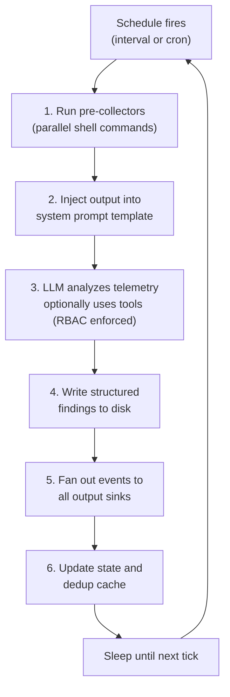
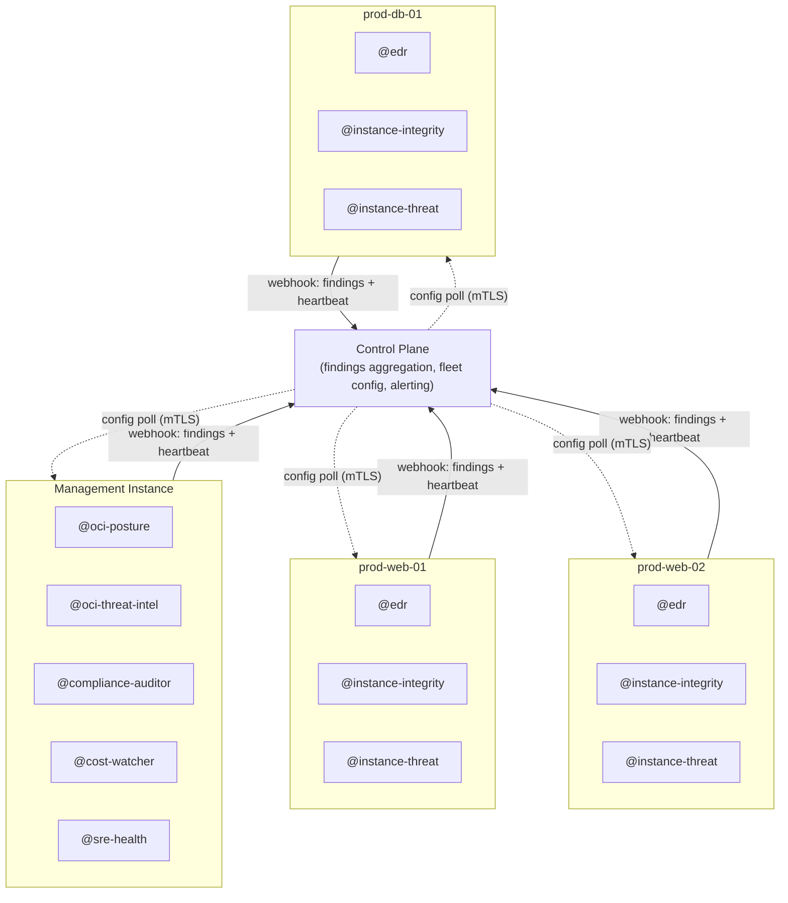

# Okesu Daemon Mode

Okesu's daemon mode turns any agent file into a persistent, scheduled service. The agent wakes on an interval or cron schedule, collects data from the host or cloud APIs, injects it into a prompt, runs an LLM-powered analysis loop, writes structured findings, and sleeps until the next tick. It runs indefinitely until stopped with SIGTERM.

The same daemon engine powers security agents, compliance auditors, cost monitors, SRE health checks, and data quality pipelines. Only the agent file changes — the scheduling, output, state, and tool infrastructure is shared.

---

## How it works



Each tick is a **fresh context** — no memory of prior ticks beyond what the state directory holds. This prevents context window bloat and makes each analysis independent and reproducible.

## Quick start

```bash
# Build the binary
go build -o okesu .

# Run the EDR agent with a 30-second tick interval
ANTHROPIC_API_KEY="sk-ant-..." ./okesu daemon --agent edr --interval 30s

# Or build and run in Docker
docker build -t okesu:dev .
docker run --rm -it -e ANTHROPIC_API_KEY="$ANTHROPIC_API_KEY" okesu:dev

# Run any agent by name
docker run --rm -it \
  -e ANTHROPIC_API_KEY="$ANTHROPIC_API_KEY" \
  okesu:dev daemon --agent sre-health --interval 1m
```

Pipe through `jq` for readable output:

```bash
./okesu daemon --agent edr --interval 30s 2>/dev/null | jq .
```

## CLI flags

```
okesu daemon --agent <name> [flags]
```

| Flag | Description |
|---|---|
| `--agent` | **(required)** Agent name — loads from `.claude/agents/` or `.codex/agents/` |
| `--interval` | Override tick interval (e.g., `30s`, `5m`, `1h`) |
| `--cron` | Override cron schedule (e.g., `"0 * * * *"`) |
| `--model` | Override the model from the agent file |
| `--effort` | Override thinking depth (`low`, `medium`, `high`, `xhigh`, `max`) |
| `--max-turns` | Override maximum agentic loop iterations per tick |
| `--api-key` | API key (overrides `ANTHROPIC_API_KEY` / `OPENAI_API_KEY`) |

Schedule precedence: `--cron` flag > `--interval` flag > agent file `cron:` > agent file `interval:` > default 60s.

## Signal handling

| Signal | Behavior |
|---|---|
| `SIGTERM` / `SIGINT` | Finish the current tick cleanly, then exit 0 |
| `SIGHUP` | Hot-reload the agent file from disk (no restart needed) |

## Agent file anatomy

Every daemon agent is a Markdown file with YAML frontmatter. The frontmatter configures scheduling, tools, collectors, outputs, and RBAC. The body is the system prompt — a Go template that receives live telemetry data each tick.

```yaml
---
name: my-agent
mode: daemon
interval: 5m              # or cron: "*/5 * * * *"
provider: claude
model: claude-sonnet-4-6
effort: low
maxTurns: 10
stateDir: /var/lib/okesu/my-agent
dedupeTtl: 1h

collectors:
  - name: my-data
    command: "some-command --json"
    timeout: 10s
    optional: true         # failure skips silently instead of aborting tick

tools: [bash, read_file, write_file, list_files, search]

outputs:
  - type: stdout
  - type: file
    path: /var/log/okesu/my-agent.jsonl
    maxBytes: 104857600
---

You are an agent on host {{.HostID}} in {{.CloudRegion}}.
Time: {{.TickTime}} | Last run: {{.LastRunISO}}

{{range .CollectorsList}}
### {{.Name}}
` `` 
{{.Output}}
` ``
{{end}}

Analyze the data above and write findings to {{.StateDir}}/findings/{{.TickTime}}.json
```

### Template variables

| Variable | Type | Description |
|---|---|---|
| `{{.HostID}}` | string | Hostname |
| `{{.CloudRegion}}` | string | Cloud region (AWS/GCP/Azure/OCI env vars) |
| `{{.AgentName}}` | string | Agent name from frontmatter |
| `{{.Tick}}` | int64 | Tick sequence number |
| `{{.TickTime}}` | string | RFC3339 timestamp of this tick |
| `{{.LastRunISO}}` | string | RFC3339 timestamp of the previous tick |
| `{{.LastRunFile}}` | string | Path to `last_run` sentinel (for `find -newer`) |
| `{{.StateDir}}` | string | Agent state directory |
| `{{.Collectors}}` | map | Collector results keyed by name |
| `{{.CollectorsList}}` | slice | Collector results for `{{range}}` iteration |

### Template functions

| Function | Description |
|---|---|
| `{{ now }}` | Current UTC time as RFC3339 |
| `{{ env "VAR" }}` | Read an environment variable |
| `{{ cloudRegion }}` | Cloud region from well-known env vars |

---

## Example agents

All example agents live in `examples/agents/`. Each demonstrates different daemon capabilities — different schedules, collector types, analysis domains, and output patterns.

### Per-instance agents

These run on each host and analyze data only available from inside the OS: process tables, file systems, network stacks, kernel state.

---

#### `edr.md` — Endpoint Detection & Response

The flagship security agent. Runs every 2 minutes, collecting process, network, filesystem, and authentication telemetry. The LLM triages for anomalies — suspicious processes, unexpected connections, new files in temp directories, auth failures — and writes structured findings when something looks wrong.

| Property | Value |
|---|---|
| Schedule | `interval: 2m` |
| Model | `claude-mythos-preview` |
| Collectors | 8 (2 required, 6 optional) |
| Tools | bash, read_file, write_file, list_files, search |

**Collectors:**

| Name | What it collects | Required |
|---|---|---|
| `processes` | `ps aux` sorted by CPU — running process snapshot | yes |
| `connections` | `ss -tulnp` — established and listening connections | yes |
| `new_files` | `find` in `/tmp`, `/var/tmp`, `/dev/shm` since last tick | no |
| `auth_events` | `journalctl` auth/privilege events since last tick | no |
| `memfd_procs` | Processes running from memory (no disk-backed exe) | no |
| `listening_ports` | Listening TCP ports with process info | no |
| `dmesg_recent` | Kernel messages: OOM kills, segfaults, warnings | no |
| `osquery_no_disk` | osquery: processes where `on_disk = 0` | no |

**What the LLM looks for:** crypto miners (high CPU + suspicious names), memfd/deleted executables (shellcode), unexpected listening ports, SSH from unusual sources, new setuid files, kernel anomalies.

**Finding schema:** severity, title, resource (pid, path, IP), evidence (raw telemetry lines), recommended action, dedup key.

---

#### `instance-integrity.md` — Host Integrity Monitor

Detects unauthorized changes to a host's configuration and software. Runs every 3 minutes, hashing critical files and comparing against a self-managed baseline. On the first tick, it creates the baseline; on subsequent ticks, it flags any drift.

| Property | Value |
|---|---|
| Schedule | `interval: 3m` |
| Model | `claude-sonnet-4-6` |
| Collectors | 5 (2 required, 3 optional) |
| Tools | bash, read_file, write_file, list_files, search |

**Collectors:**

| Name | What it collects | Required |
|---|---|---|
| `file_hashes` | SHA256 of `/etc/passwd`, `/etc/shadow`, `sshd_config`, `sudo`, `su`, systemd units, crontab | yes |
| `oci_agents` | Health status and binary checksums of OCI cloud agents | no |
| `kernel_modules` | `lsmod` + dmesg module load events | yes |
| `firewall_rules` | Full iptables + nftables ruleset dump | no |
| `ebpf_programs` | `bpftool prog list` — loaded eBPF programs | no |

**What the LLM looks for:** modified system binaries (rootkit), changed `sshd_config` (backdoor), new kernel modules loaded via `insmod` (not `modprobe`), iptables NAT/masquerade rules (pivoting), unauthorized eBPF programs (packet sniffers, credential harvesters), stopped OCI agents (visibility blinding).

---

#### `instance-threat.md` — Active Exploitation Detector

Hunts for signs of active compromise on a host. Runs every 2 minutes, checking for IMDS abuse, container escapes, privilege escalation, and cryptomining.

| Property | Value |
|---|---|
| Schedule | `interval: 2m` |
| Model | `claude-sonnet-4-6` |
| Collectors | 5 (3 required, 2 optional) |
| Tools | bash, read_file, write_file, list_files, search |

**Collectors:**

| Name | What it collects | Required |
|---|---|---|
| `imds_connections` | Processes connecting to `169.254.169.254`, IMDSv2 enforcement check | yes |
| `container_escapes` | Processes with container cgroups but host mount namespace; `--privileged` containers | no |
| `setuid_binaries` | `find / -perm -4000` + `getcap -r /` | yes |
| `privesc_logs` | sudo/su usage, `usermod` events, `authorized_keys` changes since last tick | no |
| `crypto_indicators` | Top CPU processes, connections to mining pool ports, suspicious process names, GPU usage | yes |

**What the LLM looks for:**

- **IMDS abuse** — Non-OCI-agent processes hitting the metadata service (SSRF-to-IMDS attack). Also flags if IMDSv1 is still accessible.
- **Container escapes** — Processes that show a container cgroup but share the host mount namespace. Privileged containers flagged as pre-escape conditions.
- **Privilege escalation** — Unusual sudo from service accounts, new setuid binaries, new `authorized_keys` entries, users added to `wheel`/`docker`/`lxd` groups.
- **Cryptomining** — >80% CPU with suspicious names/cmdlines, connections to ports 3333/4444/5555/14444, GPU processes on non-GPU workloads.

---

### Centralized agents

These run on a single management host (or container) and query cloud APIs across one or more OCI tenancies. They never need local OS access — all data comes from the OCI CLI.

---

#### `oci-posture.md` — Cloud Posture Auditor

Audits the security configuration of OCI tenancies: IAM policies, compartment boundaries, network security groups, and object storage visibility. Runs every 10 minutes.

| Property | Value |
|---|---|
| Schedule | `interval: 10m` |
| Model | `claude-sonnet-4-6` |
| Collectors | 4 (2 required, 2 optional) |
| Tools | bash, read_file, write_file, list_files, search |

**Collectors:**

| Name | What it collects | Required |
|---|---|---|
| `iam_policies` | All IAM policies with statements, compartment, lifecycle | yes |
| `compartments` | Compartment tree with parent-child relationships | yes |
| `nsgs` | NSG rules and security lists across all VCNs | no |
| `public_buckets` | Object Storage buckets with non-`NoPublicAccess` visibility | no |

**What the LLM looks for:** `Allow` statements on `all-resources in tenancy`, `any-user` grants, cross-compartment policy violations, NSG rules with `0.0.0.0/0` ingress on non-80/443 ports, public buckets in compartments named "prod"/"customer"/"pii"/"backup".

**Multi-tenancy:** Run one instance per tenancy using different `OCI_CLI_PROFILE` env vars, or use a wrapper script in the collector commands that iterates over profiles.

---

#### `oci-threat-intel.md` — Cloud Threat Intelligence

Correlates OCI audit logs, Cloud Guard findings, and compute activity to detect active threats and compromised credentials. Runs every 5 minutes.

| Property | Value |
|---|---|
| Schedule | `interval: 5m` |
| Model | `claude-sonnet-4-6` |
| Collectors | 3 (1 required, 2 optional) |
| Tools | bash, read_file, write_file, list_files, search |

**Collectors:**

| Name | What it collects | Required |
|---|---|---|
| `audit_events` | Audit log events since last tick, grouped by type with source IPs and users | yes |
| `cloud_guard` | Active Cloud Guard problems with severity, resource, and detector info | no |
| `cost_anomaly` | Compute instances created since last tick (shape, AD, creator) | no |

**What the LLM looks for:** First-time API calls (`CreateUser`, `PutBucketPolicy`, `CreateApiKey`) from unexpected principals, API calls from unknown source IPs, delete/update storms suggesting credential compromise, new GPU instances (cryptomining), cross-signal correlation (new API key + new instance + open NSG = attack chain).

---

### Compliance and governance

---

#### `compliance-auditor.md` — Compliance Auditor

Daily compliance sweep covering CIS benchmarks, IAM access staleness, resource tagging, and data residency. Runs once at 06:00 UTC. Produces a comprehensive report suitable for SOC2/ISO 27001 evidence.

| Property | Value |
|---|---|
| Schedule | `cron: "0 6 * * *"` (daily at 06:00 UTC) |
| Model | `claude-sonnet-4-6` |
| Collectors | 4 (2 required, 2 optional) |
| Tools | bash, read_file, write_file, list_files, search |

**Collectors:**

| Name | What it collects | Required |
|---|---|---|
| `cis_checks` | Password policy, SSH hardening, file permissions, unowned files, auditd status, kernel params | yes |
| `iam_review` | OCI users with login timestamps, MFA status, API key capability | no |
| `resource_tags` | OCI resources missing required tags (owner, environment, cost-center, data-classification) | no |
| `data_residency` | Storage resources (buckets, databases) and their regions | no |

**What the LLM produces:** A structured compliance report with pass/fail counts per domain, stale account list, untagged resource inventory, data residency violations (e.g., EU data in `ap-*` regions), and recommended remediations with severity ratings.

---

### Non-security agents

These agents prove the daemon framework is domain-agnostic. The same collector/template/sink/RBAC/state primitives handle FinOps, SRE, and data engineering workloads with zero changes to the daemon engine.

---

#### `cost-watcher.md` — FinOps Cost Watcher

Monitors OCI spending for anomalies, identifies idle resources, and tracks budget thresholds. Runs every hour.

| Property | Value |
|---|---|
| Schedule | `cron: "0 * * * *"` (hourly) |
| Model | `claude-sonnet-4-6` |
| Collectors | 3 (2 required, 1 optional) |
| Tools | bash, read_file, write_file, list_files |

**Collectors:**

| Name | What it collects | Required |
|---|---|---|
| `daily_cost` | Today's spend by service from the OCI Usage API | yes |
| `idle_instances` | All running instances with shape, OCPU count, tags, creation date | yes |
| `budget_status` | Budget definitions with actual vs. forecasted spend | no |

**What the LLM looks for:** Services with >2x normal daily spend, instances with temp-sounding names running >7 days, large shapes in non-production compartments, untagged instances, budgets at >80% utilization, forecasted overspend.

**Finding format:** Includes `estimated_savings` field — e.g., "$450/month — downsize BM.Standard2.52 to VM.Standard.E4.Flex in dev compartment."

---

#### `sre-health.md` — SRE Health Monitor

Checks service health endpoints, TLS certificate expiry, deployment frequency, and incident patterns. Runs every 10 minutes.

| Property | Value |
|---|---|
| Schedule | `interval: 10m` |
| Model | `claude-sonnet-4-6` |
| Collectors | 4 (1 required, 3 optional) |
| Tools | bash, read_file, write_file |

**Collectors:**

| Name | What it collects | Required |
|---|---|---|
| `health_endpoints` | HTTP status + latency for configured service URLs | yes |
| `cert_expiry` | TLS certificate expiry dates for configured hostnames | no |
| `deploy_frequency` | Git log from deploy repo + Docker container image ages | no |
| `recent_incidents` | Failed systemd units, OOM kills, service restarts in last 24h | no |

**Configuration:** Set `OKESU_HEALTH_URLS` and `OKESU_TLS_HOSTS` environment variables to your service endpoints. Example:

```bash
OKESU_HEALTH_URLS="https://api.prod.internal/health https://web.prod.internal/health"
OKESU_TLS_HOSTS="api.prod.internal:443 web.prod.internal:443 cdn.example.com:443"
```

**What the LLM produces:** An overall status (HEALTHY/DEGRADED/CRITICAL), per-service availability with latency tracking, certificate urgency tiers (<7d CRITICAL, <30d HIGH, <60d MEDIUM), deploy velocity analysis, and incident pattern correlation (e.g., a service that restarted 5 times in 24h + high latency = likely memory leak).

---

#### `data-quality.md` — Data Quality Auditor

Monitors database health for data engineering teams. Checks row counts, null rates, and schema drift. Runs daily at 07:30 UTC — before the data team standup.

| Property | Value |
|---|---|
| Schedule | `cron: "30 7 * * *"` (daily at 07:30 UTC) |
| Model | `claude-sonnet-4-6` |
| Collectors | 3 (2 required, 1 optional) |
| Tools | bash, read_file, write_file, list_files |

**Configuration:** Set `DB_CONNECTION_STRING` to your PostgreSQL connection string. The SQL queries in the collectors should be customized for your schema.

**Collectors:**

| Name | What it collects | Required |
|---|---|---|
| `row_counts` | Row counts for critical tables (users, orders, events, payments) | yes |
| `null_rates` | Null percentage for key columns (email, user_id, total, status) | yes |
| `schema_diff` | Column names and types compared against a stored baseline | no |

**What the LLM looks for:**

- **Volume anomalies** — >20% row count drop (data loss), >50% increase (duplicate ingestion), zero rows on previously populated tables (catastrophic).
- **Quality degradation** — Nulls on NOT NULL-expected columns, negative values in amount fields, rising null rates over time.
- **Schema drift** — New columns (LOW), removed columns (HIGH — downstream breakage), type changes (CRITICAL — silent corruption).
- **Pipeline freshness** — Tables whose latest timestamps are older than expected, suggesting a stalled pipeline.

---

## Deployment patterns

### Single host — systemd

```bash
# Enable and start agents
systemctl enable --now okesu-agent@edr
systemctl enable --now okesu-agent@instance-integrity
systemctl enable --now okesu-agent@instance-threat

# Follow logs
journalctl -fu okesu-agent@edr

# Hot-reload config
systemctl kill --signal=SIGHUP okesu-agent@edr
```

### Container

```bash
# Build once
docker build -t okesu:dev .

# Run any agent
docker run --rm -it \
  -e ANTHROPIC_API_KEY="$ANTHROPIC_API_KEY" \
  okesu:dev daemon --agent edr --interval 30s

# For OCI agents, mount the OCI config
docker run --rm -it \
  -e ANTHROPIC_API_KEY="$ANTHROPIC_API_KEY" \
  -v ~/.oci:/home/okesu/.oci:ro \
  -e OCI_TENANCY_OCID="ocid1.tenancy.oc1..." \
  okesu:dev daemon --agent oci-posture
```

### Fleet deployment

Run per-instance agents on every host via systemd. Run centralized agents (OCI posture, threat intel, compliance, cost) on a single hardened management instance or container with OCI CLI credentials. All agents push findings to the Control Plane via webhook sinks — the management instance is just another host running agents, not the Control Plane itself.



## Infrastructure requirements

| Requirement | Per-instance agents | Centralized agents |
|---|---|---|
| API key | `ANTHROPIC_API_KEY` | `ANTHROPIC_API_KEY` |
| OCI CLI | not needed | required + configured profiles |
| Management plane | optional | optional |
| mTLS certificates | optional | optional |
| Webhook endpoint | optional | optional |
| Additional packages | procps, iproute2, findutils | oci-cli, jq |

The minimum viable setup is a single environment variable (`ANTHROPIC_API_KEY`) and the okesu binary. Everything else — management plane, webhooks, mTLS, osquery, OCI CLI — is optional and additive.
