# Okesu Architecture

Okesu is a fully autonomous AI agent runner written in Go. It exposes a single binary with three subcommands (`claude`, `codex`, `auto`) that each drive an agentic loop against either the Anthropic or OpenAI API. The agent executes tools — bash, file I/O, search — on the local machine with no sandbox and streams all activity as JSONL to stdout.

---

## Table of Contents

1. [High-Level Overview](#1-high-level-overview)
2. [Package Structure](#2-package-structure)
3. [CLI Layer — `main.go`](#3-cli-layer--maingo)
   - [Startup Sequence](#startup-sequence)
   - [Environment Loading — `.env` file](#environment-loading--env-file)
   - [Command Tree](#command-tree)
   - [Shared Flags](#shared-flags)
   - [API Key Resolution](#api-key-resolution)
4. [Agent File System](#4-agent-file-system)
5. [Configuration Pipeline](#5-configuration-pipeline)
6. [Tool System — `agent/tools.go`](#6-tool-system--agenttoolsgo)
7. [Claude Runner — `agent/claude.go`](#7-claude-runner--agentclaudego)
8. [OpenAI Runner — `agent/openai.go`](#8-openai-runner--agentopeniago)
9. [JSONL Event Bus — `agent/jsonl.go`](#9-jsonl-event-bus--agentjsonlgo)
10. [Provider Inference — `auto` Command](#10-provider-inference--auto-command)
11. [End-to-End Request Flow](#11-end-to-end-request-flow)
12. [Concurrency Model](#12-concurrency-model)
13. [Data Structures Reference](#13-data-structures-reference)

---

## 1. High-Level Overview

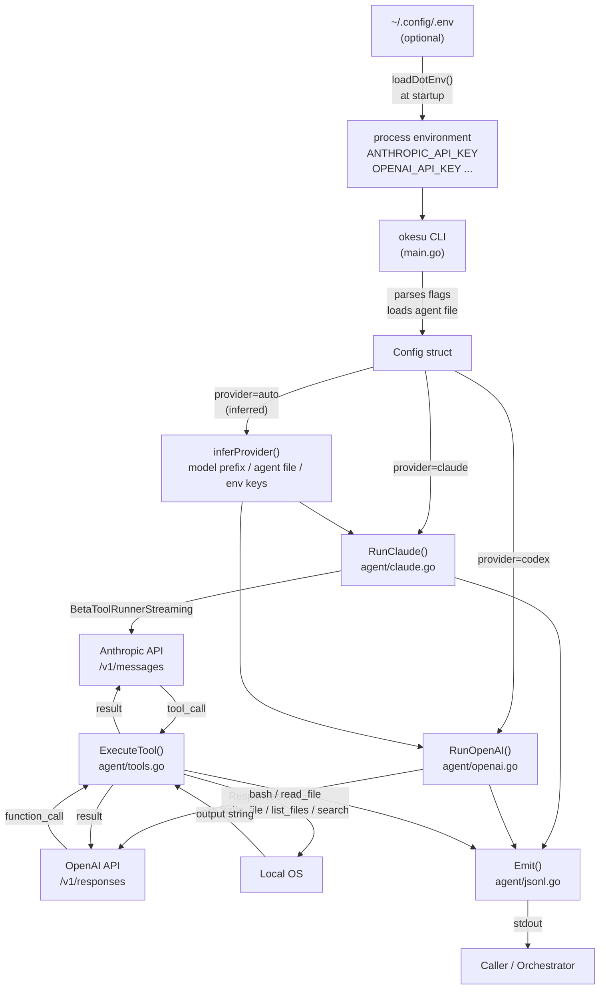

**Key design decisions:**

- **No sandbox.** Every tool call executes directly on the host. The model can run arbitrary bash commands, read and write any file reachable by the process, and search any directory.
- **JSONL protocol.** Every event — text delta, tool call, tool result, session end — is a single JSON line written to stdout. Callers parse line-by-line.
- **Provider abstraction.** A single `Config` struct is handed to either `RunClaude` or `RunOpenAI`. The runners handle all SDK-specific translation internally.
- **Agent files as configuration.** `.md` files with YAML frontmatter carry model, provider, tools, maxTurns, and effort — no code changes needed to define a new agent persona.
- **Zero-config credential loading.** `~/.config/.env` is read at startup so API keys are available without shell exports. Existing shell variables always take precedence.

---

## 2. Package Structure

```
okesu/
├── main.go                      # CLI entry point (Cobra commands)
├── go.mod                       # Module: github.com/section9labs/okesu
│
├── agent/
│   ├── claude.go                # Anthropic agentic loop + Config struct
│   ├── openai.go                # OpenAI agentic loop (Responses API)
│   ├── tools.go                 # Tool definitions, execution, agent file parsing
│   └── jsonl.go                 # JSONL event types and Emit()
│
├── .claude/
│   ├── settings.local.json      # Claude Code CLI project settings
│   └── agents/
│       └── security-reviewer.md # Example agent file
│
└── docs/
    └── architecture.md          # This document
```

**Dependencies:**

| Package | Version | Role |
|---|---|---|
| `github.com/anthropics/anthropic-sdk-go` | v1.37.0 | Anthropic API client + BetaToolRunner |
| `github.com/openai/openai-go/v3` | v3.32.0 | OpenAI Responses API client |
| `github.com/spf13/cobra` | v1.10.2 | CLI framework |
| `gopkg.in/yaml.v3` | v3.0.1 | Agent file frontmatter parsing |

---

## 3. CLI Layer — `main.go`

Okesu uses [Cobra](https://github.com/spf13/cobra) to define three subcommands. All share the same flag set and configuration pipeline.

### Startup Sequence

`main()` runs two steps before handing off to Cobra:

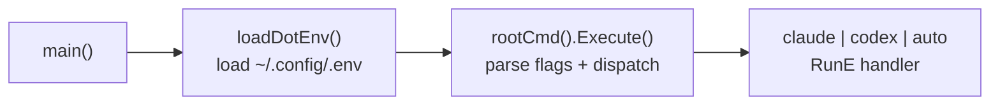

Environment loading happens unconditionally before any flag parsing, so API keys from `.env` are available to all subcommands and to `inferProvider`.

### Environment Loading — `.env` file

`loadDotEnv()` reads `~/.config/.env` at process startup and populates the environment with any variables not already set. Variables already exported in the shell always take precedence.

```mermaid
flowchart TD
    L["loadDotEnv()"] --> H{"HOME set?"}
    H --> |"no"| Return["return (no-op)"]
    H --> |"yes"| Read["os.ReadFile\n~/.config/.env"]
    Read --> |"file missing\nor unreadable"| Return
    Read --> |"ok"| Lines["iterate lines"]
    Lines --> Skip{"blank or\n# comment?"}
    Skip --> |"yes"| Lines
    Skip --> |"no"| Strip["strip 'export ' prefix"]
    Strip --> Split["split on first '='"]
    Split --> |"no '='"| Lines
    Split --> Unquote["strip surrounding\n\" or ' quotes"]
    Unquote --> Exists{"os.Getenv(key)\nalready set?"}
    Exists --> |"yes — env wins"| Lines
    Exists --> |"no"| Set["os.Setenv(key, val)"]
    Set --> Lines
```

**Supported line formats:**

```bash
ANTHROPIC_API_KEY=sk-ant-abc123          # bare value
OPENAI_API_KEY="sk-abc123"               # double-quoted
AWS_SECRET_KEY='abc123'                  # single-quoted
export SOME_OTHER_VAR=value              # optional export prefix
# this line is a comment                 # ignored
                                         # blank lines ignored
```

**Implementation:**

```go
func loadDotEnv() {
    home := os.Getenv("HOME")
    if home == "" {
        return
    }
    data, err := os.ReadFile(filepath.Join(home, ".config", ".env"))
    if err != nil {
        return  // silently skip — file is optional
    }
    for _, line := range strings.Split(string(data), "\n") {
        line = strings.TrimSpace(line)
        if line == "" || strings.HasPrefix(line, "#") {
            continue
        }
        line = strings.TrimPrefix(line, "export ")
        idx := strings.IndexByte(line, '=')
        if idx < 1 {
            continue
        }
        key := strings.TrimSpace(line[:idx])
        val := strings.TrimSpace(line[idx+1:])
        if len(val) >= 2 {
            if (val[0] == '"' && val[len(val)-1] == '"') ||
                (val[0] == '\'' && val[len(val)-1] == '\'') {
                val = val[1 : len(val)-1]
            }
        }
        if key != "" && os.Getenv(key) == "" {  // existing env vars win
            os.Setenv(key, val)
        }
    }
}
```

### Command Tree

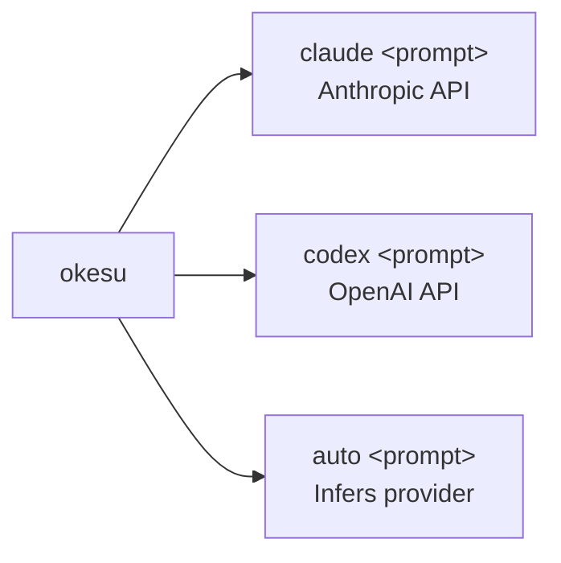

### Shared Flags

```go
func sharedFlags(cmd *cobra.Command) {
    cmd.Flags().String("model", "", "Model override")
    cmd.Flags().String("system", "", "Path to system prompt file")
    cmd.Flags().String("agent", "", "Agent name — loads from .claude/agents/ or .codex/agents/")
    cmd.Flags().String("api-key", "", "API key (overrides env var)")
    cmd.Flags().Int64("max-tokens", 8192, "Maximum tokens per response")
    cmd.Flags().String("effort", "", "Thinking depth — claude: low|medium|high|xhigh|max  codex: low|medium|high|xhigh")
    cmd.Flags().Int("max-turns", 0, "Maximum agentic loop iterations (0 = unlimited)")
}
```

### Flag Precedence (highest to lowest)

```
CLI flag  >  agent file frontmatter  >  built-in default
```

For example, if the agent file declares `model: claude-opus-4-6` but the user passes `--model claude-sonnet-4-6`, the CLI flag wins.

### API Key Resolution

API keys go through a three-tier lookup. `loadDotEnv()` runs before any of this, so `~/.config/.env` values are already in the process environment by the time `resolveAPIKey` is called:

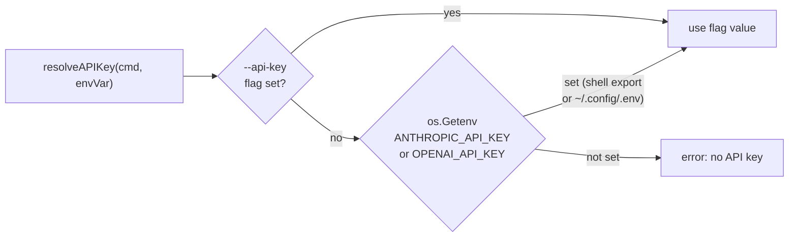

**Full precedence chain (highest to lowest):**

```
--api-key flag  >  shell export  >  ~/.config/.env  >  error
```

```go
func resolveAPIKey(cmd *cobra.Command, envVar string) (string, error) {
    key, _ := cmd.Flags().GetString("api-key")
    if key == "" {
        key = os.Getenv(envVar)  // picks up shell export OR ~/.config/.env value
    }
    if key == "" {
        return "", fmt.Errorf("no API key — set %s or use --api-key", envVar)
    }
    return key, nil
}
```

---

## 4. Agent File System

Agent files are Markdown documents with YAML frontmatter. They encode both the agent's persona (as a system prompt in the body) and its runtime configuration (in the frontmatter).

### File Discovery

`ParseAgentFile(name)` searches four directories in order, stopping at the first match:

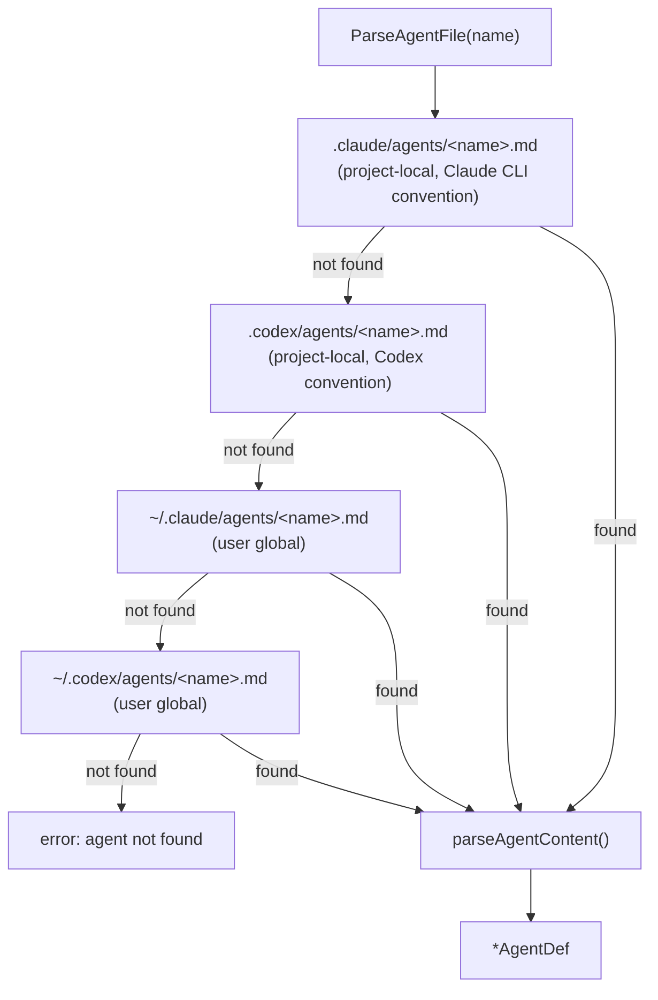

### Frontmatter Format

```yaml
---
name: security-reviewer
description: Expert security engineer for code review.
model: claude-opus-4-6          # default model (overridable by --model)
provider: claude                 # "claude" | "codex" — used by okesu auto
tools: [bash, read_file, write_file, list_files, search]
maxTurns: 100                    # agentic loop cap (overridable by --max-turns)
effort: high                     # reasoning depth (overridable by --effort)
---

You are a world-class security engineer...   ← becomes SystemPrompt / Instructions
```

### Tool Name Mapping

The `tools:` list accepts either okesu-native names or Claude Code CLI names:

| Claude Code CLI | okesu canonical |
|---|---|
| `Bash` | `bash` |
| `Read` | `read_file` |
| `Edit`, `Write` | `write_file` |
| `Glob` | `list_files` |
| `Grep` | `search` |

```go
func normalizeToolName(name string) string {
    switch strings.ToLower(name) {
    case "bash":               return "bash"
    case "read", "read_file":  return "read_file"
    case "write", "edit",
         "write_file":         return "write_file"
    case "glob", "list_files": return "list_files"
    case "grep", "search":     return "search"
    default:                   return ""   // silently ignored
    }
}
```

### AgentDef Struct

```go
type AgentDef struct {
    Name        string   `yaml:"name"`
    Description string   `yaml:"description"`
    Model       string   `yaml:"model"`
    Provider    string   `yaml:"provider"`   // "claude" | "codex"
    Tools       []string `yaml:"tools"`      // okesu or Claude Code CLI names
    MaxTurns    int      `yaml:"maxTurns"`
    Effort      string   `yaml:"effort"`
    Body        string   // system prompt body (content after the frontmatter)
}
```

---

## 5. Configuration Pipeline

All three subcommands funnel through `buildConfig()`, which merges CLI flags with agent frontmatter and applies provider-specific defaults.

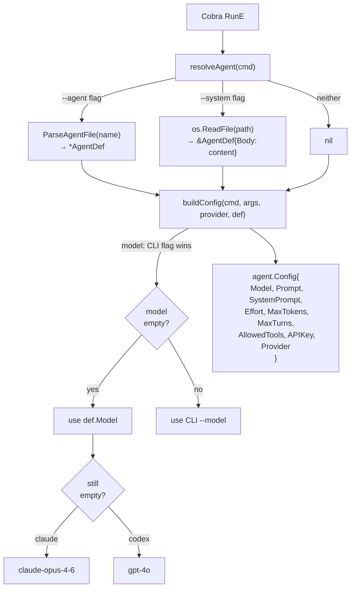

### Config Struct

```go
type Config struct {
    Provider     string    // "claude" | "codex"
    Model        string    // e.g. "claude-opus-4-6", "gpt-4o"
    Prompt       string    // the user's task (positional arg)
    SystemPrompt string    // agent body text → system / instructions
    MaxTokens    int64     // max tokens per API response
    APIKey       string    // resolved API key
    Effort       string    // reasoning depth: low|medium|high|xhigh|max
    MaxTurns     int       // loop cap; 0 = unlimited
    AllowedTools []string  // empty = all tools
}
```

---

## 6. Tool System — `agent/tools.go`

### The Five Built-in Tools

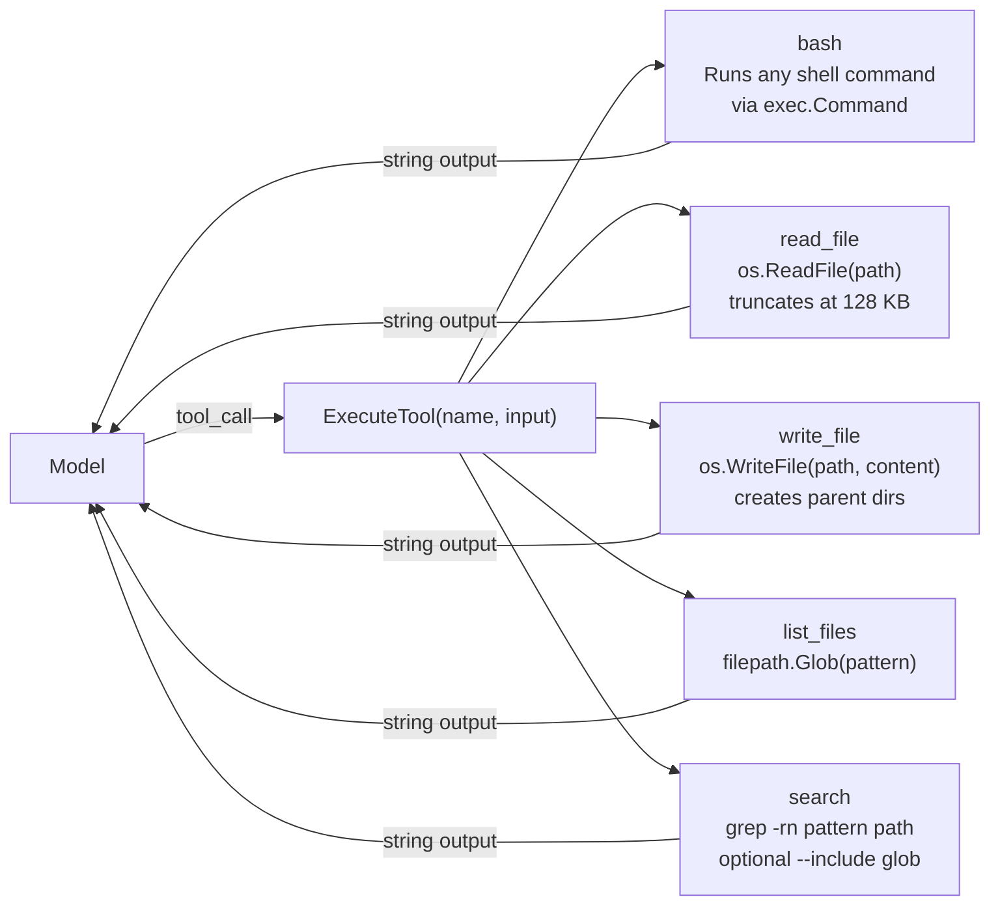

### Tool Definitions

Each tool is declared as a `ToolDef` containing a JSON Schema for the model:

```go
type ToolDef struct {
    Name        string
    Description string
    Parameters  map[string]interface{}  // full JSON Schema object
    Required    []string
}
```

Example — the `bash` tool:

```go
{
    Name:        "bash",
    Description: "Execute a shell command. Returns combined stdout and stderr.",
    Parameters: map[string]interface{}{
        "type": "object",
        "properties": map[string]interface{}{
            "command": map[string]interface{}{
                "type":        "string",
                "description": "The bash command to execute.",
            },
            "timeout_seconds": map[string]interface{}{
                "type":        "integer",
                "description": "Optional timeout in seconds (default: 120).",
            },
        },
    },
    Required: []string{"command"},
}
```

### Tool Filtering via `ActiveTools`

When `AllowedTools` is non-empty, only the listed tools are exposed to the model:

```go
func ActiveTools(names []string) []ToolDef {
    if len(names) == 0 {
        return Tools   // all tools
    }
    allowed := make(map[string]bool)
    for _, n := range names {
        if norm := normalizeToolName(n); norm != "" {
            allowed[norm] = true
        }
    }
    result := []ToolDef{}
    for _, t := range Tools {
        if allowed[t.Name] {
            result = append(result, t)
        }
    }
    return result
}
```

This is called at runner startup before the first API request:

```go
// In RunClaude:
tools, err := buildBetaTools(ActiveTools(cfg.AllowedTools))

// In RunOpenAI:
tools := buildResponsesTools(ActiveTools(cfg.AllowedTools))
```

### Output Limits

| Tool | Truncation |
|---|---|
| `bash` | 64 KB |
| `read_file` | 128 KB |
| `search` | 32 KB |
| `write_file` | none (input, not output) |
| `list_files` | none |

---

## 7. Claude Runner — `agent/claude.go`

The Claude runner uses the Anthropic SDK's built-in `BetaToolRunnerStreaming`, which manages the multi-turn tool loop, parallel tool execution, and message history accumulation internally.

### Architecture

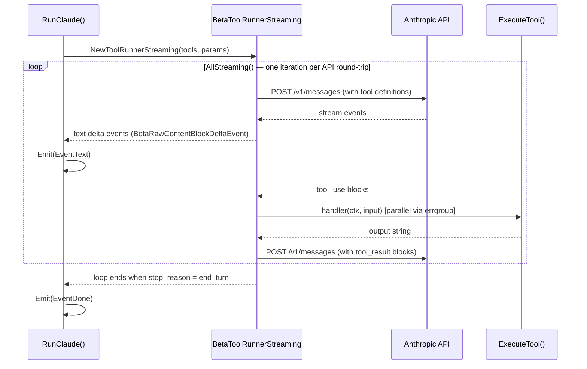

### Key Implementation Details

**Tool handler registration** — each tool gets a closure that emits JSONL before and after execution:

```go
tool := toolrunner.NewBetaTool(
    td.Name,
    td.Description,
    schema,
    func(ctx context.Context, input map[string]interface{}) (anthropic.BetaToolResultBlockParamContentUnion, error) {
        Emit(Event{Type: EventToolCall, ToolName: td.Name, Input: input})
        output := ExecuteTool(td.Name, input)
        Emit(Event{Type: EventToolResult, ToolName: td.Name, Output: output})
        return anthropic.BetaToolResultBlockParamContentUnion{
            OfText: &anthropic.BetaTextBlockParam{Text: output},
        }, nil
    },
)
```

**Effort / extended thinking:**

```go
if cfg.Effort != "" {
    msgParams.OutputConfig = anthropic.BetaOutputConfigParam{
        Effort: anthropic.BetaOutputConfigEffort(cfg.Effort),
        // "low" | "medium" | "high" | "xhigh" | "max"
    }
}
```

**MaxTurns enforcement** — breaks from the range-over-func iterator (Go 1.23):

```go
turn := 0
for events, err := range runner.AllStreaming(context.Background()) {
    turn++
    if cfg.MaxTurns > 0 && turn > cfg.MaxTurns {
        break   // valid in Go 1.23 range-over-func
    }
    for event, err := range events {
        if delta, ok := event.AsAny().(anthropic.BetaRawContentBlockDeltaEvent); ok {
            if text, ok := delta.Delta.AsAny().(anthropic.BetaTextDelta); ok {
                Emit(Event{Type: EventText, Text: text.Text, Turn: turn})
            }
        }
    }
}
```

**Parallel tool execution** — the SDK uses `errgroup` internally to run tool handlers concurrently when the model issues multiple tool calls in the same turn. This is why `Emit()` uses a mutex.

### Message Flow Inside the SDK

```
BetaMessageNewParams
  ├── Model: "claude-opus-4-6"
  ├── MaxTokens: 8192
  ├── System: [{Text: systemPrompt}]
  ├── Messages: [{role: user, content: prompt}]
  ├── OutputConfig: {Effort: "high"}
  └── Tools: [BetaTool{name, description, schema, handler}]
                    ↕ runner manages internally
         BetaMessage (response)
           ├── content: [TextBlock | ToolUseBlock]
           └── stop_reason: "tool_use" | "end_turn"
```

---

## 8. OpenAI Runner — `agent/openai.go`

The OpenAI runner uses the **Responses API** (`/v1/responses`), required for models with function calling + reasoning (e.g. `gpt-5.4-cyber`). Unlike the Claude runner, the tool loop is implemented manually.

### Why Responses API, not Chat Completions

Models with `reasoning_effort` require `/v1/responses`. Sending function tools to `/v1/chat/completions` returns:

```
400 Bad Request: Function tools with reasoning_effort are not supported for
gpt-5.4-cyber in /v1/chat/completions. Please use /v1/responses instead.
```

The Responses API is also stateful via `previous_response_id` — the server retains the conversation, so each turn only sends the delta (tool results) rather than the full history.

### Architecture

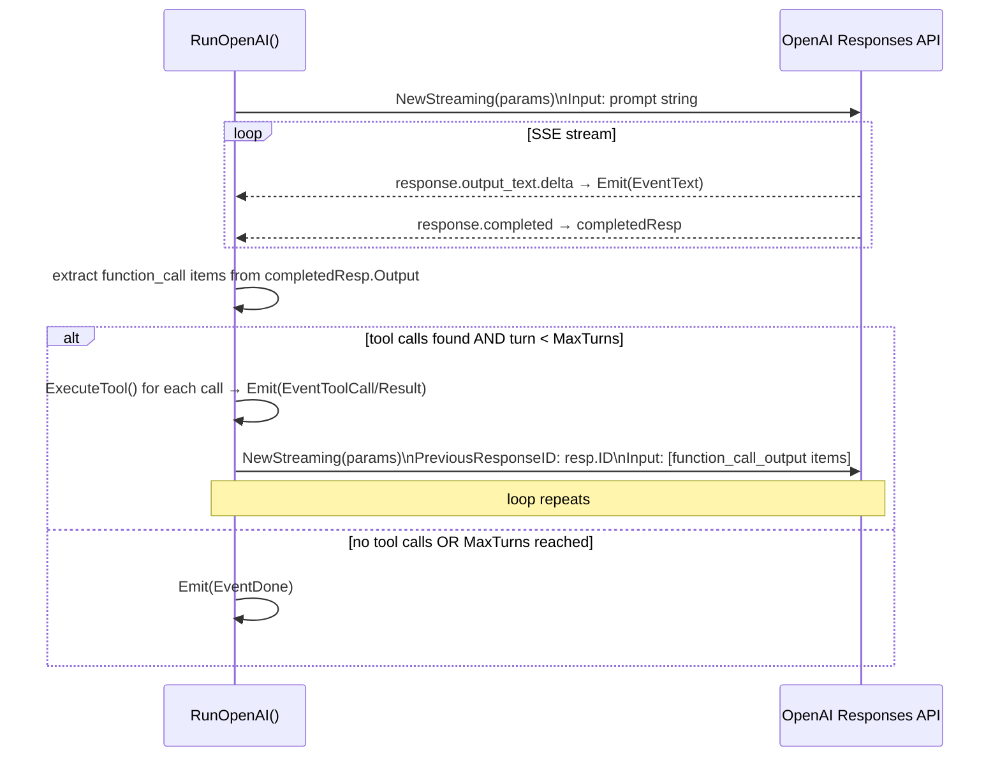

### Multi-Turn State via `previous_response_id`

The Responses API is **server-side stateful**. The first request carries the full prompt; subsequent requests reference the previous response ID and carry only tool results:

```go
// Turn 1 — seed with user prompt
firstParams.Input = responses.ResponseNewParamsInputUnion{
    OfString: param.NewOpt(cfg.Prompt),
}

// Turn N — submit tool results only
nextParams.PreviousResponseID = param.NewOpt(prevResponseID)
nextParams.Input = responses.ResponseNewParamsInputUnion{
    OfInputItemList: responses.ResponseInputParam(resultItems),
}
```

Tool results are wrapped as `ResponseInputItemFunctionCallOutputParam`:

```go
resultItems = append(resultItems,
    responses.ResponseInputItemParamOfFunctionCallOutput(tc.CallID, output),
)
```

### Detecting Tool Calls in the Response

After each stream completes, the runner inspects `completedResp.Output` (obtained from the `response.completed` SSE event):

```go
var toolCalls []responses.ResponseFunctionToolCall
for _, item := range completedResp.Output {
    if item.Type == "function_call" {
        toolCalls = append(toolCalls, item.AsFunctionCall())
        // tc.Name, tc.CallID, tc.Arguments (JSON string)
    }
}
```

### Effort / Reasoning

```go
if cfg.Effort != "" {
    baseParams.Reasoning = shared.ReasoningParam{
        Effort: shared.ReasoningEffort(cfg.Effort),
        // "low" | "medium" | "high" | "xhigh"
    }
}
```

### Tool Schema Conversion

Each `ToolDef` is converted to a `FunctionToolParam` for the Responses API:

```go
responses.ToolUnionParam{
    OfFunction: &responses.FunctionToolParam{
        Name:        t.Name,
        Description: param.NewOpt(t.Description),
        Parameters: map[string]interface{}{
            "type":       "object",
            "properties": t.Parameters["properties"],
            "required":   t.Required,
        },
    },
}
```

---

## 9. JSONL Event Bus — `agent/jsonl.go`

All activity is serialized as JSONL to stdout. Callers (orchestrators, log collectors, UIs) read line-by-line.

### Event Types

```go
const (
    EventInit       EventType = "init"         // session started
    EventText       EventType = "text"         // streaming text delta from model
    EventToolCall   EventType = "tool_call"    // model is invoking a tool
    EventToolResult EventType = "tool_result"  // tool execution completed
    EventDone       EventType = "done"         // session complete with usage
    EventError      EventType = "error"        // fatal error
)
```

### Event Schema

```go
type Event struct {
    Type       EventType   `json:"type"`
    Provider   string      `json:"provider,omitempty"`   // "claude" | "codex"
    Model      string      `json:"model,omitempty"`
    Text       string      `json:"text,omitempty"`        // EventText only
    ToolID     string      `json:"tool_id,omitempty"`     // OpenAI call_id
    ToolName   string      `json:"tool_name,omitempty"`
    Input      interface{} `json:"input,omitempty"`       // tool arguments
    Output     string      `json:"output,omitempty"`      // tool result
    Error      string      `json:"error,omitempty"`
    StopReason string      `json:"stop_reason,omitempty"`
    Usage      *Usage      `json:"usage,omitempty"`       // EventDone only
    Turn       int         `json:"turn,omitempty"`        // loop iteration
    Ts         int64       `json:"ts"`                    // Unix milliseconds
}
```

### Example Session Stream

```jsonl
{"type":"init","provider":"claude","model":"claude-opus-4-6","ts":1745000000000}
{"type":"text","text":"I'll start by listing the files in the repository.","turn":1,"ts":1745000000120}
{"type":"tool_call","tool_name":"list_files","input":{"pattern":"./**/*.go"},"turn":1,"ts":1745000000340}
{"type":"tool_result","tool_name":"list_files","output":"./main.go\n./agent/claude.go\n...","turn":1,"ts":1745000000350}
{"type":"text","text":"Now let me read the main entry point.","turn":2,"ts":1745000001200}
{"type":"tool_call","tool_name":"read_file","input":{"path":"./main.go"},"turn":2,"ts":1745000001400}
{"type":"tool_result","tool_name":"read_file","output":"package main\n...","turn":2,"ts":1745000001405}
{"type":"text","text":"I found a command injection vulnerability on line 42...","turn":3,"ts":1745000002000}
{"type":"done","provider":"claude","model":"claude-opus-4-6","stop_reason":"end_turn","usage":{"input_tokens":4821,"output_tokens":1203},"ts":1745000005000}
```

### Thread Safety

Tool handlers in the Claude runner execute concurrently (the SDK uses `errgroup`). `Emit()` is protected by a package-level mutex so JSON lines are never interleaved:

```go
var mu sync.Mutex

func Emit(e Event) {
    e.Ts = time.Now().UnixMilli()
    b, _ := json.Marshal(e)
    mu.Lock()
    fmt.Printf("%s\n", b)
    mu.Unlock()
}
```

---

## 10. Provider Inference — `auto` Command

`okesu auto` runs the same agentic loop as `claude` or `codex` but determines the provider automatically so the user doesn't need to know or specify it.

### Inference Priority

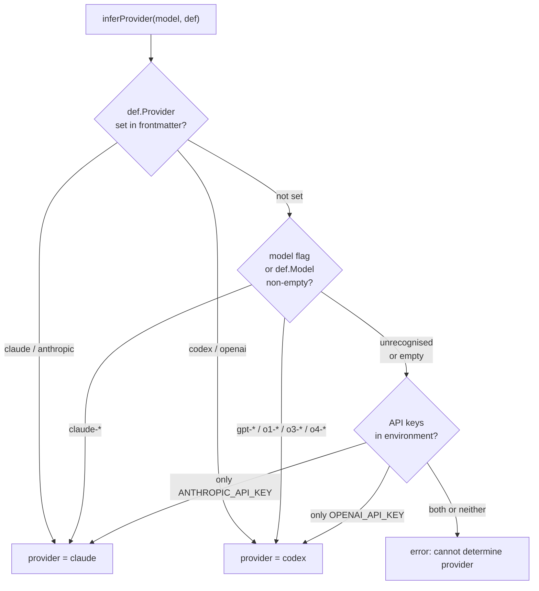

### Implementation

```go
func inferProvider(model string, def *agent.AgentDef) (string, error) {
    // 1. Explicit provider in agent file frontmatter
    if def != nil && def.Provider != "" {
        switch strings.ToLower(def.Provider) {
        case "claude", "anthropic": return "claude", nil
        case "codex", "openai":     return "codex", nil
        }
    }

    // 2. Model name prefix
    if model != "" {
        lower := strings.ToLower(model)
        if strings.HasPrefix(lower, "claude") { return "claude", nil }
        if strings.HasPrefix(lower, "gpt")  ||
           strings.HasPrefix(lower, "o1")   ||
           strings.HasPrefix(lower, "o3")   ||
           strings.HasPrefix(lower, "o4")   { return "codex", nil }
    }

    // 3. Available API keys
    hasAnthropic := os.Getenv("ANTHROPIC_API_KEY") != ""
    hasOpenAI    := os.Getenv("OPENAI_API_KEY") != ""
    if hasAnthropic && !hasOpenAI { return "claude", nil }
    if hasOpenAI && !hasAnthropic { return "codex", nil }

    return "", fmt.Errorf("cannot determine provider — ...")
}
```

### Common `auto` Patterns

```bash
# Provider from agent file frontmatter (provider: claude)
okesu auto --agent security-reviewer "audit ./api"

# Provider inferred from model prefix
okesu auto --model claude-opus-4-6 "refactor this module"
okesu auto --model gpt-4o "find memory leaks"

# Provider inferred from env (only OPENAI_API_KEY is set)
okesu auto "summarise the codebase"
```

---

## 11. End-to-End Request Flow

### Claude — Full Turn Sequence

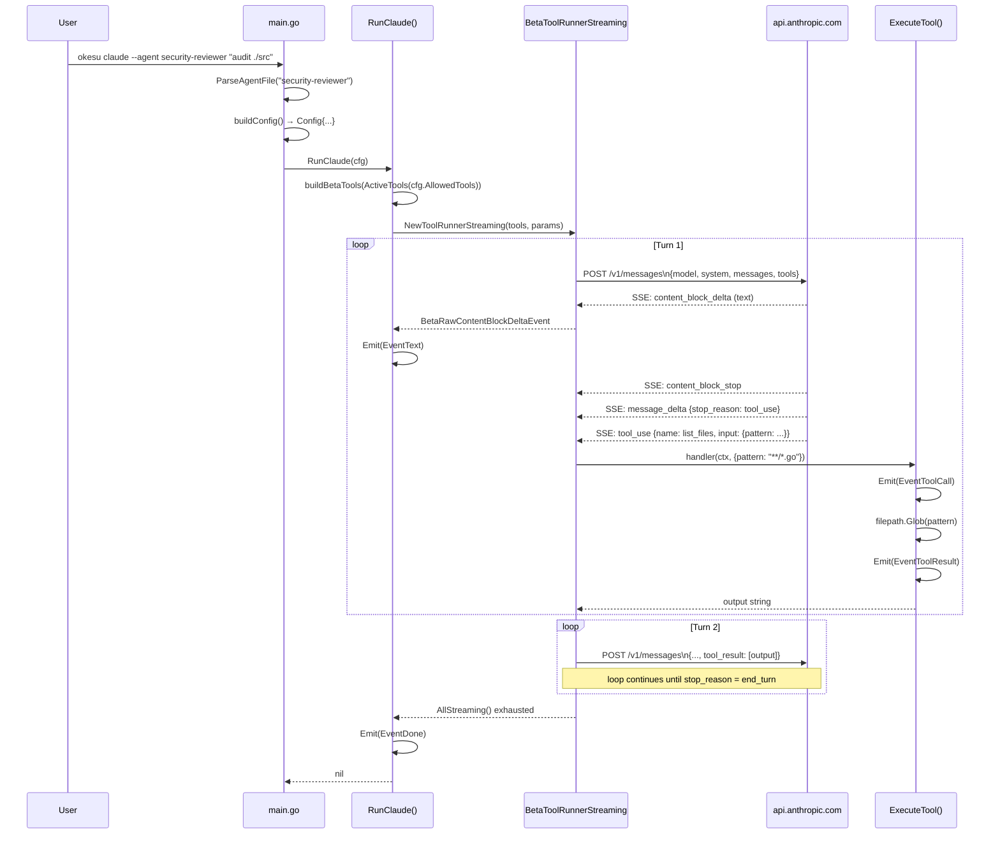

### OpenAI — Full Turn Sequence

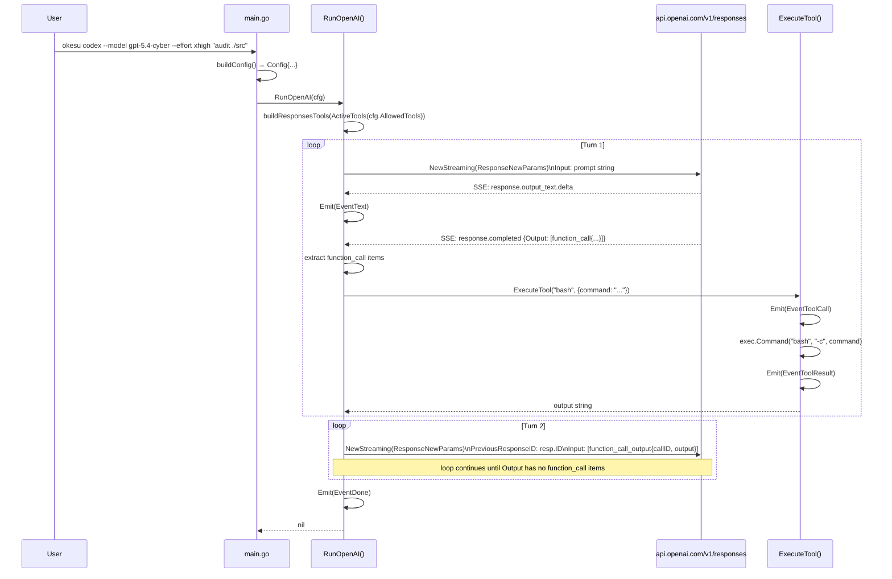

---

## 12. Concurrency Model

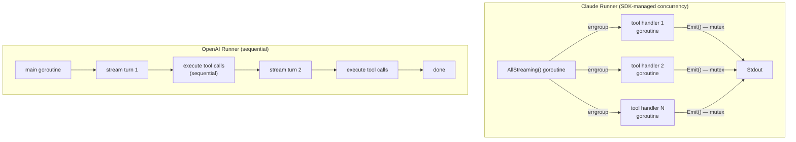

**Claude** — The `BetaToolRunnerStreaming` SDK uses `errgroup` to run tool handlers in parallel when the model issues multiple tool calls in one turn. All tool handlers are independent Go functions sharing the process state. The mutex in `Emit()` ensures output lines are never interleaved.

**OpenAI** — The manual loop runs tool calls sequentially in the main goroutine. No additional goroutines are spawned. The mutex in `Emit()` is still present for correctness but is not strictly needed.

---

## 13. Data Structures Reference

### Complete Config

```go
type Config struct {
    Provider     string    // "claude" | "codex"
    Model        string    // API model identifier
    Prompt       string    // user task (positional CLI arg)
    SystemPrompt string    // agent file body → system / instructions field
    MaxTokens    int64     // per-response token cap (default 8192)
    APIKey       string    // resolved API key
    Effort       string    // "low"|"medium"|"high"|"xhigh"|"max"
    MaxTurns     int       // agentic loop cap; 0 = unlimited
    AllowedTools []string  // empty = all 5 tools; otherwise filtered subset
}
```

### Tool Definition

```go
type ToolDef struct {
    Name        string
    Description string
    Parameters  map[string]interface{}  // JSON Schema {"type":"object","properties":{...}}
    Required    []string
}
```

### Agent File Definition

```go
type AgentDef struct {
    Name        string   `yaml:"name"`
    Description string   `yaml:"description"`
    Model       string   `yaml:"model"`
    Provider    string   `yaml:"provider"`
    Tools       []string `yaml:"tools"`
    MaxTurns    int      `yaml:"maxTurns"`
    Effort      string   `yaml:"effort"`
    Body        string   // system prompt body
}
```

### JSONL Event

```go
type Event struct {
    Type       EventType   `json:"type"`           // init|text|tool_call|tool_result|done|error
    Provider   string      `json:"provider,omitempty"`
    Model      string      `json:"model,omitempty"`
    Text       string      `json:"text,omitempty"`
    ToolID     string      `json:"tool_id,omitempty"`   // OpenAI call_id
    ToolName   string      `json:"tool_name,omitempty"`
    Input      interface{} `json:"input,omitempty"`
    Output     string      `json:"output,omitempty"`
    Error      string      `json:"error,omitempty"`
    StopReason string      `json:"stop_reason,omitempty"`
    Usage      *Usage      `json:"usage,omitempty"`
    Turn       int         `json:"turn,omitempty"`
    Ts         int64       `json:"ts"`             // Unix milliseconds
}

type Usage struct {
    InputTokens  int64 `json:"input_tokens"`
    OutputTokens int64 `json:"output_tokens"`
}
```

### Provider API Mapping

| Concept | Claude (`agent/claude.go`) | OpenAI (`agent/openai.go`) |
|---|---|---|
| Client | `anthropic.NewClient()` | `openai.NewClient()` |
| API endpoint | `/v1/messages` | `/v1/responses` |
| System prompt | `BetaMessageNewParams.System` | `ResponseNewParams.Instructions` |
| Tool definition | `BetaTool` via `toolrunner.NewBetaTool` | `ToolUnionParam{OfFunction: FunctionToolParam}` |
| Effort / reasoning | `BetaOutputConfigParam{Effort: ...}` | `shared.ReasoningParam{Effort: ...}` |
| Loop management | SDK-managed (`BetaToolRunnerStreaming`) | Manual (`for {}` with `PreviousResponseID`) |
| Multi-turn state | SDK accumulates messages in memory | Server-side via `previous_response_id` |
| Text streaming | `BetaRawContentBlockDeltaEvent → BetaTextDelta` | SSE `response.output_text.delta` event |
| Tool call detection | SDK dispatches to registered handler | Manual: `completedResp.Output[i].Type == "function_call"` |
| Tool result submission | SDK sends `tool_result` content block | `ResponseInputItemParamOfFunctionCallOutput(callID, output)` |
| Stop detection | `stop_reason == "end_turn"` (SDK internal) | `len(toolCalls) == 0` after stream |
