# Okesu Architecture

Okesu is a fully autonomous AI agent runner written in Go. It exposes a single binary with four subcommands (`claude`, `codex`, `auto`, `daemon`) that drive an agentic loop against either the Anthropic or OpenAI API. The agent executes tools — bash, file I/O, search — on the local machine with no sandbox and streams all activity as JSONL to stdout (or to configured sinks).

---

## Table of Contents

1. [High-Level Overview](#1-high-level-overview)
2. [Package Structure](#2-package-structure)
3. [CLI Layer — `main.go`](#3-cli-layer--maingo)
4. [Agent File System](#4-agent-file-system)
5. [Configuration Pipeline](#5-configuration-pipeline)
6. [Tool System — `agent/tools.go`](#6-tool-system--agenttoolsgo)
7. [Claude Runner — `agent/claude.go`](#7-claude-runner--agentclaudego)
8. [OpenAI Runner — `agent/openai.go`](#8-openai-runner--agentopeniago)
9. [JSONL Event Bus — `agent/jsonl.go`](#9-jsonl-event-bus--agentjsonlgo)
10. [Output Sinks — `agent/sinks.go` + `agent/buffer.go`](#10-output-sinks--agentsinksgo--agentbuffergo)
11. [Provider Inference — `auto` Command](#11-provider-inference--auto-command)
12. [Daemon Mode — `agent/daemon.go`](#12-daemon-mode--agentdaemongo)
13. [Pre-Collectors — `agent/collectors.go`](#13-pre-collectors--agentcollectorsgo)
14. [Persistent State — `agent/state.go`](#14-persistent-state--agentstatego)
15. [RBAC Action Filtering — `agent/rbac.go`](#15-rbac-action-filtering--agentrbacgo)
16. [Management Plane — `agent/mgmt.go`](#16-management-plane--agentmgmtgo)
17. [Deployment — systemd + install script](#17-deployment--systemd--install-script)
18. [End-to-End Request Flow](#18-end-to-end-request-flow)
19. [Concurrency Model](#19-concurrency-model)
20. [Data Structures Reference](#20-data-structures-reference)
21. [Control Plane Data Architecture](#21-control-plane-data-architecture)
22. [Lifecycle Management (Phase 7)](#22-lifecycle-management-phase-7)
23. [Hexagonal Architecture (Phase 8 — Ports + Adapters)](#23-hexagonal-architecture-phase-8--ports--adapters)

---

## 1. High-Level Overview

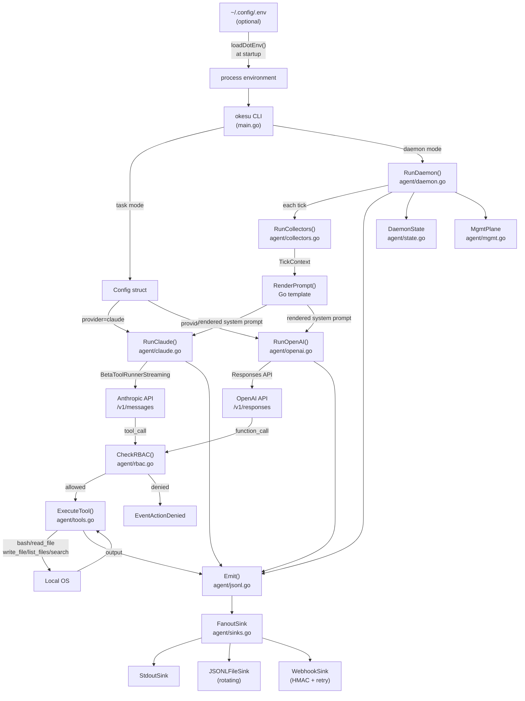
```mermaid
graph TD
    DotEnv["~/.config/.env\n(optional)"] --> |"loadDotEnv()\nat startup"| Env["process environment"]
    Env --> CLI

    CLI["okesu CLI\n(main.go)"] --> |"task mode"| Config["Config struct"]
    CLI --> |"daemon mode"| Daemon["RunDaemon()\nagent/daemon.go"]

    Config --> |"provider=claude"| RunClaude["RunClaude()\nagent/claude.go"]
    Config --> |"provider=codex"| RunOpenAI["RunOpenAI()\nagent/openai.go"]

    Daemon --> |"each tick"| Collectors["RunCollectors()\nagent/collectors.go"]
    Collectors --> |"TickContext"| Template["RenderPrompt()\nGo template"]
    Template --> |"rendered system prompt"| RunClaude
    Template --> |"rendered system prompt"| RunOpenAI

    RunClaude --> |"BetaToolRunnerStreaming"| AnthropicAPI["Anthropic API\n/v1/messages"]
    RunOpenAI --> |"Responses API"| OpenAIAPI["OpenAI API\n/v1/responses"]

    AnthropicAPI --> |"tool_call"| RBAC["CheckRBAC()\nagent/rbac.go"]
    OpenAIAPI --> |"function_call"| RBAC
    RBAC --> |"allowed"| Tools["ExecuteTool()\nagent/tools.go"]
    RBAC --> |"denied"| Denied["EventActionDenied"]

    Tools --> |"bash/read_file\nwrite_file/list_files/search"| OS["Local OS"]
    OS --> |"output"| Tools

    RunClaude --> Emit["Emit()\nagent/jsonl.go"]
    RunOpenAI --> Emit
    Tools --> Emit
    Daemon --> Emit

    Emit --> Sinks["FanoutSink\nagent/sinks.go"]
    Sinks --> Stdout["StdoutSink"]
    Sinks --> File["JSONLFileSink\n(rotating)"]
    Sinks --> Webhook["WebhookSink\n(HMAC + retry)"]

    Daemon --> State["DaemonState\nagent/state.go"]
    Daemon --> Mgmt["MgmtPlane\nagent/mgmt.go"]
```

**Key design decisions:**

- **No sandbox.** Every tool call executes directly on the host. RBAC policies (allow/deny lists) are the only execution gate.
- **JSONL protocol.** Every event — text delta, tool call, tool result, session end — is a single JSON line. All sinks receive the same stream.
- **Provider abstraction.** A single `Config` struct is handed to either `RunClaude` or `RunOpenAI`. Runners handle all SDK translation internally.
- **Agent files as configuration.** `.md` files with YAML frontmatter carry every runtime option — model, tools, schedule, collectors, RBAC, outputs, mgmt plane.
- **Daemon mode.** A persistent tick loop runs the agentic loop on a cron or interval schedule. Pre-collectors inject host data into the system prompt before each tick.

---

## 2. Package Structure

```
okesu/
├── main.go                        # CLI entry point (Cobra commands)
├── go.mod                         # Module: github.com/section9labs/okesu
│
├── agent/
│   ├── claude.go                  # Anthropic agentic loop + Config struct
│   ├── openai.go                  # OpenAI agentic loop (Responses API)
│   ├── tools.go                   # Tool definitions, execution, AgentDef parsing
│   ├── jsonl.go                   # JSONL event types and Emit()
│   ├── daemon.go                  # Daemon loop, scheduler, DaemonConfig
│   ├── collectors.go              # Pre-collector execution and template rendering
│   ├── state.go                   # Persistent daemon state, dedup cache
│   ├── buffer.go                  # MemoryBuffer (ring), FileBuffer (rotating), OutputDef
│   ├── sinks.go                   # Sink interface, StdoutSink, JSONLFileSink,
│   │                              #   WebhookSink, FilteredSink, FanoutSink, global sink
│   ├── rbac.go                    # RBACPolicy, CheckRBAC, EmitActionDenied
│   ├── mgmt.go                    # Management plane: mTLS, register, heartbeat, poll
│   ├── api_policy.go              # APIUnavailablePolicy interface (Control Plane hook)
│   └── apierr.go                  # classifyRunError — SDK/network error detection
│
├── examples/
│   └── agents/
│       └── edr.md                 # Sample EDR daemon agent file
│
├── systemd/
│   └── okesu-agent@.service       # Systemd template unit
│
├── scripts/
│   └── install.sh                 # Install binary, user, dirs, and systemd unit
│
├── Dockerfile                     # Multi-stage build: Go builder → Debian slim runtime
├── .dockerignore
│
├── .claude/
│   ├── settings.local.json
│   └── agents/
│       ├── security-reviewer.md   # Example agent file
│       └── edr.md                 # Symlink → examples/agents/edr.md
│
└── docs/
    ├── architecture.md            # This document
    └── daemon.design.md           # Daemon design discussion
```

**Dependencies:**

| Package | Version | Role |
|---|---|---|
| `github.com/anthropics/anthropic-sdk-go` | v1.37.0 | Anthropic API + BetaToolRunner |
| `github.com/openai/openai-go/v3` | v3.32.0 | OpenAI Responses API |
| `github.com/spf13/cobra` | v1.10.2 | CLI framework |
| `github.com/robfig/cron/v3` | v3.0.1 | Cron expression parsing |
| `gopkg.in/yaml.v3` | v3.0.1 | Agent file frontmatter |

---

## 3. CLI Layer — `main.go`

Okesu uses [Cobra](https://github.com/spf13/cobra) to define four subcommands. All share the same flag set and configuration pipeline.

### Startup Sequence

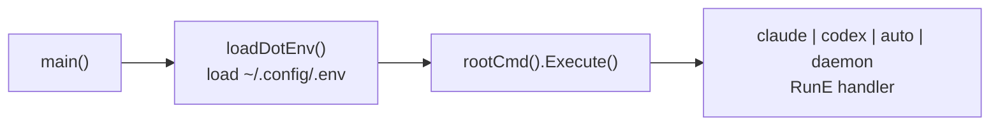
```mermaid
flowchart LR
    main["main()"] --> LD["loadDotEnv()\nload ~/.config/.env"]
    LD --> RC["rootCmd().Execute()"]
    RC --> Cmd["claude | codex | auto | daemon\nRunE handler"]
```

### Environment Loading — `.env` file

`loadDotEnv()` reads `~/.config/.env` at startup and populates missing env vars. Existing shell exports always take precedence.

**Supported formats:**
```bash
ANTHROPIC_API_KEY=sk-ant-abc123
OPENAI_API_KEY="sk-abc123"
export SOME_VAR=value
# comment line — ignored
```

### Command Tree

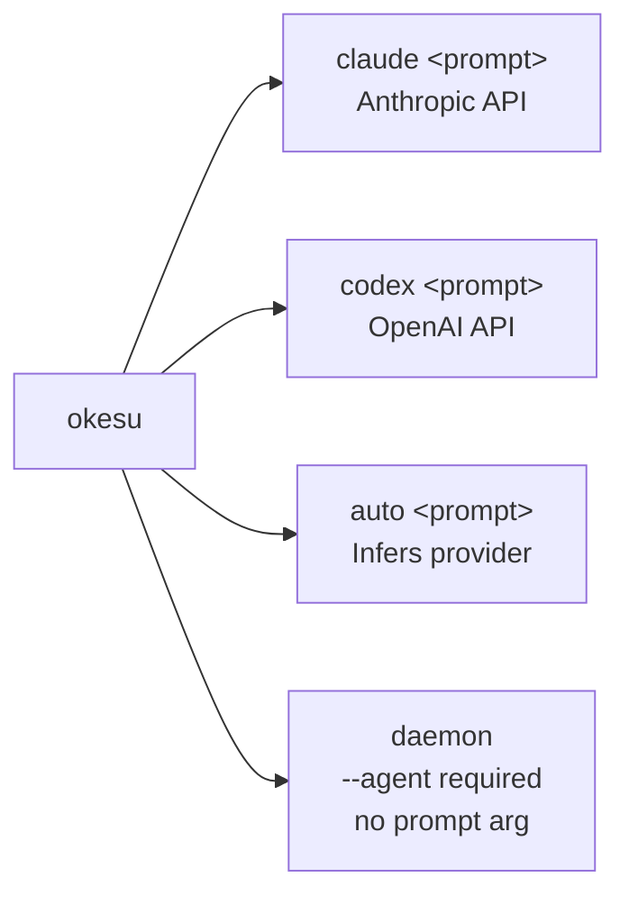
```mermaid
graph LR
    okesu --> claude["claude &lt;prompt&gt;\nAnthropic API"]
    okesu --> codex["codex &lt;prompt&gt;\nOpenAI API"]
    okesu --> auto["auto &lt;prompt&gt;\nInfers provider"]
    okesu --> daemon["daemon\n--agent required\nno prompt arg"]
```

### Shared Flags

All subcommands share:

| Flag | Default | Description |
|---|---|---|
| `--model` | | Model override |
| `--system` | | Path to system prompt file |
| `--agent` | | Agent file name (searches `.claude/agents/`, `~/.claude/agents/`, etc.) |
| `--api-key` | | API key override |
| `--max-tokens` | 8192 | Token cap per response |
| `--effort` | | Reasoning depth: `low\|medium\|high\|xhigh\|max` |
| `--max-turns` | 0 | Loop cap (0 = unlimited) |

The `daemon` subcommand adds:

| Flag | Description |
|---|---|
| `--interval` | Override tick interval (e.g. `30s`, `5m`) |
| `--cron` | Override cron schedule (e.g. `"0 * * * *"`) |

### Flag Precedence

```
CLI flag  >  agent file frontmatter  >  built-in default
```

### API Key Resolution

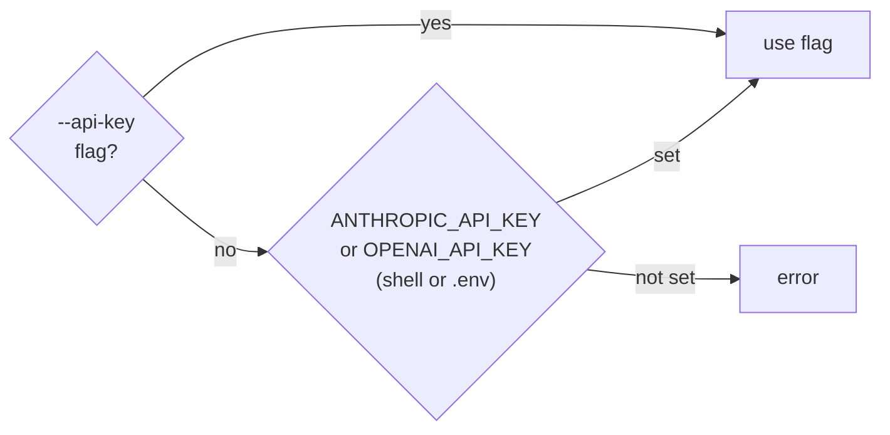
```mermaid
flowchart LR
    F{"--api-key\nflag?"}
    F --> |"yes"| Use["use flag"]
    F --> |"no"| E{"ANTHROPIC_API_KEY\nor OPENAI_API_KEY\n(shell or .env)"}
    E --> |"set"| Use
    E --> |"not set"| Err["error"]
```

---

## 4. Agent File System

Agent files are Markdown with YAML frontmatter. They encode both persona (body = system prompt) and full runtime configuration (frontmatter).

### File Discovery

`ParseAgentFile(name)` searches four directories, stopping at the first match:

```
1. .claude/agents/<name>.md       (project-local)
2. .codex/agents/<name>.md        (project-local)
3. ~/.claude/agents/<name>.md     (user-global)
4. ~/.codex/agents/<name>.md      (user-global)
```

### Full Frontmatter Schema

```yaml
---
name: edr-agent
description: Endpoint detection and response daemon
model: claude-mythos-preview
provider: claude               # "claude" | "codex"
tools: [bash, read_file, search]
maxTurns: 50
effort: high

# Daemon scheduling
mode: daemon
interval: 60s                  # OR use cron:
cron: "*/5 * * * *"
overlap: skip                  # "skip" | "queue"
stateDir: /var/lib/okesu/edr
dedupeTtl: 1h

# Pre-collectors (run before each tick)
collectors:
  - name: processes
    command: ps aux
    timeout: 10s
  - name: netstat
    command: ss -tnp
    timeout: 10s

# Output sinks
outputs:
  - type: stdout
  - type: file
    path: /var/log/okesu/edr.jsonl
    maxBytes: 104857600         # 100 MB rotation
  - type: webhook
    url: https://siem.example.com/ingest
    secret: hmac-signing-secret
    retries: 3

# RBAC action policy
actions:
  rbac:
    deny:
      - tool: bash
        reason: no arbitrary shell in production
    allow:
      - tool: read_file
      - tool: search

# Management plane
management:
  url: https://mgmt.example.com
  heartbeatSec: 30
  pollSec: 60
  certDir: /etc/okesu
---

You are an autonomous EDR agent. Your role is to...

<!-- Go template directives are expanded before each tick: -->
Current time: {{ .TickTime }}
Host: {{ .HostID }} | Region: {{ .CloudRegion }}
Last run: {{ .LastRunISO }}

=== Running Processes ===
{{ (index .Collectors "processes").Output }}

=== Network Connections ===
{{ (index .Collectors "connections").Output }}
```

### AgentDef Struct (full)

```go
type AgentDef struct {
    // Task mode
    Name, Description, Model, Provider string
    Tools    []string
    MaxTurns int
    Effort   string

    // Daemon scheduling
    Mode, Interval, Cron, Overlap, StateDir, DedupeTTL string

    // Pre-collectors
    Collectors []CollectorDef

    // Output sinks
    Outputs []OutputDef

    // RBAC
    Actions ActionsConfig

    // Management plane
    Mgmt MgmtConfig

    Body string  // system prompt (after frontmatter)
}
```

---

## 5. Configuration Pipeline

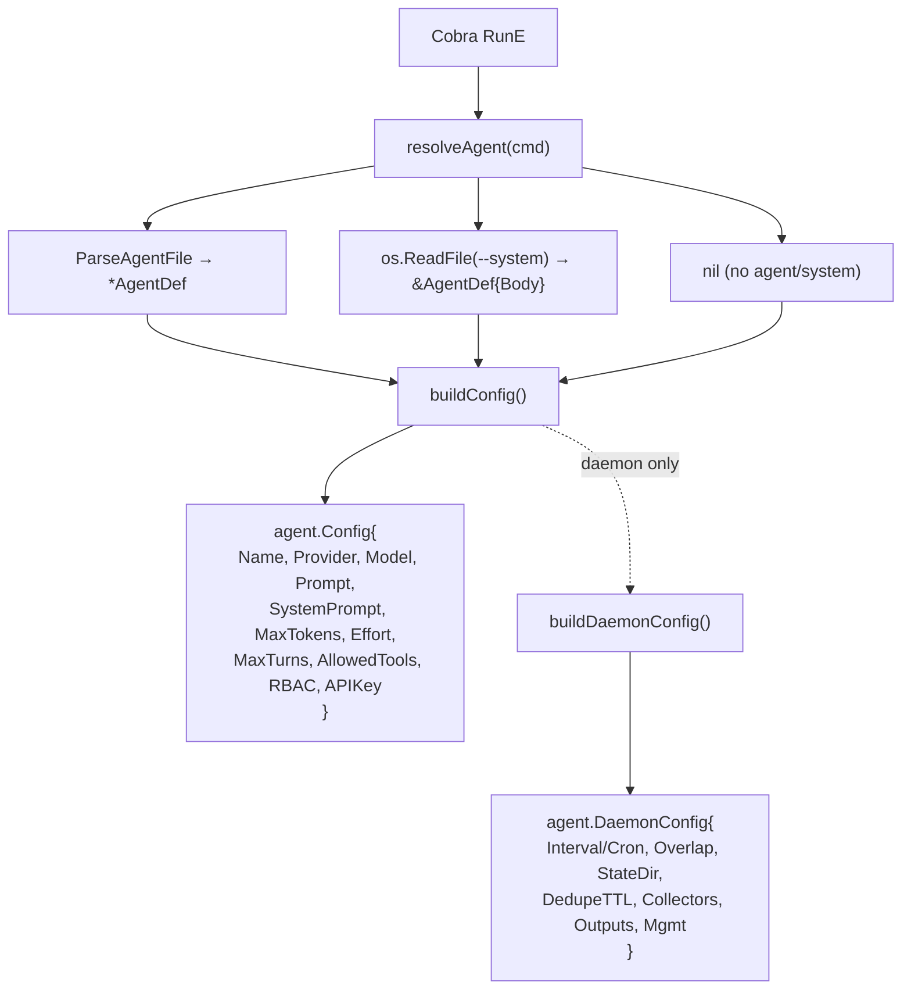
```mermaid
flowchart TD
    Cmd["Cobra RunE"] --> RA["resolveAgent(cmd)"]
    RA --> PAF["ParseAgentFile → *AgentDef"]
    RA --> SF["os.ReadFile(--system) → &AgentDef{Body}"]
    RA --> Nil["nil (no agent/system)"]

    PAF --> BC["buildConfig()"]
    SF --> BC
    Nil --> BC

    BC --> Config["agent.Config{\n  Name, Provider, Model, Prompt,\n  SystemPrompt, MaxTokens, Effort,\n  MaxTurns, AllowedTools, RBAC, APIKey\n}"]

    BC -.daemon only.-> BDC["buildDaemonConfig()"]
    BDC --> DConfig["agent.DaemonConfig{\n  Interval/Cron, Overlap, StateDir,\n  DedupeTTL, Collectors, Outputs, Mgmt\n}"]
```

---

## 6. Tool System — `agent/tools.go`

### The Five Built-in Tools

| Tool | Action | Truncation |
|---|---|---|
| `bash` | `exec.Command("bash", "-c", cmd)` | 64 KB |
| `read_file` | `os.ReadFile(path)` | 128 KB |
| `write_file` | `os.WriteFile(path, content, 0644)` | none |
| `list_files` | `filepath.Glob(pattern)` | none |
| `search` | `grep -rn pattern [--include glob]` | 32 KB |

### Tool Filtering via `ActiveTools`

When `AllowedTools` is non-empty, only listed tools are exposed to the model. Accepts both okesu names and Claude Code CLI names (`Bash`, `Read`, `Edit`, `Glob`, `Grep`).

```go
func ActiveTools(names []string) []ToolDef  // empty = all tools
```

---

## 7. Claude Runner — `agent/claude.go`

Uses the Anthropic SDK's `BetaToolRunnerStreaming`, which manages the multi-turn tool loop and parallel tool execution internally.

### Tool Handler with RBAC

```go
func(ctx context.Context, input map[string]interface{}) (anthropic.BetaToolResultBlockParamContentUnion, error) {
    Emit(Event{Type: EventToolCall, ToolName: td.Name, Input: input})

    // RBAC check before execution
    if ok, reason := CheckRBAC(rbac, td.Name, input); !ok {
        EmitActionDenied(td.Name, input, reason)
        denied := "action denied: " + reason
        Emit(Event{Type: EventToolResult, ToolName: td.Name, Output: denied})
        return anthropic.BetaToolResultBlockParamContentUnion{
            OfText: &anthropic.BetaTextBlockParam{Text: denied},
        }, nil
    }

    output := ExecuteTool(td.Name, input)
    Emit(Event{Type: EventToolResult, ToolName: td.Name, Output: output})
    return anthropic.BetaToolResultBlockParamContentUnion{
        OfText: &anthropic.BetaTextBlockParam{Text: output},
    }, nil
}
```

### Effort / Extended Thinking

```go
msgParams.OutputConfig = anthropic.BetaOutputConfigParam{
    Effort: anthropic.BetaOutputConfigEffort(cfg.Effort),  // "low"|"medium"|"high"|"xhigh"|"max"
}
```

---

## 8. OpenAI Runner — `agent/openai.go`

Uses the **Responses API** (`/v1/responses`). The tool loop is implemented manually; the server retains conversation state via `previous_response_id`.

### Multi-Turn Loop

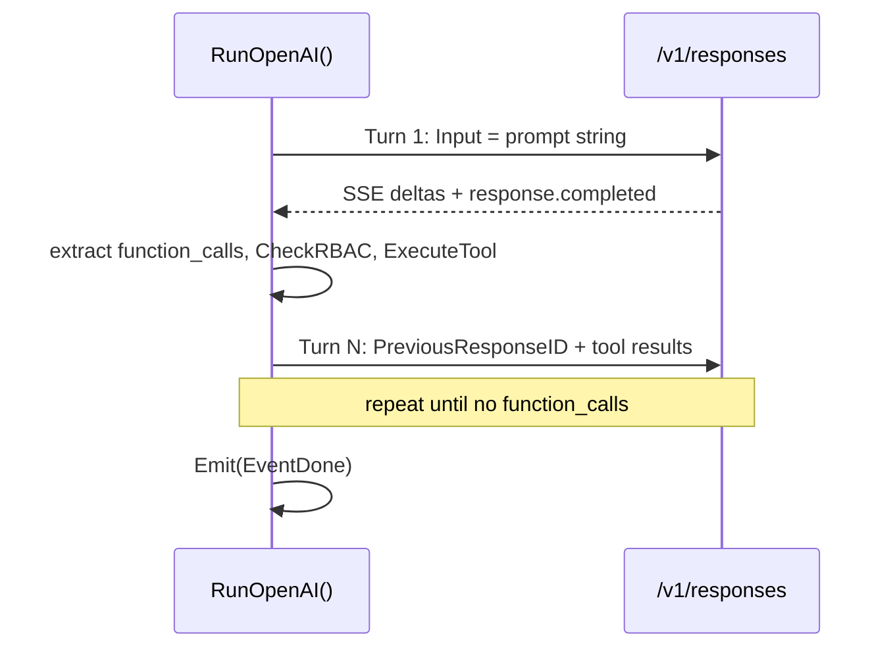
```mermaid
sequenceDiagram
    participant Runner as RunOpenAI()
    participant API as /v1/responses

    Runner->>API: Turn 1: Input = prompt string
    API-->>Runner: SSE deltas + response.completed
    Runner->>Runner: extract function_calls, CheckRBAC, ExecuteTool
    Runner->>API: Turn N: PreviousResponseID + tool results
    Note over Runner,API: repeat until no function_calls
    Runner->>Runner: Emit(EventDone)
```

### Effort / Reasoning

```go
baseParams.Reasoning = shared.ReasoningParam{
    Effort: shared.ReasoningEffort(cfg.Effort),  // "low"|"medium"|"high"|"xhigh"
}
```

---

## 9. JSONL Event Bus — `agent/jsonl.go`

All activity is serialized as JSONL. `Emit()` routes every event through the active global sink (see §10).

### Event Types

| Event | When |
|---|---|
| `init` | Session started |
| `text` | Streaming text delta |
| `tool_call` | Model invoking a tool |
| `tool_result` | Tool execution completed |
| `done` | Session complete with usage |
| `error` | Fatal error |
| `daemon_start` | Daemon process started |
| `daemon_stop` | Clean shutdown |
| `tick_start` | Tick beginning |
| `tick_done` | Tick complete (`completed\|skipped\|error`) |
| `collector_result` | Pre-collector command finished |
| `finding` | Agent-reported finding |
| `action_taken` | Tool executed after RBAC allow (daemon mode) |
| `action_denied` | RBAC blocked a tool call |
| `api_unavailable` | AI provider API unreachable or errored |
| `config_reloaded` | Config reloaded via SIGHUP or management plane |

### Full Event Schema

```go
type Event struct {
    Type       EventType   `json:"type"`
    Provider   string      `json:"provider,omitempty"`
    Model      string      `json:"model,omitempty"`
    Text       string      `json:"text,omitempty"`
    ToolID     string      `json:"tool_id,omitempty"`
    ToolName   string      `json:"tool_name,omitempty"`
    Input      interface{} `json:"input,omitempty"`
    Output     string      `json:"output,omitempty"`
    Error      string      `json:"error,omitempty"`
    StopReason string      `json:"stop_reason,omitempty"`
    Usage      *Usage      `json:"usage,omitempty"`
    Turn       int         `json:"turn,omitempty"`
    Ts         int64       `json:"ts"`                      // Unix ms

    // Daemon lifecycle
    Agent        string `json:"agent,omitempty"`             // agent name
    Host         string `json:"host,omitempty"`              // hostname
    Tick         int64  `json:"tick,omitempty"`              // tick sequence number
    Result       string `json:"result,omitempty"`            // tick_done: completed|skipped|error
    Duration     string `json:"duration,omitempty"`          // tick_done: wall time e.g. "1.4s"
    Findings     int    `json:"findings,omitempty"`          // tick_done: finding count
    ActionsTaken int    `json:"actions_taken,omitempty"`     // tick_done: allowed tool call count

    // Collector
    Collector string `json:"collector,omitempty"`            // collector name
    Bytes     int    `json:"bytes,omitempty"`                // output size

    // Finding
    Severity  string `json:"severity,omitempty"`             // critical|high|medium|low|info
    Title     string `json:"title,omitempty"`                // short human-readable title
    Evidence  string `json:"evidence,omitempty"`             // raw telemetry lines
    Resource  string `json:"resource,omitempty"`             // affected resource (pid:N, path:...)
    DedupKey  string `json:"dedup_key,omitempty"`            // dedup cache key

    // RBAC / action
    Reason string `json:"reason,omitempty"`                  // action_denied: why blocked

    // API unavailability
    StatusCode int `json:"status_code,omitempty"`            // HTTP status (0 = network error)
}
```

---

## 10. Output Sinks — `agent/sinks.go` + `agent/buffer.go`

All events flow through a pluggable global sink. The default (task mode) is `StdoutSink`. Daemon mode initializes `BuildSinks(dcfg.Outputs)` at startup and replaces the global sink before the first `Emit`.

### Sink Interface

```go
type Sink interface {
    Write(line []byte) error
    Close() error
}
```

### Sink Types

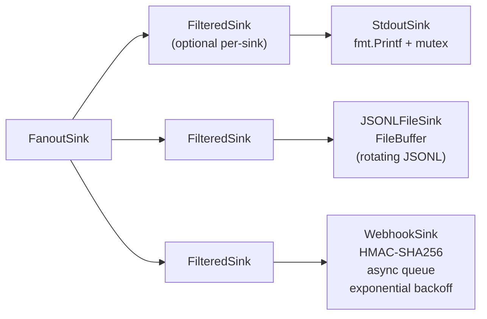
```mermaid
graph LR
    FanoutSink --> FS1["FilteredSink\n(optional per-sink)"]
    FanoutSink --> FS2["FilteredSink"]
    FanoutSink --> FS3["FilteredSink"]
    FS1 --> StdoutSink["StdoutSink\nfmt.Printf + mutex"]
    FS2 --> JSONLFileSink["JSONLFileSink\nFileBuffer\n(rotating JSONL)"]
    FS3 --> WebhookSink["WebhookSink\nHMAC-SHA256\nasync queue\nexponential backoff"]
```

### FilteredSink

Each sink can be wrapped in a `FilteredSink` that only forwards events whose `type` is in an allow-list. Configured via the `events:` field on an output definition. An empty or absent `events` field means all events are forwarded.

```yaml
outputs:
  - type: stdout                           # all events
  - type: file
    path: /var/log/okesu/agent.jsonl
    events: [finding, action_taken, error]  # filtered
  - type: webhook
    url: https://siem.example.com/events
    events: [finding, action_denied]        # filtered — no tick noise
```

### WebhookSink Architecture

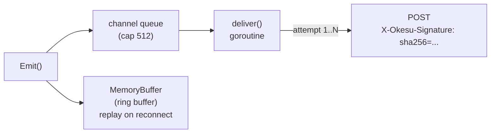
```mermaid
flowchart LR
    Emit["Emit()"] --> Q["channel queue\n(cap 512)"]
    Q --> D["deliver()\ngoroutine"]
    D --> |"attempt 1..N"| HTTP["POST\nX-Okesu-Signature: sha256=..."]
    Emit --> Ring["MemoryBuffer\n(ring buffer)\nreplay on reconnect"]
```

**HMAC signing:**
```go
mac := hmac.New(sha256.New, []byte(s.secret))
mac.Write(line)
req.Header.Set("X-Okesu-Signature", "sha256="+hex.EncodeToString(mac.Sum(nil)))
```

### FileBuffer Rotation

When the log file exceeds `maxBytes`, it is renamed to `<path>.1` and a new file is opened. Only one backup is kept.

### Agent File Configuration

```yaml
outputs:
  - type: stdout
  - type: file
    path: /var/log/okesu/agent.jsonl
    maxBytes: 104857600
  - type: webhook
    url: https://siem.example.com/events
    secret: my-hmac-secret
    retries: 3
    bufferCap: 1024
```

---

## 11. Provider Inference — `auto` Command

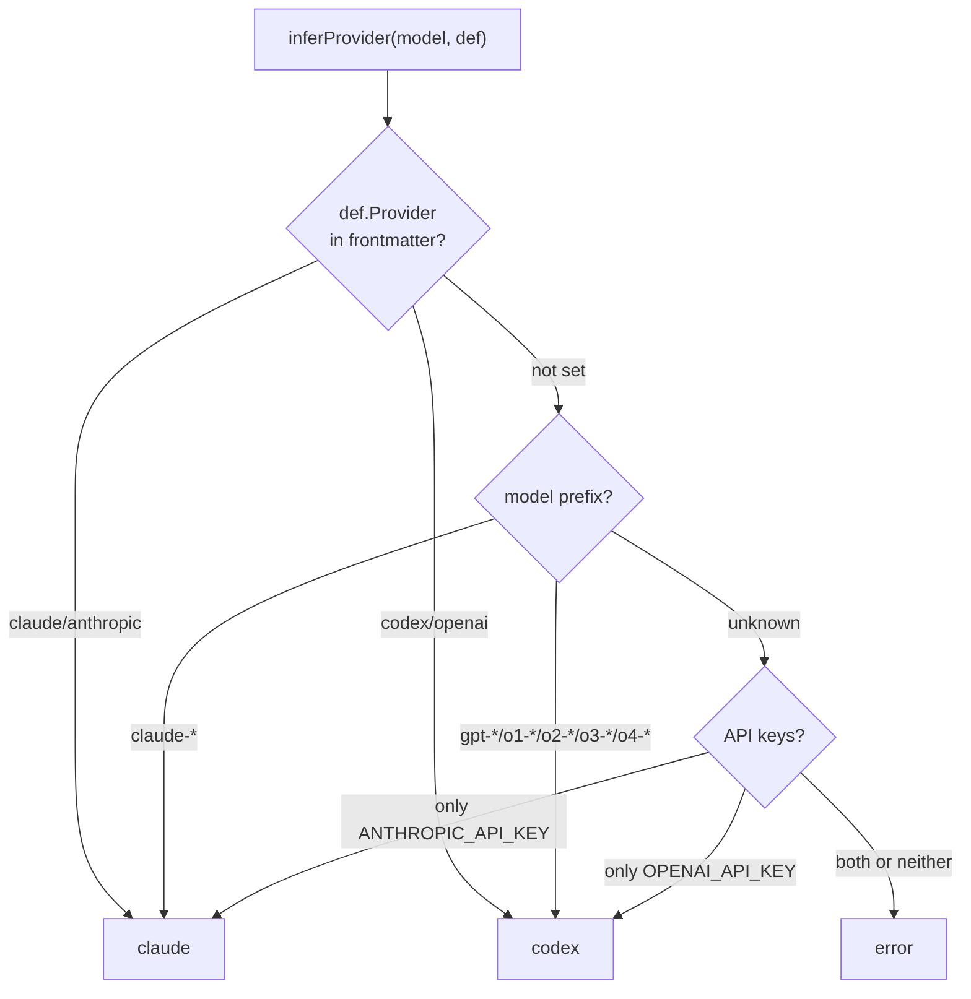
```mermaid
flowchart TD
    Start["inferProvider(model, def)"] --> A{"def.Provider\nin frontmatter?"}
    A --> |"claude/anthropic"| Claude["claude"]
    A --> |"codex/openai"| Codex["codex"]
    A --> |"not set"| B{"model prefix?"}
    B --> |"claude-*"| Claude
    B --> |"gpt-*/o1-*/o2-*/o3-*/o4-*"| Codex
    B --> |"unknown"| C{"API keys?"}
    C --> |"only ANTHROPIC_API_KEY"| Claude
    C --> |"only OPENAI_API_KEY"| Codex
    C --> |"both or neither"| Err["error"]
```

---

## 12. Daemon Mode — `agent/daemon.go`

Daemon mode runs an endless agentic loop on a configurable schedule. Each iteration (tick) runs the full pipeline: collect → render → run → persist.

### Daemon Lifecycle

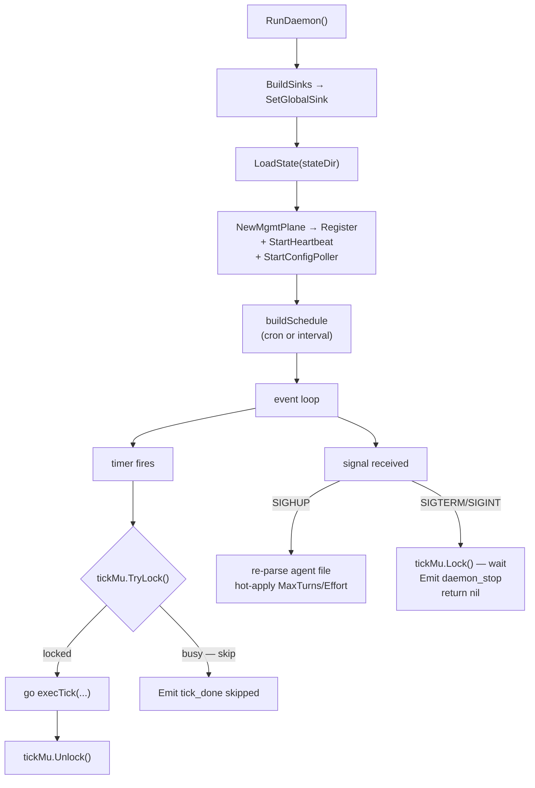
```mermaid
flowchart TD
    Start["RunDaemon()"] --> Sinks["BuildSinks → SetGlobalSink"]
    Sinks --> State["LoadState(stateDir)"]
    State --> Mgmt["NewMgmtPlane → Register\n+ StartHeartbeat\n+ StartConfigPoller"]
    Mgmt --> Schedule["buildSchedule\n(cron or interval)"]
    Schedule --> Loop["event loop"]

    Loop --> Timer["timer fires"]
    Timer --> TryLock{"tickMu.TryLock()"}
    TryLock --> |"locked"| Goroutine["go execTick(...)"]
    TryLock --> |"busy — skip"| Emit["Emit tick_done skipped"]
    Goroutine --> Unlock["tickMu.Unlock()"]

    Loop --> Signal["signal received"]
    Signal --> |"SIGHUP"| Reload["re-parse agent file\nhot-apply MaxTurns/Effort"]
    Signal --> |"SIGTERM/SIGINT"| Drain["tickMu.Lock() — wait\nEmit daemon_stop\nreturn nil"]
```

### Tick Execution (`execTick`)

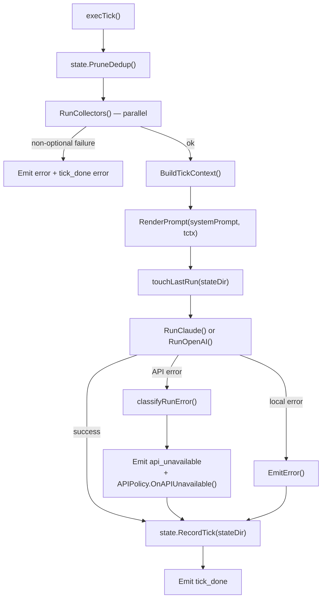
```mermaid
flowchart TD
    T["execTick()"] --> PS["state.PruneDedup()"]
    PS --> RC["RunCollectors() — parallel"]
    RC --> |"non-optional failure"| AbortErr["Emit error + tick_done error"]
    RC --> |"ok"| BTC["BuildTickContext()"]
    BTC --> RP["RenderPrompt(systemPrompt, tctx)"]
    RP --> Touch["touchLastRun(stateDir)"]
    Touch --> Run["RunClaude() or RunOpenAI()"]
    Run --> |"success"| Rec["state.RecordTick(stateDir)"]
    Run --> |"API error"| Classify["classifyRunError()"]
    Run --> |"local error"| LocalErr["EmitError()"]
    Classify --> APIUnavail["Emit api_unavailable\n+ APIPolicy.OnAPIUnavailable()"]
    APIUnavail --> Rec
    LocalErr --> Rec
    Rec --> Done["Emit tick_done"]
```

### Schedule Configuration

Priority (highest to lowest):
1. `--cron` CLI flag
2. `--interval` CLI flag
3. `cron:` in agent file
4. `interval:` in agent file
5. Default: 60 seconds

### Overlap Policy

`overlap: skip` (default) — if a tick is still running when the next fires, the new tick is skipped with a `tick_done result=skipped` event. The `sync.Mutex.TryLock()` pattern serves double duty: overlap detection on the timer path and clean-shutdown wait on the signal path.

### API Unavailability — `agent/apierr.go` + `agent/api_policy.go`

When `RunClaude()` or `RunOpenAI()` returns an error, `classifyRunError()` inspects the error chain to distinguish provider failures from local errors:

| Match | isAPIError | statusCode |
|---|---|---|
| `*anthropic.Error` | true | HTTP status (429, 5xx, etc.) |
| `*openai.Error` | true | HTTP status |
| `*url.Error` (DNS, TLS, timeout) | true | 0 |
| anything else | false | — |

When `isAPIError` is true, `execTick` emits `EventAPIUnavailable` (with `status_code` and `error` fields) and invokes `DaemonConfig.APIPolicy.OnAPIUnavailable()`. When false, the error is treated as a local error via `EmitError()`.

`APIUnavailablePolicy` is the Control Plane integration hook. The default is `NoopAPIPolicy` (do nothing). A future Control Plane implementation can supply a concrete policy that buffers prompts, switches providers, or escalates.

```go
type APIUnavailablePolicy interface {
    OnAPIUnavailable(ctx context.Context, provider, model string, statusCode int, err error)
}
```

---

## 13. Pre-Collectors — `agent/collectors.go`

Pre-collectors are shell commands that run in parallel before each agentic tick. Their output is injected into the system prompt via Go templates, giving the model fresh host context every cycle.

### Execution Flow

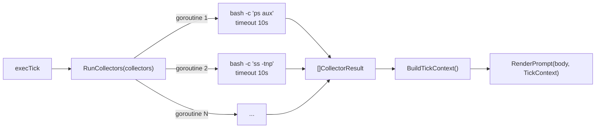
```mermaid
flowchart LR
    Tick["execTick"] --> RC["RunCollectors(collectors)"]
    RC --> |"goroutine 1"| C1["bash -c 'ps aux'\ntimeout 10s"]
    RC --> |"goroutine 2"| C2["bash -c 'ss -tnp'\ntimeout 10s"]
    RC --> |"goroutine N"| CN["..."]
    C1 --> Merge["[]CollectorResult"]
    C2 --> Merge
    CN --> Merge
    Merge --> BTC["BuildTickContext()"]
    BTC --> RP["RenderPrompt(body, TickContext)"]
```

### TickContext Template Data

```go
type TickContext struct {
    // Convenience string aliases (design-specified names for templates)
    HostID      string    // hostname
    CloudRegion string    // AWS/GCP/Azure region or "unknown"
    AgentName   string    // from agent file frontmatter
    TickTime    string    // RFC3339 timestamp of this tick
    LastRunISO  string    // ISO 8601 timestamp of the previous tick
    LastRunFile string    // absolute path to last_run sentinel file
    StateDir    string    // state directory path

    // Strongly-typed fields
    Tick           int64
    Time           time.Time
    Host           string
    Agent          string
    LastRunAt      time.Time
    Collectors     map[string]CollectorResult  // indexed: {{ (index .Collectors "name").Output }}
    CollectorsList []CollectorResult           // iterable: {{ range .CollectorsList }}
}
```

### Template Example

```markdown
---
collectors:
  - name: processes
    command: "ps aux --no-headers"
    timeout: 5s
  - name: connections
    command: "ss -tulnp"
    timeout: 5s
---
You are an EDR agent on host {{ .HostID }} in {{ .CloudRegion }}.
Tick: {{ .Tick }} | Time: {{ .TickTime }} | Last run: {{ .LastRunISO }}

## Telemetry

{{ range .CollectorsList }}
### {{ .Name }}{{ if .Error }} — ERROR: {{ .Error }}{{ end }}{{ if .Skipped }} (skipped){{ end }}
` ` `
{{ .Output }}
` ` `
{{ end }}
```

**Available template functions:**
- `{{ now }}` — current UTC time as RFC3339
- `{{ env "VAR_NAME" }}` — read environment variable
- `{{ cloudRegion }}` — cloud region from `AWS_DEFAULT_REGION` / `AWS_REGION` / `CLOUDSDK_COMPUTE_REGION` / `AZURE_REGION`

---

## 14. Persistent State — `agent/state.go`

`DaemonState` is persisted atomically to `stateDir/<name>/state.json` after every tick. It survives daemon restarts.

### State Contents

```go
type DaemonState struct {
    mu         sync.Mutex       `json:"-"`
    Dedup      map[string]int64 `json:"dedup,omitempty"` // hash → expiry (Unix ms)
    TickCount  int64            `json:"tick_count"`
    ErrorCount int64            `json:"error_count"`     // ticks that ended with an error
    LastTickAt time.Time        `json:"last_tick_at,omitempty"`
}
```

### Dedup Cache

Prevents re-alerting on findings that were already reported within `dedupeTtl`:

```go
func (s *DaemonState) IsDuplicate(text string, ttl time.Duration) bool
func (s *DaemonState) AddToDedup(text string, ttl time.Duration)
func (s *DaemonState) PruneDedup()  // removes expired entries
```

Uses SHA-256 content hashing (64-bit prefix for space efficiency):
```go
func contentHash(text string) string {
    h := sha256.Sum256([]byte(text))
    return fmt.Sprintf("%x", h[:8])
}
```

### Atomic Writes

State is written to `state.json.tmp` then renamed to `state.json` to prevent corruption on crash:
```go
os.WriteFile(path+".tmp", data, 0644)
os.Rename(path+".tmp", path)
```

---

## 15. RBAC Action Filtering — `agent/rbac.go`

RBAC policies enforce allow/deny rules on tool calls **before** `ExecuteTool` is called. Blocked calls return a denial message to the model (not a Go error), so the model can reason about the restriction.

### Evaluation Order

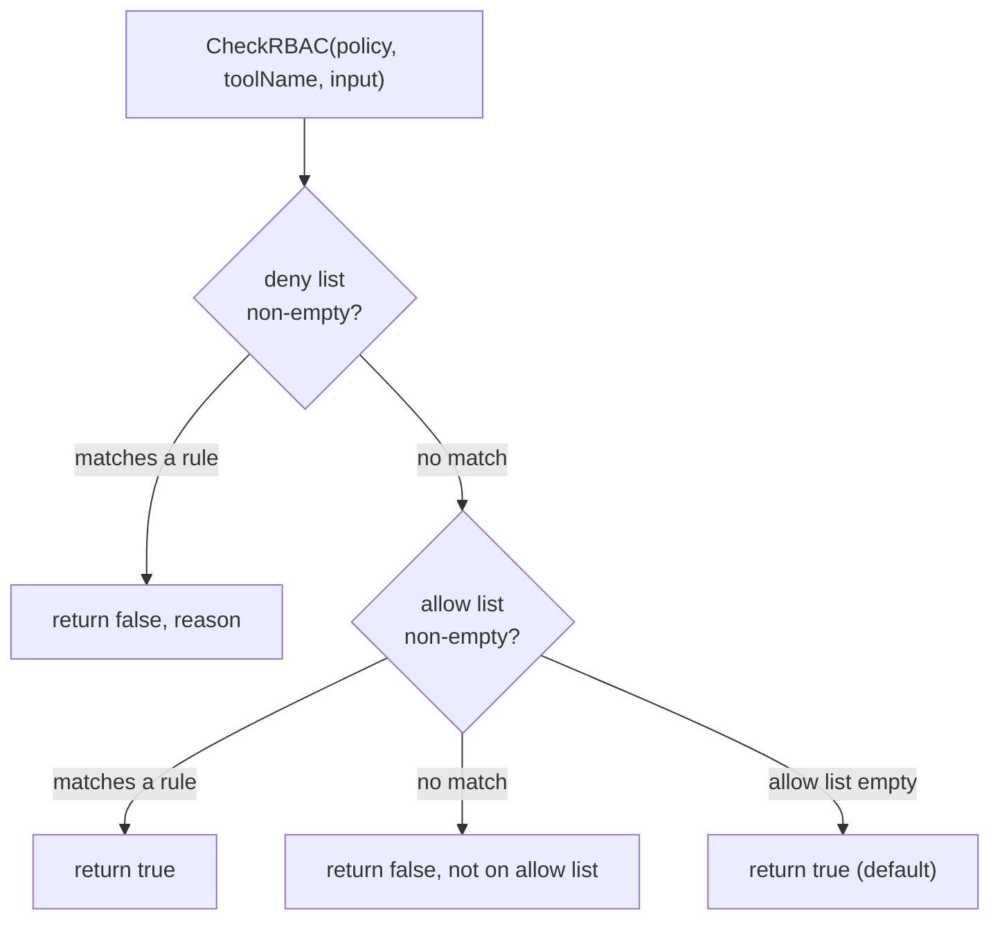
```mermaid
flowchart TD
    Check["CheckRBAC(policy, toolName, input)"] --> D{"deny list\nnon-empty?"}
    D --> |"matches a rule"| Deny["return false, reason"]
    D --> |"no match"| A{"allow list\nnon-empty?"}
    A --> |"matches a rule"| Allow["return true"]
    A --> |"no match"| Block["return false, not on allow list"]
    A --> |"allow list empty"| Allow2["return true (default)"]
```

### Agent File Configuration

```yaml
actions:
  rbac:
    deny:
      - tool: bash
        reason: arbitrary shell not permitted in production
    allow:
      - tool: read_file
      - tool: search
      - tool: list_files
```

### Integration Points

- **Claude** (`buildBetaTools`): RBAC is checked inside every tool handler closure.
- **OpenAI** (`RunOpenAI`): RBAC is checked in the tool execution loop before `ExecuteTool`.
- **Denied calls**: emit `EventActionDenied` + return `"action denied: <reason>"` to the model.

---

## 16. Management Plane — `agent/mgmt.go`

The management plane is an optional central server that daemons connect to for registration, heartbeat reporting, and remote config delivery. The connection uses mutual TLS (TLS 1.3).

### Architecture

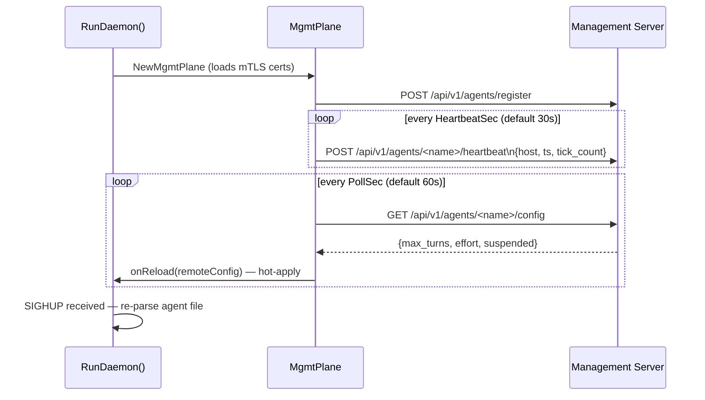
```mermaid
sequenceDiagram
    participant Daemon as RunDaemon()
    participant Mgmt as MgmtPlane
    participant Server as Management Server

    Daemon->>Mgmt: NewMgmtPlane (loads mTLS certs)
    Mgmt->>Server: POST /api/v1/agents/register
    loop every HeartbeatSec (default 30s)
        Mgmt->>Server: POST /api/v1/agents/<name>/heartbeat\n{host, ts, tick_count}
    end
    loop every PollSec (default 60s)
        Mgmt->>Server: GET /api/v1/agents/<name>/config
        Server-->>Mgmt: {max_turns, effort, suspended}
        Mgmt->>Daemon: onReload(remoteConfig) — hot-apply
    end
    Daemon->>Daemon: SIGHUP received — re-parse agent file
```

### Certificate Layout

```
/etc/okesu/
├── client.crt    ← agent client certificate
├── client.key    ← agent private key
└── ca.crt        ← CA certificate (verifies management server)
```

`NewMgmtPlane` returns `(nil, nil)` when `management.url` is empty — daemons operate normally without a management plane. If cert loading fails, a warning is emitted and the daemon continues without management connectivity.

### Agent File Configuration

```yaml
management:
  url: https://mgmt.example.com
  heartbeatSec: 30
  pollSec: 60
  certDir: /etc/okesu
```

### SIGHUP Hot Reload

On `SIGHUP`, the daemon re-parses the agent file from disk and hot-applies `maxTurns` and `effort`. The next tick uses the updated config. No process restart is needed.

```bash
# Trigger hot reload:
systemctl kill --signal=SIGHUP okesu-agent@edr-agent
```

### Known-Issues Pull Cache (Phase 13)

`MgmtPlane.StartKnownIssuesPoller` runs alongside the config poller (60s
default). On each tick it calls
`GET /api/v1/agents/{name}/known-issues` and caches a fingerprint →
`{status, triage_note, updated_at}` map in memory. The harvester
consults this cache before emitting any finding:

| Cached status | Harvester behaviour |
|---|---|
| not present, or `open` | fall through to the local fingerprint dedup |
| `false_positive` | suppress silently forever (until reopened) |
| `acknowledged` / `investigating` / `resolved` / `wontfix` | suppress until reopened |

A suppression hit does **not** add the fingerprint to the local
`state.Dedup` cache, so an un-triage by the operator takes effect on
the very next tick rather than after `dedupeTtl` expires.

### `lookup_findings` LLM Tool (Phase 13)

When a management plane is configured, the daemon registers a built-in
tool the model can call when investigating:

```
lookup_findings(query: string, limit: int = 5)
  → [{ fingerprint, title, severity, status, host,
       resource, triage_note, last_seen, occurrence_count }]
```

The handler is `MgmtPlane.LookupFindings`, which calls
`GET /api/v1/agents/{name}/findings/search?q=...&limit=N` over the
existing mTLS client. Server-side it's a `LIKE` search across title,
resource, network endpoint, path, process name, and dedup_key, scoped
to the calling agent across all hosts. Triaged matches surface above
untriaged so the LLM sees the operator's classification first.

The tool is auto-included in the per-tick `cfg.AllowedTools` list when
mgmt is wired (operators don't need to edit each agent file). System
prompts include a small instruction block teaching the model to call
it before reporting and to honour the `status` field on results.

This forms the third dedup layer:

| Layer | When it runs | Catches |
|---|---|---|
| Local fingerprint cache | every harvested finding | repeats within `dedupeTtl` |
| Pulled known-issues cache | every harvested finding | operator-triaged, fleet-wide |
| `lookup_findings` tool | only when LLM asks | semantic neighbours, related context |

Triage notes are **not** auto-injected into the system prompt — they
surface only when the LLM explicitly looks them up, keeping daemon
prompts compact regardless of triage history size.

---

## 17. Deployment — systemd + install script

### systemd Template Unit

`systemd/okesu-agent@.service` is a template unit. One instance per agent name:

```bash
# Enable and start the "edr-agent" agent:
systemctl enable okesu-agent@edr-agent
systemctl start  okesu-agent@edr-agent

# Follow logs:
journalctl -fu okesu-agent@edr-agent

# Hot reload config:
systemctl kill --signal=SIGHUP okesu-agent@edr-agent
```

**Security hardening in the unit:**
- Runs as unprivileged `okesu` system user
- `ProtectSystem=strict` — OS directories read-only
- `NoNewPrivileges=yes`
- `PrivateTmp=yes`
- `ReadWritePaths` limited to state dir, config dir, and `/tmp`

**Per-agent secrets** go in `/etc/okesu/agents/<name>.env`:
```bash
# /etc/okesu/agents/edr-agent.env
ANTHROPIC_API_KEY=sk-ant-...
WEBHOOK_SECRET=hmac-signing-key
```

### Install Script

```bash
sudo ./scripts/install.sh --binary ./okesu --agent edr-agent
```

Steps performed:
1. Creates `okesu` system user (if absent)
2. Installs binary to `/usr/local/bin/okesu`
3. Creates `/etc/okesu/` and `/var/lib/okesu/` directories
4. Installs systemd template unit
5. `systemctl daemon-reload`
6. Enables and starts the named agent instance

### Directory Layout (production)

```
/usr/local/bin/okesu              ← binary
/etc/okesu/
├── client.crt / client.key / ca.crt ← mTLS certs
└── agents/
    ├── edr.md                        ← agent file
    └── edr.env                       ← secrets (chmod 600)
/var/lib/okesu/
└── edr-agent/
    ├── state.json                    ← dedup cache + tick count
    ├── last_run                      ← last tick timestamp
    └── ...
```

### Docker

A multi-stage `Dockerfile` is provided for container-based deployment and testing. The build stage compiles a static Go binary; the runtime stage runs on `debian:bookworm-slim` with `procps`, `iproute2`, `findutils`, and `util-linux` for the pre-collectors.

```bash
# Build
docker build -t okesu:dev .

# Run the EDR agent with a 30s tick interval
docker run --rm -it \
  -e ANTHROPIC_API_KEY="$ANTHROPIC_API_KEY" \
  okesu:dev daemon --agent edr --interval 30s

# Pipe through jq for readable output
docker run --rm -it \
  -e ANTHROPIC_API_KEY="$ANTHROPIC_API_KEY" \
  okesu:dev daemon --agent edr --interval 30s 2>/dev/null | jq .
```

The container requires only an API key at runtime. No management plane, mTLS certificates, or webhook endpoint is needed for basic testing.

---

## 18. End-to-End Request Flow

### Task Mode — Claude

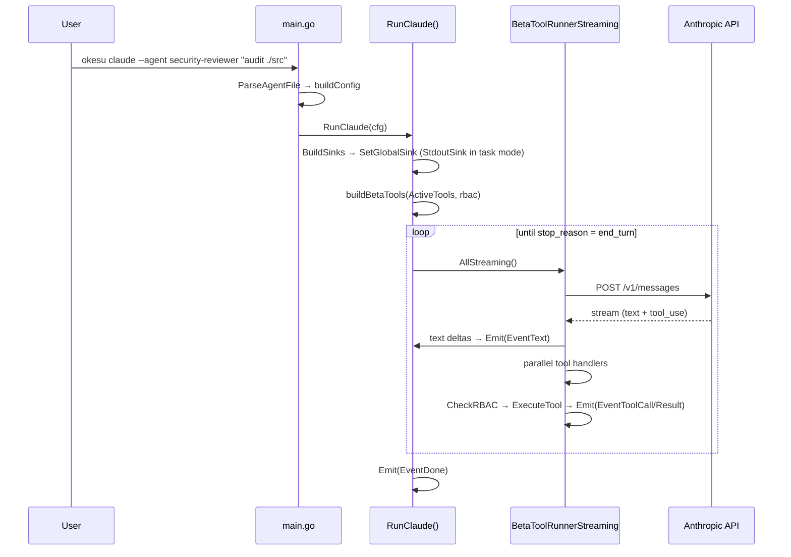
```mermaid
sequenceDiagram
    participant User
    participant Main as main.go
    participant Runner as RunClaude()
    participant SDK as BetaToolRunnerStreaming
    participant API as Anthropic API

    User->>Main: okesu claude --agent security-reviewer "audit ./src"
    Main->>Main: ParseAgentFile → buildConfig
    Main->>Runner: RunClaude(cfg)
    Runner->>Runner: BuildSinks → SetGlobalSink (StdoutSink in task mode)
    Runner->>Runner: buildBetaTools(ActiveTools, rbac)
    loop until stop_reason = end_turn
        Runner->>SDK: AllStreaming()
        SDK->>API: POST /v1/messages
        API-->>SDK: stream (text + tool_use)
        SDK->>Runner: text deltas → Emit(EventText)
        SDK->>SDK: parallel tool handlers
        SDK->>SDK: CheckRBAC → ExecuteTool → Emit(EventToolCall/Result)
    end
    Runner->>Runner: Emit(EventDone)
```

### Daemon Mode — Full Tick

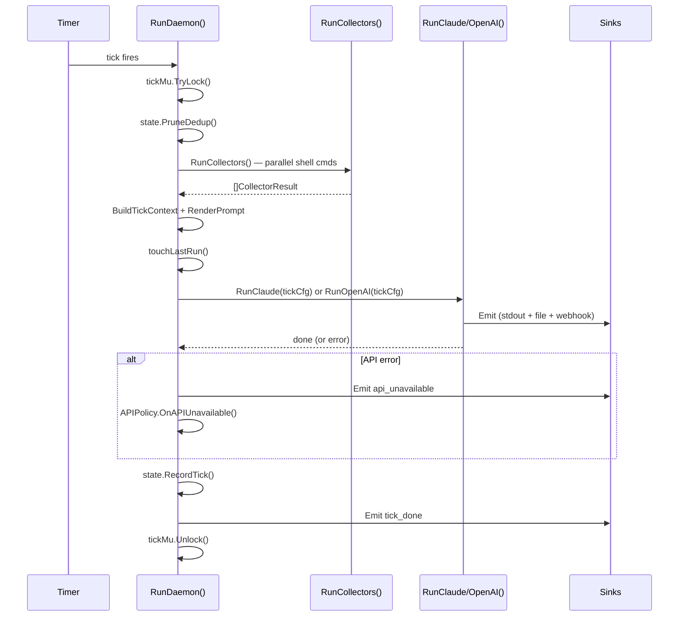
```mermaid
sequenceDiagram
    participant Timer
    participant Daemon as RunDaemon()
    participant Collectors as RunCollectors()
    participant Runner as RunClaude/OpenAI()
    participant Sinks

    Timer->>Daemon: tick fires
    Daemon->>Daemon: tickMu.TryLock()
    Daemon->>Daemon: state.PruneDedup()
    Daemon->>Collectors: RunCollectors() — parallel shell cmds
    Collectors-->>Daemon: []CollectorResult
    Daemon->>Daemon: BuildTickContext + RenderPrompt
    Daemon->>Daemon: touchLastRun()
    Daemon->>Runner: RunClaude(tickCfg) or RunOpenAI(tickCfg)
    Runner->>Sinks: Emit (stdout + file + webhook)
    Runner-->>Daemon: done (or error)
    alt API error
        Daemon->>Sinks: Emit api_unavailable
        Daemon->>Daemon: APIPolicy.OnAPIUnavailable()
    end
    Daemon->>Daemon: state.RecordTick()
    Daemon->>Sinks: Emit tick_done
    Daemon->>Daemon: tickMu.Unlock()
```

---

## 19. Concurrency Model

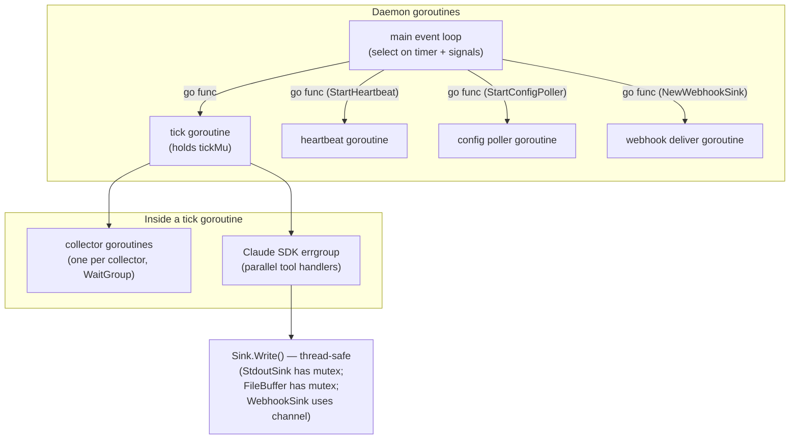
```mermaid
graph TD
    subgraph "Daemon goroutines"
        ML["main event loop\n(select on timer + signals)"]
        TG["tick goroutine\n(holds tickMu)"]
        HB["heartbeat goroutine"]
        CP["config poller goroutine"]
        WH["webhook deliver goroutine"]
        ML --> |"go func"| TG
        ML --> |"go func (StartHeartbeat)"| HB
        ML --> |"go func (StartConfigPoller)"| CP
        ML --> |"go func (NewWebhookSink)"| WH
    end

    subgraph "Inside a tick goroutine"
        TG --> Col["collector goroutines\n(one per collector, WaitGroup)"]
        TG --> SDK["Claude SDK errgroup\n(parallel tool handlers)"]
    end

    SDK --> Sink["Sink.Write() — thread-safe\n(StdoutSink has mutex;\nFileBuffer has mutex;\nWebhookSink uses channel)"]
```

**Thread safety guarantees:**
- `Emit()` → `emitToSink()` → `sink.Write()`: each sink implementation is mutex-protected.
- `tickMu sync.Mutex` serializes tick execution and provides clean-shutdown wait.
- `DaemonState.mu` protects dedup cache from concurrent reads/writes.
- `MgmtPlane.mu sync.RWMutex` protects `remote` config from concurrent reads/writes.

---

## 20. Data Structures Reference

### Config (full)

```go
type Config struct {
    Name         string      // agent name (from agent file)
    Provider     string      // "claude" | "codex"
    Model        string
    Prompt       string      // user task
    SystemPrompt string      // agent file body (may contain Go template directives)
    MaxTokens    int64
    APIKey       string
    Effort       string      // "low"|"medium"|"high"|"xhigh"|"max"
    MaxTurns     int         // 0 = unlimited
    AllowedTools []string    // empty = all tools
    RBAC         *RBACPolicy // nil = no restrictions
    IsDaemon     bool        // true when running under RunDaemon (enables action_taken events)
}
```

### DaemonConfig (full)

```go
type DaemonConfig struct {
    Interval   time.Duration
    Cron       string
    Overlap    string                // "skip" | "queue"
    StateDir   string
    DedupeTTL  time.Duration
    Collectors []CollectorDef
    Outputs    []OutputDef
    Mgmt       MgmtConfig
    APIPolicy  APIUnavailablePolicy  // nil defaults to NoopAPIPolicy
}
```

### CollectorDef

```go
type CollectorDef struct {
    Name       string        `yaml:"name"`
    Command    string        `yaml:"command"`
    Timeout    time.Duration `yaml:"-"`                 // parsed from TimeoutStr
    TimeoutStr string        `yaml:"timeout,omitempty"` // e.g. "30s"
    Optional   bool          `yaml:"optional"`          // true: failure = skip; false: failure = abort tick
}
```

### RBACPolicy

```go
type RBACPolicy struct {
    Allow []RBACRule `yaml:"allow"`
    Deny  []RBACRule `yaml:"deny"`
}

type RBACRule struct {
    Tool    string `yaml:"tool"`
    Pattern string `yaml:"pattern,omitempty"`
    Reason  string `yaml:"reason,omitempty"`
}
```

### OutputDef

```go
type OutputDef struct {
    Type      string   `yaml:"type"`               // "stdout" | "file" | "webhook"
    Path      string   `yaml:"path,omitempty"`     // file: JSONL log path
    MaxBytes  int64    `yaml:"maxBytes,omitempty"` // file: rotation threshold
    URL       string   `yaml:"url,omitempty"`      // webhook: endpoint URL
    Secret    string   `yaml:"secret,omitempty"`   // webhook: HMAC-SHA256 signing secret
    Retries   int      `yaml:"retries,omitempty"`  // webhook: max delivery attempts
    BufferCap int      `yaml:"bufferCap,omitempty"`// webhook: ring buffer size
    Events    []string `yaml:"events,omitempty"`   // event type allow-list (empty = all)
}
```

### Provider API Mapping

| Concept | Claude | OpenAI |
|---|---|---|
| Client | `anthropic.NewClient()` | `openai.NewClient()` |
| Endpoint | `/v1/messages` | `/v1/responses` |
| System prompt | `BetaMessageNewParams.System` | `ResponseNewParams.Instructions` |
| Tool definition | `BetaTool` via `toolrunner.NewBetaTool` | `ToolUnionParam{OfFunction: FunctionToolParam}` |
| Effort | `BetaOutputConfigParam{Effort}` | `shared.ReasoningParam{Effort}` |
| Loop management | SDK-managed (`BetaToolRunnerStreaming`) | Manual with `PreviousResponseID` |
| Multi-turn state | SDK in-memory | Server-side via `previous_response_id` |
| Text streaming | `BetaRawContentBlockDeltaEvent` | SSE `response.output_text.delta` |
| Tool call detection | SDK dispatches to handler | Manual: `item.Type == "function_call"` |
| Tool result | `BetaToolResultBlockParamContentUnion` | `ResponseInputItemParamOfFunctionCallOutput` |

---

## 21. Control Plane Data Architecture

Sections 1–20 describe the daemon. The **Control Plane** is a separate
Go service (`cmd/cp/`) that ingests JSONL events from daemon webhooks,
projects them into structured tables, and serves the operator UI plus
the agent-facing management plane. This section focuses on the
non-obvious data-layer choices.

### 21.1 Findings: from event to indexed issue

A finding flows through the system in three shapes:

```
┌────────────────────┐    ┌──────────────────┐    ┌────────────────────┐
│ LLM-written file   │ →  │ JSONL event line │ →  │ findings row       │
│ {stateDir}/        │    │ on the wire      │    │ + structured cols  │
│  findings/<ts>.json│    │                  │    │                    │
└────────────────────┘    └──────────────────┘    └────────────────────┘
       harvester          webhook receiver          insert + index
       (daemon)           (CP)                      (CP)
```

The harvester (Phase 12) is responsible for two kinds of normalization
before the event leaves the daemon:

1. **Title volatility stripping.** `agent.NormalizeFindingTitle()`
   removes prefixes/suffixes like `PERSISTENT (TICK 87): `,
   `[5+ ticks] `, `— 7th Consecutive Tick`. The same regex runs
   server-side as defense-in-depth for events from external producers
   via `/api/findings/ingest`.

2. **Stable fingerprint computation.** A SHA-256 prefix of:
   ```
   severity | normalized_title | resource_root |
   process_pid | path | network_endpoint | dedup_key
   ```
   where `resource_root` extracts the first stable token of `resource`
   (e.g. `host:api.example.com:443` → `host:api.example.com`, port
   stripped). This fingerprint is wired as the outbound `dedup_key`,
   so the CP's grouping query collapses LLM variants automatically.

The `findings` table after Phase 12 has eight indexed enrichment
columns (`category`, `process_pid`, `process_name`, `path`,
`network_endpoint`, `cve`, `tags`, `attributes`) plus the Phase 13
triage columns (`status`, `triage_note`, `triaged_at`, `triaged_by_*`).
Most are nullable; agents fill what they extract, the harvester infers
the rest from `resource` shapes (`pid:N` → process, `path:/...` →
file, etc.).

### 21.2 Three-layer dedup architecture

The dedup layers compose: each catches a different category of repeat,
escalating in cost.

```
┌──────────────────────────────────────────────────────────────────┐
│ Layer 1: Local fingerprint cache (state.Dedup)                   │
│   in-memory map of fingerprint → expiry_ms                       │
│   keyed by the same fingerprint that goes on the wire            │
│   PruneDedup at tick start drops entries past expiry             │
│   pure CPU, no API cost                                          │
└──────────────────────────────────────────────────────────────────┘
                            ↓ miss
┌──────────────────────────────────────────────────────────────────┐
│ Layer 2: Pulled known-issues cache                               │
│   GET /api/v1/agents/{name}/known-issues every 60s               │
│   in-memory map of fingerprint → {status, triage_note}           │
│   suppress on any non-open status                                │
│   ~one tiny GET per minute, regardless of fleet size             │
└──────────────────────────────────────────────────────────────────┘
                            ↓ miss (or LLM curiosity)
┌──────────────────────────────────────────────────────────────────┐
│ Layer 3: lookup_findings tool                                    │
│   GET /api/v1/agents/{name}/findings/search?q=...                │
│   LIKE search across title/resource/path/endpoint/process/key    │
│   one tool call per LLM-driven look-up; on-demand                │
└──────────────────────────────────────────────────────────────────┘
```

A subtle invariant: when Layer 2 suppresses a finding, the harvester
does **not** add the fingerprint to Layer 1's local cache. This means
an un-triage by the operator (status → open) takes effect on the very
next tick, instead of being shadowed by a stale Layer-1 entry until
`dedupeTtl` expires.

Triage notes are stored in the DB and surfaced via the
`lookup_findings` tool — they are intentionally **not** injected into
the LLM system prompt, which keeps the prompt compact regardless of
how many findings have been triaged. The LLM pulls notes only when it
asks.

### 21.3 Agents identity: (name, host) composite key

Pre-Phase-12, the `agents` table had `name` as the sole primary key.
Real fleets routinely run the same agent (e.g. `edr`) on dozens of
hosts; under the old schema they collapsed into one row and only the
most-recent heartbeat survived.

Migration 012 rebuilds the table with `PRIMARY KEY (name, host)`. The
existing single-name lookup path (`AgentByName`) is preserved for
code that only has the cert CN — it returns the most-recently-active
row. New code uses `AgentByNameHost(name, host)` for an exact match.

`SetDesiredConfig` is intentionally still keyed by `name` only —
operators tune *the agent*, not a specific host instance, so a
`MaxTurns` change rolls out to every host running that agent on the
next config poll.

### 21.4 Schema migration policy

Migrations are SQL files embedded via `go:embed` and applied in numeric
order. Pre-Phase-12 they were all idempotent (`CREATE TABLE IF NOT
EXISTS`, `CREATE INDEX IF NOT EXISTS`), which let the runner re-apply
them on every boot without harm.

Phase 12 introduced the first `ALTER TABLE` and `DROP TABLE`
migrations, which are NOT safely re-runnable. The runner now uses a
`schema_migrations(version PK)` table to track what's applied:

```
1. CREATE TABLE IF NOT EXISTS schema_migrations
2. If the table is empty AND `meta` exists (a pre-tracker DB):
     bootstrap by probing each migration's signature (e.g. table
     exists, column exists, agents PK is composite) and INSERT
     OR IGNORE its version. This avoids re-running schema-altering
     migrations against tables that already have the new shape.
3. For each embedded migration:
     skip if its version is in schema_migrations
     otherwise: Exec the SQL, then INSERT the version
```

Probes used during bootstrap (one per migration version):

| Version | Probe |
|---|---|
| 1–10 | `table_exists(<expected table>)` |
| 11 | `column_exists(findings, category)` |
| 12 | `agents_has_composite_pk()` (counts pk-flagged columns in `pragma_table_info('agents')`) |
| 13 | `column_exists(findings, status)` |

Going forward: any new migration is free to use destructive DDL.
Operators upgrading from older builds get the bootstrap probe; new
deployments start with empty `schema_migrations` and apply every
version in order.

### 21.5 Triage feedback loop (Phase 13)

The mgmt-plane `known-issues` endpoint is what closes the operator →
daemon feedback loop:

```mermaid
sequenceDiagram
    participant Op as Operator (UI)
    participant CP as Control Plane
    participant Daemon as Daemon
    participant LLM as LLM

    Op->>CP: POST /findings/{id}/status<br/>{status:false_positive, note}
    Note over CP: findings.status updated;<br/>audit-logged

    loop every 60s (mTLS)
        Daemon->>CP: GET /api/v1/agents/{name}/known-issues
        CP-->>Daemon: [{fingerprint, status, note, ...}]
        Note over Daemon: updates in-memory cache
    end

    Note over LLM: tick begins
    LLM->>LLM: write findings/<ts>.json
    Daemon->>Daemon: harvest + compute fingerprint
    Note over Daemon: cache hit on false_positive →<br/>silently drop, do NOT add to local dedup
    Daemon-->>CP: (no event emitted)

    Note over LLM: optionally
    LLM->>Daemon: lookup_findings(query="...")
    Daemon->>CP: GET /findings/search?q=...
    CP-->>Daemon: [{fingerprint, status, triage_note, ...}]
    Daemon-->>LLM: tool result (compact JSON)
    Note over LLM: skips emitting based on triage_note
```

The pull cache (top loop) handles the bulk-suppression case at
near-zero token cost. The tool (bottom path) handles the cases the
LLM wants nuance for — related issues, cross-host context, "is this
what we think it is?".

---

## 22. Lifecycle Management (Phase 7)

Operators routinely need to update three independent things — daimon
*definitions* (the prompt + tools), daemon *binaries*, and node
*metadata* — without taking the fleet down. Phase 7 split these into
three first-class actions so the operator UX matches the underlying
mechanics.

### 22.1 Daimon hot-reload (Phase 7b — mgmt-plane push)

Edit a daimon definition in the Daimon Library, save, every running
daemon picks up the change within ~60 seconds. No SSH, no service
restart, mid-tick conversations finish unaffected.

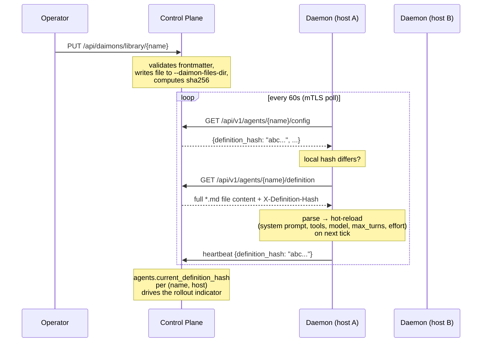
```mermaid
sequenceDiagram
    participant Op as Operator
    participant CP as Control Plane
    participant D1 as Daemon (host A)
    participant D2 as Daemon (host B)

    Op->>CP: PUT /api/daimons/library/{name}
    Note over CP: validates frontmatter,<br/>writes file to --daimon-files-dir,<br/>computes sha256

    loop every 60s (mTLS poll)
        D1->>CP: GET /api/v1/agents/{name}/config
        CP-->>D1: {definition_hash: "abc...", ...}
        Note over D1: local hash differs?
        D1->>CP: GET /api/v1/agents/{name}/definition
        CP-->>D1: full *.md file content + X-Definition-Hash
        Note over D1: parse → hot-reload<br/>(system prompt, tools, model, max_turns, effort)<br/>on next tick
        D1->>CP: heartbeat {definition_hash: "abc..."}
    end

    Note over CP: agents.current_definition_hash<br/>per (name, host)<br/>drives the rollout indicator
```

**What hot-reloads:** system prompt, model, allowed tools, max turns,
effort.

**What still requires a restart:** schedule (`interval`), `stateDir`.
The save-time validator flags these and warns the operator.

**Race protection:** the daemon verifies the post-fetch hash matches
what `/config` reported. If a second save lands mid-fetch, it skips
this round and retries on the next poll cycle.

### 22.2 Binary update + rollback (Phase 7c — SSH push)

Updating the `okesu` binary is structurally different from a daimon
edit because it requires a process restart. Phase 7c treats it as a
discrete operator action with explicit rollback.

```
SSH to node →  upload to /usr/local/bin/okesu.new
                                ↓
            mv okesu → okesu.previous (atomic)
            mv okesu.new → okesu     (atomic)
                                ↓
            systemctl restart okesu-agent@*
```

Rollback inverts the renames: `okesu.previous → okesu`, then the
same systemd restart. Both flows are jobs streamed through the
existing `/api/jobs/{id}/log` SSE endpoint that deploys already
use, so the UI just reuses `subscribeJobLog`.

The previous-binary slot is single-deep by design — a second update
overwrites the first rollback target. Operators rolling back to
`N - 2` need to re-deploy from the CP's `--daemon-binaries-dir`.

### 22.3 Node metadata refresh (Phase 7a — tunnel probe)

Some operator-visible fields aren't tied to the binary or the
daimon — they're just "what does this node look like". Phase 7a
adds a `MsgProbe` / `MsgProbeReply` round-trip on the existing
tunnel: the CP sends a probe, the node collects `os.Hostname()`,
`uname -m`, `/etc/os-release`, `runtime.NumCPU()`, `/proc/meminfo`,
`syscall.Statfs(/var/lib/okesu)`, returns it. The CP writes to
`nodes.kernel_release`, `nodes.os_release`, etc.

No SSH required, no service restart, sub-second per node. Operators
hit "Refresh metadata" on the NodeDetail page after the CP grows a
new column (e.g. `daemon_hostname` from migration 014) without
having to redeploy the fleet.

### 22.4 Update lifecycle table

| Artifact            | Channel         | Restart? | Operator UX                       |
|---------------------|-----------------|----------|-----------------------------------|
| Daimon definition   | mgmt-plane      | No       | Save in Library → auto-rolls in 60s |
| Daemon binary       | SSH             | Yes      | "Update binary" on Nodes page     |
| Node binary (tunnel)| SSH (same as ↑) | Yes      | Same — same Go binary             |
| Node metadata       | Tunnel probe    | No       | "Refresh metadata" on NodeDetail  |

---

## 23. Hexagonal Architecture (Phase 8 — Ports + Adapters)

Phase 8 refactored the CP to talk to every external service through
small Go interfaces ("ports") so the same code runs in dev (SQLite +
in-process queue + filesystem blobs) and production (Postgres +
ClickHouse + Kafka + Redis + S3 + OCI Vault) — adapter selection is
a config decision, not a code change.

### 23.1 The ports

| Port (`controlplane/ports/`) | Purpose                                | Adapters shipping today                             |
|------------------------------|----------------------------------------|-----------------------------------------------------|
| `Store` (the SQL DB)         | Relational state — users, daimons, findings, audit | SQLite (dev), Postgres (production via pgx)        |
| `EventStore`                 | Events firehose — append-only telemetry | sqliteevents (wraps Store), clickhouseevents       |
| `Queue`                      | Durable async ingest                   | inprocess (channel-backed), kafka (Kafka API + SASL/TLS) |
| `PubSub`                     | Fire-and-forget broadcast (SSE fan-out)| inprocess, redispubsub (Redis & compatible)        |
| `BlobStore`                  | Object storage (binaries, exports, cold-tier) | filesystem (local disk), s3blob (any S3-compat)    |
| `CertManager`                | mTLS PKI for daemons + tunnel-clients  | internalca (current self-signed), oci-certificates (planned) |
| `Secrets`                    | KMS / secret store                      | envsecrets (env + LoadCredential dir), oci-vault (planned) |

Each port is small (1–6 methods), error semantics use sentinel
errors (`ports.ErrNotFound`, `ports.ErrAlreadyExists`,
`ports.ErrNotSupported`, `ports.ErrShutdown`), and the CP code
never imports an adapter directly. Selection happens once at
`controlplane.New(cfg)`.

### 23.2 Adapter selection

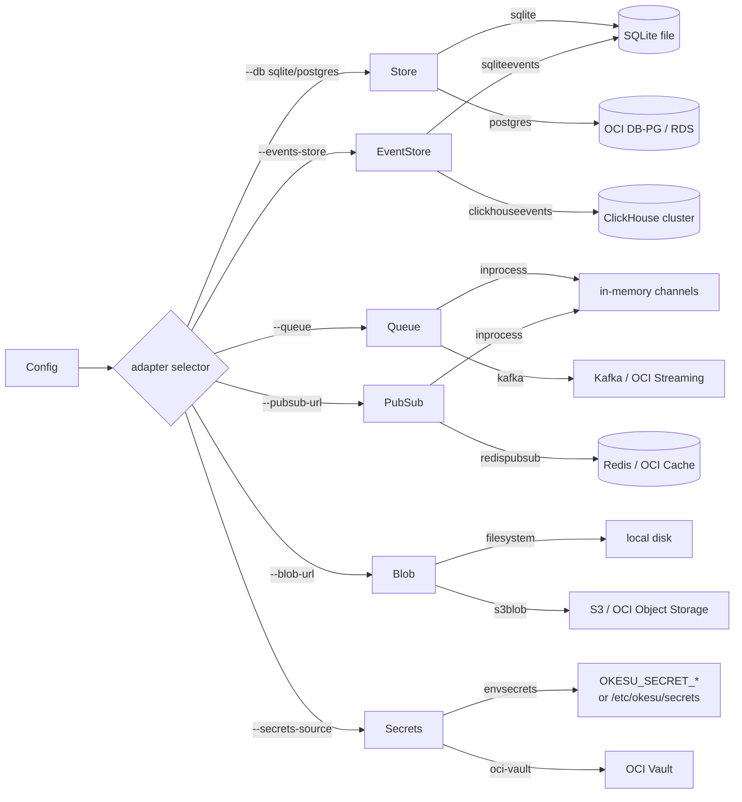
```mermaid
graph LR
    Cfg[Config] --> Pick{adapter selector}
    Pick -->|--db sqlite/postgres| Store
    Pick -->|--events-store| Events[EventStore]
    Pick -->|--queue| Q[Queue]
    Pick -->|--pubsub-url| PubSub
    Pick -->|--blob-url| Blob
    Pick -->|--secrets-source| Sec[Secrets]

    Store -->|sqlite| SQLite[(SQLite file)]
    Store -->|postgres| PG[(OCI DB-PG / RDS)]
    Events -->|sqliteevents| SQLite
    Events -->|clickhouseevents| CH[(ClickHouse cluster)]
    Q -->|inprocess| Mem[in-memory channels]
    Q -->|kafka| KK[Kafka / OCI Streaming]
    PubSub -->|inprocess| Mem
    PubSub -->|redispubsub| Redis[(Redis / OCI Cache)]
    Blob -->|filesystem| Disk[local disk]
    Blob -->|s3blob| S3[S3 / OCI Object Storage]
    Sec -->|envsecrets| Env[OKESU_SECRET_*\nor /etc/okesu/secrets]
    Sec -->|oci-vault| Vault[OCI Vault]
```

### 23.3 Async event ingest pipeline

In production with `--events-store=clickhouse --queue=kafka`, the
write path becomes:

```
webhook POST → CP validates HMAC → publish to Kafka topic events.raw
                                                                ↓
                            eventpipeline worker (one per CP replica)
                                                                ↓
                                        accumulate 100ms / 1000-row batch
                                                                ↓
                                                ClickHouse.InsertBatch
```

A worker failure leaves the message uncommitted in Kafka, so a
healthy CP replica picks it up. No data loss. Findings projection
(state-mutating) stays in the synchronous CP path because it
depends on the event_id; the events stream is the only piece that
goes async.

### 23.4 Stateless CP for horizontal scale

Three pieces of in-memory state used to pin the CP to a single
process:

- `Broadcaster` (SSE fan-out for `/api/events/stream`)
- run subscriber channels (live job/run logs)
- deploy job log subscribers

Phase 8d moved these behind `ports.PubSub`. The default
in-process adapter preserves single-CP behavior; `--pubsub-url
redis://...` swaps in Redis so an event posted to replica A reaches
an SSE client on replica B in milliseconds.

### 23.5 Database dialect handling

`Store.Exec` / `Query` / `QueryRow` (and their `Context` variants)
override the embedded `*sql.DB` to apply a runtime placeholder
rewriter when `Dialect == DialectPostgres`. Every `?` placeholder
becomes `$N`; single-quoted string literals are passed through
verbatim. The CP code base stays SQLite-native; Postgres
compatibility is a single-pass transformation.

Dialect-specific helpers live in `controlplane/db/rewriter.go`:

- `tsToMillisExpr(dialect, col)` — `strftime('%s', col) * 1000` on
  SQLite, `(EXTRACT(EPOCH FROM col) * 1000)::bigint` on Postgres
- `dialectSQL(dialect)` — migration-runner check/insert SQL with
  the right placeholder style

Migrations live in `migrations/sqlite/` and `migrations/postgres/`.
The runner picks the dir from the dialect; both dirs stay in
lockstep — every migration N has a counterpart at the same N.

### 23.6 Secrets — single door (Phase 8g)

Every secret the CP needs flows through `ports.Secrets` at boot.
Three layers, applied in order in `controlplane.New`:

```
1. LoadConfigFile          — YAML config with "${secret:NAME}" refs
        ↓
2. resolveConfigSecretRefs — substitute ${secret:NAME} via adapter
        ↓
3. resolveSecrets          — for canonical names the CP needs,
                              fill the field if still empty
```

Canonical secret names (slash-separated, mirrors OCI Vault folder
hierarchy):

```
cp/admin-password         clickhouse/password
cp/webhook-secret         kafka/sasl-password
cp/session-key            blob/secret-key
cp/oidc/client-secret
```

`--secrets-source` selects the adapter:

| Source                                       | Use when                                |
|----------------------------------------------|-----------------------------------------|
| `env` (default)                              | dev — secrets in `OKESU_SECRET_*` env vars |
| `file:///etc/okesu/secrets`                  | systemd `LoadCredential=` in production |
| `oci-vault://<compartment-ocid>?region=...`  | OCI Vault (Phase 8e.next, after tenancy round-trip) |

`scrubDSN()` redacts password components from URL-style DSNs before
logging. CLI flags + raw `OKESU_CP_*` env vars for individual
secrets still work but trigger a deprecation log line at boot.

### 23.7 What still needs the OCI tenancy

- Postgres migrations applied against managed OCI Database PostgreSQL
- ClickHouse cluster on OKE — schema bootstrap + ingest under load
- OCI Streaming SASL handshake (the SASL username format is
  OCI-specific)
- OCI Object Storage S3-compat round-trip with Customer Secret Keys
- OCI Certificates adapter for `ports.CertManager` (Phase 8e.next)
- OCI Vault adapter for `ports.Secrets` (Phase 8e.next)

### 23.8 Where each adapter lives

```
controlplane/
  ports/                       interfaces (ports.{Store,EventStore,Queue,PubSub,BlobStore,CertManager,Secrets})
  adapters/
    inprocess/                 channel-backed Queue + PubSub (dev)
    sqliteevents/              EventStore wrapping db.Store
    clickhouseevents/          EventStore against ClickHouse (production)
    kafka/                     Queue against Kafka API (OCI Streaming, MSK, Confluent, Redpanda)
    redispubsub/               PubSub against Redis (OCI Cache, ElastiCache, Cloud Memorystore)
    filesystem/                BlobStore on local disk (dev)
    s3blob/                    BlobStore against S3-compat (OCI Object Storage, AWS S3, R2, MinIO)
    internalca/                CertManager around the built-in self-signed CA
    envsecrets/                Secrets from env vars + optional dir of files
  eventpipeline/               Queue → batch → EventStore worker
```

A new cloud requires writing one new file per service, not editing
the rest of the CP.

---

## 24. Multi-OS Service Manager (Phase 8)

The SSH deploy and the install paths used to shell out to
`systemctl` directly. Phase 8 introduced an abstraction so daimons +
the jobs runtime install on every Unix-family target the daemon
binary builds for.

```
controlplane/sshdeploy/
  svcmgr.go            ServiceManager interface + Detect() factory
  svcmgr_launchd.go    macOS — /Library/LaunchDaemons/<label>.plist + launchctl
  svcmgr_rcd.go        FreeBSD/OpenBSD — /usr/local/etc/rc.d or /etc/rc.d
  svcmgr_smf.go        illumos/Solaris — SMF manifests + svcadm
  bootstrap.go         OS-aware unprivileged-user creation
```

`Detect()` runs `uname -s` against the target and returns the right
manager. The deploy + install paths use `mgr.Install(spec) +
mgr.EnableAndStart(name)` — same code on every flavour. Naming
convention: a service named `okesu-agent-edr` becomes
`okesu-agent-edr.service` on systemd, `com.okesu.agent-edr.plist` on
launchd, `okesu_agent_edr` on rc.d, `svc:/site/okesu-agent-edr:default`
on SMF. The mapping is symmetric so `ListOkesuAgents` round-trips.

The Phase 8.5 migration replaced the systemd template-unit pattern
(`okesu-agent@.service`) with per-instance units; existing template
instances are stopped + disabled on the next deploy.

---

## 25. S3 Dead-Drop Transport (Phase 9)

For nodes that can't reach the CP directly (NAT, air-gap, DMZ) but
can reach an object-storage bucket. Both sides only ever read/write
objects in a shared bucket; they never connect to each other.

Wire-format spec: [docs/s3-transport.md](s3-transport.md). Layout:

```
s3://okesu-<cp-id>/
  cp/<cp-id>/
    enrollment/pubkey.pem                 fleet trust anchor
    registration/<node-uuid>.json         inbox for new nodes
    nodes/<node-id>/
      cert.pem                            CP-issued post-enrollment
      heartbeat.json                      ~30s liveness
      jobs/inbox/<job-id>.json            CP enqueues
      jobs/<job-id>/output/<seq>.txt      node-streamed chunks
      jobs/<job-id>/exit.json             terminal status
      events/YYYY-MM-DD/*.ndjson          batched daimon events
      findings/*.json                     finding-type events
      config/desired.json                 hot-reloaded from CP
```

Implementation:

```
agent/s3transport/         node-side: client, runner, eventsink, enroll, wire types
controlplane/transport/
  s3scanner/               CP-side: ingests registrations, heartbeats, events,
                           findings, job output, job exits
controlplane/packaging/    self-register package generator with pluggable
                           Formatter interface (tar.gz live; deb/rpm/pkg/msi stubs)
```

Trust: per-CP fleet keypair (`transport_configs.fleet_pubkey_pem`)
signs each generated package's signing cert. Each node generates
its own UUID + keypair on first boot, uploads a CSR signed with the
package signing cert, and the CP scanner validates against the
fleet public key before issuing the per-node mTLS cert. One package
safely registers N machines — there's no per-node identity in the
package.

Tunables (`config/desired.json`, hot-reload): jobs poll, heartbeat,
events flush, output chunk flush. Defaults documented in
`docs/s3-transport.md` §"Polling cadence".

UI: `+ Add Node` modal has an **S3 dead-drop** tab where the
operator picks a transport config, agents to install, format, and
downloads the tar.gz. Backend ready for `.deb`, `.rpm`, `.pkg`,
`.msi` — `packaging.Register()` makes adding a formatter a
single-file change.

---

## 26. Engine-Applied Action Protocol (Phase 11)

Agents emit structured intent in `orchestration_result.attributes.actions[]`;
the engine validates against the step's `actions:` allowlist and
applies via DB methods. Agents never get CP credentials. Full
protocol doc: [agents/_orchestration-actions.md](../agents/_orchestration-actions.md);
operator-facing doc: [docs/orchestrations.md §Engine-applied actions](orchestrations.md#engine-applied-actions-cp-side-mutations).

Action set:
- `update_finding_status` — open / acknowledged / investigating / resolved / false_positive / wontfix / suppressed
- `add_finding_tag` / `remove_finding_tag`
- `set_finding_severity_override`
- `link_run_to_finding`
- `escalate` (soft signal)

Schema (mig 027):
- `finding_edits` — audit log keyed off `finding_id`; one row per
  atomic change. Origin can be a user (operator triage) or an
  orchestration run + step.
- `finding_run_links` — bidirectional join so the finding-detail
  page lists "auto-handled by run #N" and the run-detail page lists
  "this run touched findings X, Y, Z".

Implementation:

```
controlplane/orchestrator/actions.go         wire types + AllowedByStep validator
controlplane/orchestrator/engine.go          applyStepActions() called post-step
controlplane/api/orchestration_actions.go    db-backed ActionApplier impl
controlplane/api/finding_history.go          read-only API: history + run links
controlplane/db/finding_edits.go             ApplyFindingStatusChange + audit row in tx
agents/_orchestration-actions.md             protocol doc agents read at runtime
```

UI surfaces the audit:
- Finding-detail drawer has a **History** section with bot-vs-user
  icons and run deep-links
  (`web/src/components/FindingHistory.tsx`).
- Run-detail expanded step shows an **Actions applied** strip — one
  green chip per action (`Orchestrations.tsx::StepActionsApplied`).

## 27. IOC entity (Phase 22.1)

Phase 22.1 promoted indicators of compromise from ad-hoc finding
attributes (`finding.attributes.sha256`, etc.) to first-class CP rows
in the `iocs` table.

### Two populations

- **Curated** (`source = "catalog"`) — declarative YAML files under
  `catalog/iocs/*.yaml`, version-controlled alongside agents and
  orchestrations. Loaded at CP boot and on `SIGHUP`. Federated parent
  ↔ child the same way agent files are.
- **Observed** (`source = "observed"`) — auto-extracted from the
  text/attributes of every finding posted to `/api/findings/ingest`.
  Hash, IPv4/v6, domain, URL, CVE, and MITRE ATT&CK identifiers are
  pulled out via regex, normalized via `controlplane/ioc/normalize`,
  and upserted via `(*db.Store).UpsertIOC`.

### Schema

Two tables (sqlite + postgres parity, migration `030_iocs.sql`):

- `iocs` — keyed by `(kind, normalized_value)`; carries `severity_floor`,
  `classification`, `confidence`, `attribution`, `observation_count`,
  `first_seen`, `last_seen`. Catalog rows additionally carry
  `definition_path`.
- `ioc_observations` — links an IOC to a `findings.id` and/or
  `orchestration_runs.id`. `ON DELETE SET NULL` on both link columns
  so observations outlive the source records that surfaced them.

### Reconciliation

A catalog upsert against an existing observed row overwrites curated
metadata (severity_floor, classification, attribution, confidence,
notes) but preserves observation history (count, last_seen). An
observed upsert against an existing catalog row only refreshes
last_seen — curated metadata is never clobbered. See
`(*db.Store).UpsertIOC` for the canonical path; the upsert is
race-safe via `INSERT … ON CONFLICT DO NOTHING + UPDATE`.

### Read path

- `GET /api/iocs` — list IOCs, filterable by `kind` or `finding_id`
  (viewer+ cookie auth).
- `iocs.lookup` orchestration data query — used by `t2-fleet-ioc-hunt`'s
  scope step; takes `kind` + `value`, normalizes via
  `normalize.NormalizeForKind`, returns `{valid, kind, normalized_value,
  attribution, severity_floor, classification, source}`. Real DB
  errors surface as step failures; genuine misses return `valid:false`
  for `when:` branching.

Cross-reference:
`docs/superpowers/specs/2026-04-29-threatcaddy-borrows-phasing-design.md`
for the design.

### Severity-floor propagation (Phase 22.2)

When a finding is ingested, the IOCs extracted from its text/attributes
are looked up in the catalog. If any matched IOC has a `severity_floor`,
the finding's `severity` is raised to the highest matching floor (never
lowered). The matched IOC's `attribution`, `classification`, and
`confidence` are stamped on the finding as `ioc_attribution`,
`ioc_classification`, and `ioc_confidence`. Operators see the resulting
context on the finding-detail page without the agent having to copy it
into the title.

Cluster ID is also assigned at ingest: the first finding to surface a
given IOC mints a cluster (cluster_id = that finding's id, as TEXT);
subsequent findings within the IOC's window (24h for sha*, 1h for
ipv*/domain, 7d for cve/mitre, 15m otherwise) join the same cluster.
The smallest window across the finding's IOC kinds wins, so an ipv4
clusters aggressively even when a sha256 (24h) is in the same hit set.

## 28. Agent lessons (Phase 22.2)

Per-agent `lessons` KV in the `agent_lessons` table. Orchestrations
write lessons via the `reflect_with_lessons` action; daemons fetch the
top 10 from `GET /api/v1/agents/{name}/lessons` (mgmt plane, mTLS-gated)
on each tick and prepend them to the system prompt under a "## Lessons
from prior runs" header.

Bounds:
- Max 10 entries per agent_name (older entries pruned on insert).
- Max 200 chars per entry, UTF-8-safe truncation (clips to rune boundary).
- Whitespace-only entries dropped at the daemon-side render layer.

The daemon's lessons fetch is best-effort — a missing CP, network
error, or empty list all degrade silently to the original prompt.

See `docs/superpowers/specs/2026-04-29-threatcaddy-borrows-phasing-design.md`
for the design.

## Investigations (Phase 22.3)

T2 case workspace. An Investigation groups findings + orchestration
runs + analyst notes through an `active → closed` lifecycle.
Resolutions: `resolved`, `false_positive`, `duplicate`, `wont_fix`.

Schema (migration 036):
- `investigations` — id, title, status, resolution, summary, created_by, timestamps.
- `investigation_findings` — m2m link to findings (ON DELETE RESTRICT —
  a finding referenced from a case can't be silently deleted).
- `investigation_runs` — m2m link to orchestration_runs (same RESTRICT).
- `investigation_notes` — markdown notes, newest-first.

CRUD endpoints under `/api/investigations`. Findings can be promoted
straight into an investigation via `POST /api/investigations` with
`from_finding_id` set.

## Hypothesis findings + meeting steps (Phase 22.3)

Two new finding subtypes back the T2 workflow:
- **hypothesis** — falsifiable theories with claim/evidence/confidence/how_to_test
  attributes, emitted by the `hypothesis-writer` shared agent.
- **meeting_minutes** — agenda + positions + action items, emitted by the
  synthesizer of a `kind: meeting` orchestration step.

Meeting steps execute participants sequentially, each seeing the trigger
payload + all prior participants' outputs. The synthesizer receives the
full conversation and emits the meeting_minutes finding.

War-bridge variant: `war_bridge: true` on a meeting step instructs the
synthesizer (via prompt) to tag the resulting finding `war-bridge` so
the dashboard surfaces it in a red banner for immediate operator
attention. The eventpipeline reads `subtype` and `tags` directly from
the agent's JSONL emission, so the DB row reflects what the agent
emitted; the meeting executor mutates the in-memory DispatchedFinding
as a defensive fallback for downstream env-binding when the agent
forgets.

## Cross-fleet pattern surfacing (Phase 22.4)

Four pieces work together:

1. **Cross-CP IOC pattern supervisor** — `agents/cross-cp-ioc-pattern-supervisor.md`
   ticks every 5 minutes on the parent CP. Queries
   `GET /api/iocs/cross-cp-patterns?min_observations=N&window_hours=H`
   and emits a finding for each IOC that hits the threshold.

2. **IOC enrichment + cache** — `enrich_ioc` orchestration action
   (class: enrich) routes through a service that fans out to
   VirusTotal, AbuseIPDB, and Shodan adapters with per-adapter rate
   limits. Cached in `ioc_enrichments` (per-adapter row, TTL-bounded;
   default 24h).

3. **Typed IOC relationships** — `ioc_relationships` table holds
   directed edges with a fixed v1 vocabulary
   (resolves-to, exploits, hosted-at, belongs-to, signed-with,
   dropped-by). Populated by enrichment + agent emissions; queryable
   via `GET /api/iocs/{id}/relationships`.

4. **STIX 2.1 export** — `GET /api/stix2/iocs` returns indicators +
   relationships as a STIX 2.1 bundle for ingestion into MISP /
   OpenCTI / other TIPs. Query params `?since=<RFC3339>&kind=<kind>`.

## Catalog rule extensions (Phase 22.5)

Two new IOC kinds expand the catalog beyond plain indicators:

1. **`yara_rule`** — body stored verbatim in `iocs.value`. Header
   metadata (rule name, tag list, `meta.severity`) is parsed at
   catalog-load time and lifted into the new `name` / `tags` /
   `severity_floor` columns. Explicit YAML wrapper values always win
   over parsed values, so curators can override.

2. **`sigma_rule`** — body stored verbatim. `title` / `tags` / `level`
   are extracted from the YAML header. Storage only in v1; per-host
   log-adapter execution is deferred.

The `binary-analyzer` agent runs YARA matches against the catalog by
fetching `GET /api/catalog/yara-rules.yar?tag=<tag>` (concatenated
rule bundle), saving it to a temp file, and invoking the system `yara`
CLI. No Go-side YARA library — the agent has shell-tool access, and
the catalog bundle is the single source of truth. Build matrix stays
`CGO_ENABLED=0`.

Migration 039 adds `name TEXT, tags TEXT` to `iocs`. The columns are
useful for any kind (sha256 IOCs can carry a human-readable name and
tag list too) but are load-bearing for `yara_rule` / `sigma_rule`
where tag-filtering is the operator UX.

---

## Catalog UI

Operator-facing read-only browse over the `iocs` table. Single page at
`/catalog` with a sortable list (kind/source/search filters), a side
drawer for quick scan, and a `/catalog/:id` detail page with three
tabs (Overview, Observations, Relationships). Rule bodies for
`yara_rule` and `sigma_rule` kinds render in `<pre><code>` on the
Overview tab — no syntax highlighting library in v1.

Backend additions: `GET /api/iocs/{id}` (single record),
`GET /api/iocs/{id}/observations` (observation history), and
`source` + `q` filters on the existing `GET /api/iocs`. All under
the cookie-auth viewer+ group.

Frontend: `web/src/pages/Catalog.tsx`,
`web/src/pages/CatalogDetail.tsx`, `web/src/components/CatalogDrawer.tsx`.
Sidebar entry under the `Triage` group.

---

## Catalog federation

Every Catalog API endpoint federates via the
`controlplane/api/federation_reads.go` FanOut+merge pattern. The parent
CP's `/catalog` page shows merged rows from itself plus every healthy
child:

- **List**: dedup by `(kind, normalized_value)`. For text metadata,
  first non-empty wins iterating by ascending CP-ID with catalog-source
  preferred over observed. `observation_count` sums; `first_seen` =
  min, `last_seen` = max. Each merged row carries
  `cp_sources []CPSourceRef`.
- **Detail / observations / relationships**: fetched via
  `(kind, normalized_value)` query params; merged by the same pattern.
  Relationships dedup by tuple `(subject_kind, subject_value, predicate,
  object_kind, object_value)` since per-CP int IDs aren't comparable.

Child-side exports live at `/api/v1/federation/iocs*` behind
`requireFederationToken`. The legacy id-based local routes
(`/api/iocs/{id}`, `/{id}/observations`, `/{id}/relationships`) stay
mounted for external integrations; the UI uses the by-kv variants.

Build matrix unchanged: `CGO_ENABLED=0` everywhere.

---

## Federation: parent ↔ child CPs

A single tenant typically runs one **global** CP plus one or more
**regional/edge** CPs. Operators want a single pane of glass: list
nodes, findings, daimons, orchestrations across the whole fleet from
the global UI; create or mutate resources on a chosen child without
leaving the page. The federation layer covers both directions —
**reads** (parent merges child rows into its lists) and **writes**
(parent forwards mutations to a chosen child) — across two
transports: HTTPS (mTLS, default) and S3 dead-drop.

The S3 dead-drop transport is **federation-specific** — different
from the Phase 9 S3 transport for nodes (§25). They share the
underlying `agent/s3transport` package but use disjoint key prefixes
and message shapes. A child CP behind a NAT/firewall with no inbound
HTTPS path can still federate via a shared bucket.

### Bucket layout (S3 federation)

```
s3://<bucket>/
  cp/<self-id>/
    outbound/<peer-id>/
      introspect.json                     ← child publishes; parent reads
      findings.json                       ← snapshot of recent findings
      daimons.json                        ← child's daimon library
      nodes.json                          ← child's node inventory
      orchestrations.json                 ← child's orchestrations
      req/<request-id>.json               ← parent writes directives here
                                            (child reads on its tick)
      resp/<request-id>.json              ← child writes responses here
                                            (parent polls until match)
```

Symmetric: each side writes under its own
`cp/<self>/outbound/<peer>/`. The two halves of a request live in
two different `outbound/` trees — `cp/<parent>/outbound/<child>/req/`
holds parent-issued directives; `cp/<child>/outbound/<parent>/resp/`
holds the child's responses. Operators don't enumerate peers
anywhere — the bucket layout is the discovery mechanism (the child's
server lists `cp/*/outbound/<self>/req/` per tick to find every
registered parent).

### Read pipe (Phase A)

Operator-facing list pages on the parent (Findings, Nodes,
Daimons, Orchestrations, OrchestrationRuns) federate via fan-out:

```go
// controlplane/federation/aggregator.go
agg.FanOut(ctx, func(ctx context.Context, peer Peer) error {
    body, err := agg.FetchRaw(ctx, peer, "/api/v1/federation/findings")
    // ...merge into shared accumulator...
})
```

`FetchRaw` branches on `peer.Row.Transport`:

- `https` (default) — token-authed GET against the child's
  `/api/v1/federation/*` endpoint (4 MB cap, 8 s timeout per peer)
- `s3_dead_drop` — looks up the bucket-cached payload via
  `S3Source.Get(peerID, "findings.json")`. The publisher on the
  child side writes those snapshots every 30 s; the reader on the
  parent side polls `cp/<peer>/outbound/<self>/*.json` and stuffs
  bytes into an in-memory `AssetCache`.

Each row gets a `cp_source` tag so the UI can show provenance and
deep-link `?cp=<id>` for detail GETs.

```
controlplane/federation/
  aggregator.go      fan-out, transport-branched FetchRaw,
                     S3Source interface (cached bucket bytes)
  s3publisher/       child-side: writes introspect + extra assets
                     (findings/daimons/nodes/orchestrations.json)
                     every 30s
  s3reader/          parent-side: polls bucket prefixes, fills
                     AssetCache; one goroutine per bucket
```

### Write pipe (Phase B)

Operator-initiated **writes** from the parent (Add Node, Deploy
Daimon, Run Agent, Cancel Run, Set Finding Status, Orchestration
CRUD + run trigger / cancel / step approve / bulk variants) need
request/response correlation: the parent submits and waits; the
child picks up the directive on its next scan tick, executes it,
and writes the result back keyed by the same request id.

`request_id` is a UUID minted at submit time. Correlation is purely
by name — no extra index file. The child keeps an in-memory
`executed[request_id]` cache (1 h TTL) so re-issued directives
return the cached response without re-running.

```go
// controlplane/federation/s3rpc/types.go
type Request struct {
    RequestID    string
    Kind         string            // "create_node", "deploy_daimon", ...
    Body         json.RawMessage   // kind-specific payload
    PathParams   map[string]string // chi {id} / {stepID} when needed
    IssuedByUser string
    IssuedAt     time.Time
}

type Response struct {
    RequestID   string
    Kind        string
    Status      string          // "ok" | "error"
    HTTPStatus  int             // mirrors the child's local handler
    Body        json.RawMessage
    Error       string
    CompletedAt time.Time
}
```

The same forwarding wrapper handles both transports — the helper
peeks `target_cp_instance_id` (in body) or `?cp=<instance_id>` (in
query) and routes to either `proxyIfTargetCP` / `proxyWriteByQuery`
(HTTPS path) or `agg.SubmitS3Directive` (s3 path):

```
controlplane/api/
  federation_writes.go             proxyIfTargetCP, proxyWriteByQuery
                                   (transport-branched), idPathParams
  federation_writes_deploy_run.go  Forwarding{NodeDeploy,CreateRun,
                                   CancelRun}
  federation_s3_dispatch.go        child-side bridges:
                                   directive Request → synthetic
                                   *http.Request → existing handler
                                   → translate ResponseRecorder back
                                   to s3rpc.Response
controlplane/federation/s3rpc/
  client.go                        parent-side Submit (writes req
                                   object, polls resp object, returns
                                   typed Response, deletes both)
  server.go                        child-side dispatcher (multi-parent
                                   aware, idempotency cache)
```

13 directive kinds wired today:

| Kind | Underlying handler | Forwarding wrapper |
|---|---|---|
| `create_node` | `NodeCreate` | `ForwardingNodeCreate` |
| `deploy_daimon` | `NodeDeploy` | `ForwardingNodeDeploy` |
| `create_run` | `CreateRun` | `ForwardingCreateRun` |
| `cancel_run` | `CancelRun` | `ForwardingCancelRun` |
| `finding_set_status` | `FindingSetStatus` | `FederatedFindingSetStatus` |
| `orchestration_create` | `OrchestrationCreate` | `FederatedOrchestrationCreate` |
| `orchestration_update` | `OrchestrationUpdate` | `FederatedOrchestrationUpdate` |
| `orchestration_delete` | `OrchestrationDelete` | `FederatedOrchestrationDelete` |
| `orchestration_run_create` | `OrchestrationRunCreate` | `FederatedOrchestrationRunCreate` |
| `orchestration_run_cancel` | `OrchestrationRunCancel` | `FederatedOrchestrationRunCancel` |
| `orchestration_step_approve` | `OrchestrationStepApprove` | `FederatedOrchestrationStepApprove` |
| `orchestration_runs_bulk_cancel` | `OrchestrationRunsBulkCancel` | `FederatedOrchestrationRunsBulkCancel` |
| `orchestration_runs_bulk_retry` | `OrchestrationRunsBulkRetry` | `FederatedOrchestrationRunsBulkRetry` |

Adding a new kind is a four-line change: a `Kind*` constant, a
`NewS3*Handler` bridge that hands the local handler to
`runHandlerForDirective`, a `srv.Register(...)` call in
`startFederationS3Dispatcher`, and threading the kind into the
forwarder's `proxyIfTargetCP` / `proxyWriteByQuery` call. No handler
logic forks between transports — the bridge synthesizes an
`*http.Request` and runs the existing local handler through it,
re-attaching chi route params via `chi.NewRouteContext` and
injecting a `federation@parent` user via `auth.WithUser` for audit
emission.

### Latency

Worst-case round trip on the s3 path is ~60 s (one full child scan
tick + one parent poll window). Defaults: child polls every 30 s,
parent polls every 5 s, `Submit` times out at 90 s. The forwarding
handler bounds each call at 2 min so a stalled child returns a
clean 502 to the operator dialog rather than hanging the request.

### Security trade-offs

- **HTTPS path** — child has an inbound mTLS endpoint; the
  per-peer federation token is presented via
  `X-Okesu-Federation-Token`. Standard pinned-CA verification is a
  Phase 9.7 concern; today the parent uses `InsecureSkipVerify`
  against self-signed lab certs.
- **S3 dead-drop path** — bucket IAM **is** the trust boundary.
  Operators using this transport must scope the access keys to a
  single `cp/<id>/` prefix per CP, enable bucket-level encryption,
  and accept that any directive body (including
  `deploy_daimon`'s SSH private key) transits the bucket. Documented
  inline at `NewS3DeployDaimonHandler` so it's discoverable from
  code.

### Enrollment bundle (Phase A.1)

Operators "add an s3-federated child" by minting a self-contained
package on the parent. The bundle bakes the CP's own instance_id
plus the bucket coordinates into env-vars, so the child's first
boot uses `--cp-instance-id` to seed `cp_meta.instance_id`
deterministically — no chicken-and-egg with the parent's
registration row.

```
controlplane/api/cp_bundle_s3deaddrop.go    writer (env template + README)
controlplane/db/cp_meta.go                  SeedCPInstanceID(id)
controlplane/server.go                      boot honors --cp-instance-id
```

The Federation page's "Generate Bundle" dialog has a fourth radio
for **S3 dead-drop**, with a transport_config picker for the bucket
coords.

## Bucket provisioning native to Settings

Operators add object-storage buckets directly from `Settings → Cloud → Object storage buckets` via a two-step wizard (`web/src/components/AddBucketWizard.tsx`), mirroring the Add-CP flow.

The wizard offers two paths:
- **Configured cloud provider** — pick an AWS / OCI / MinIO `cloud_credential`, then either discover existing buckets or create a new one. Backend dispatches via the new `BucketProvisioner` interface (`controlplane/cpprovision/bucket_provisioner.go`) to per-cloud implementations.
- **Manual entry** — preserved for on-prem / third-party S3-compatible services without an Okesu credential. Same shape as the legacy form.

OCI's S3-compatible endpoint requires Customer Secret Keys, which the OCI provisioner auto-creates via the IAM SDK. MinIO is treated as S3-compatible and reuses the AWS S3 SDK with a custom endpoint pulled from the credential.

`PATCH /api/transport-configs/{id}` permits partial updates of `name` and `scanner_interval_ms`. Identity fields (bucket, endpoint, access keys, region) are immutable — operators delete + re-add for identity changes. `DELETE` returns `409 Conflict` with a referencing-resources list if any node or enrollment_package references the row; federation_peers and cp_provisions FKs are `ON DELETE SET NULL` and don't block.

## Fleet LLM API keys (Settings → LLM Keys)

Operators manage the Anthropic + OpenAI API keys used by the fleet (agents/daimons/jobs) directly from `Settings → LLM Keys`. Persisted in the singleton `fleet_env` table (migration 045), AES-GCM sealed via the same master-key pattern `cloud_credentials` use, with a distinct HKDF info string (`okesu-fleet-env-v1`) for domain separation.

Distribution channels:
- **HTTPS pull** (`/api/v1/fleet/env`, mTLS-authed for daemons): the daemon's heartbeat loop polls and rewrites `/etc/okesu/jobs.env` on `version` change, then `systemctl restart okesu-jobs.service`.
- **S3 dead-drop publish** (`fleet-env.json` artifact alongside findings/daimons/etc.): S3-deployed nodes' readers and S3-federated child CPs pick up the new artifact on their next bucket scan.

Federation (`/api/v1/federation/fleet-env` for HTTPS-federated children, S3 artifact for S3-federated children): child stores received keys with `source = "federated_from_parent"` and republishes through its own channels — transitive propagation via existing publish/pull plumbing. Children can override locally; the override switches `source` to `"local"` and the federation poller stops overwriting. A brand-new (default `source=local`, `version=0`) row is treated as "empty" — federation can seed it without operators having to flip the source flag manually.

Backwards compat: `OKESU_CP_FLEET_ANTHROPIC_API_KEY` / `OKESU_CP_FLEET_OPENAI_API_KEY` env vars seed the `fleet_env` row on first boot if it's empty. Once the operator saves through Settings, the DB wins forever.

## Entity-aware payload rendering (SmartPayload)

The `<SmartPayload>` component (`web/src/components/SmartPayload/`) replaces raw JSON dumps in orchestration runs, agent runs, and entity attribute blocks. Two modes:

- **Prompt mode** (string input). Tokenizes prose ↔ JSON; for each JSON segment, looks up the server-emitted `prompt_entities` ref by `literal_hash` and renders the matching entity chip; falls back to client-side shape detection when no ref is found.
- **Tree mode** (object/array input). Walks the tree; subtrees that match an entity shape become chips, the rest renders via the existing `StructuredView`.

Server side: the orchestrator captures entity refs at template render time (`controlplane/orchestrator/prompt_entities.go`) and persists them in a new nullable `prompt_entities` JSON column on `orchestration_steps` (migration 047). Wire shape:

```json
{
  "refs": [
    {
      "cp_instance_id": "cp-child-1",
      "kind": "finding",
      "id": 42,
      "snapshot": { "severity": "HIGH", "title": "...", "category": "..." },
      "literal_hash": "abc1234567890abc"
    }
  ]
}
```

Recognised entity kinds: `finding`, `ioc`, `node`, `daimon`, `run`, `investigation`, `orchestration`. Each renders as a small chip; click on the body fires an `entity:open` custom event consumed by a single `EntityDrawerHost` mounted at the App root, which opens the existing `FindingDrawer` (other kinds navigate via the chip's `↗` link). Federated entities carry `cp_instance_id` so deep-links route to the right CP.

## Investigation Overview — layered status / timeline / structure

The Investigation Overview tab (`/investigations/{id}?tab=overview`) renders three stacked sections:

1. **Status header** (`web/src/components/investigations/CaseStatusBar.tsx`) — five-cell row with status pill + war-room badge, severity histogram, freshness, linked-entity counts, and the editable Summary.

2. **Timeline** (`web/src/components/investigations/CaseTimeline.tsx`) — horizontal Gantt band, hand-rolled SVG. Default-curated lanes (lifecycle / findings / runs / notes); opt-in lanes (iocs / daimons / audit). Audit-lane fetch is lazy via the existing `api.investigations.audit` endpoint. Lane state persists in `localStorage` keyed by `investigation:overview:lanes`. War-room cases auto-zoom to the last 1 hour.

3. **Structure** (`web/src/components/investigations/CaseStructure.tsx`) — four summary cards (hosts / IOCs / daimons / runs × orchestrations) with a top-hitter line and a 3-row mini-list per card.

All three sections are pure derivations of the existing `InvestigationDetail` bundle (loaded via `api.investigations.get`); no new server-side endpoints. Click affordances reuse the SmartPayload `entity:open` event bus + `EntityDrawerHost` mounted at the App root.

## Investigation Overview — timeline collision avoidance + portal'd tooltip

Building on the layered Investigation Overview, the timeline component (`web/src/components/investigations/CaseTimeline.tsx`) clusters overlapping point events into `+N` glyphs and replaces SVG `<title>` hover tooltips with a portal'd styled `<div>`.

The clustering algorithm (`web/src/components/investigations/timeline/cluster.ts`) is a pure function that buckets point events on `(lane, x-bucket)` with a default 12px bucket width and 4-event threshold. Bars (runs / IOCs) skip clustering — their duration is the visual signal. Cluster click opens a popover (controlled `<Tooltip>`) listing each event with row-level click-through to the matching detail drawer.

The shared `<Tooltip>` component (`web/src/components/Tooltip.tsx`) is portal'd to `document.body` so it never gets clipped by SVG viewport or parent `overflow:hidden`. Two modes — uncontrolled hover/focus (replacing SVG `<title>` with instant `delay=0` appearance + styled rendering) and controlled (used as the cluster popover with outside-click + Escape dismissal). Reusable beyond the timeline.

## Investigation Overview — timeline filter & saved searches

The case timeline ships a structured filter bar above the SVG canvas:
severity chips (CRITICAL/HIGH/MEDIUM/LOW/INFO), host typeahead, agent
typeahead, and run-status chips (completed/failed/cancelled/running).
Selections feed `applyTimelineFilter(events, filter)`
(`web/src/components/investigations/timeline/filter.ts`) — a pure
predicate that keeps matching findings/runs/daimons and passes
non-applicable kinds (notes/audit/lifecycle/IOCs) through unchanged.
Lane toggles remain the only knob that hides whole kinds.

Saved filter sets reuse the existing `saved_searches` table
(migration 045) under `scope='investigation_timeline'`. The shared
`<SavedSearchesBar>` mounts above the filter inputs — same component
the Findings page uses — so save/list/rename/default-pin/delete come
free. Default-flagged saved searches auto-apply on case mount via
`api.savedSearches.list('investigation_timeline')`.

When a filter selection narrows the result to zero events on a
non-empty case, the canvas renders lane bands + axis with a small
amber banner above ("0 of N events match — adjust filters or
click Clear"). The banner predicate excludes lifecycle and daimon
kinds because pass-through semantics keep them surviving every
filter dimension. Federation: filtering is purely client-side
over events the federation aggregator already returned, and saved
searches are user-scoped (not CP-scoped) so an operator's
"my CRIT-only view" works on every case across federated CPs.

## Investigation Overview — case-structure aggregation endpoint

The Overview tab's structure cards (hosts / IOCs / daimons / runs ×
orchestrations) read from a dedicated endpoint
`GET /api/investigations/{id}/structure` rather than aggregating
client-side over the bundle. The endpoint returns four pre-sorted
lists in one JSON payload — host rollup (new), IOCs by observation
count, daimons by finding count, orchestrations by run count with
per-status breakdown (completed / failed / cancelled / running, with
all other statuses bucketed as Running).

The handler
(`controlplane/api/investigation_structure.go`) is thin: existence
check, four `Store.List*ForInvestigation` calls, sort iocs / daimons
/ orchs in Go (the Store methods sort by recency for the IOCs / Runs
/ Daimons tabs; the structure cards want desc-by-primary-count), and
emit. Federation follows the existing graph pattern: parent proxies
via `?cp=<id>`; child is token-authed.

The client (`web/src/components/investigations/CaseStructure.tsx`)
fetches the endpoint on mount and renders from the response.
On any failure (404 from a federated child running an older binary,
transient network error) it falls back to client-side derivation
via `caseStructure/derive.ts` — the same four aggregators that
previously lived inline in the component, now extracted for
testability and reuse on the fallback path. Wire shape is identical
between server and fallback paths so the render is shared.

## Investigation Overview — war-room collaborative drafts

Operators can co-edit a single shared draft per investigation in
real time via Yjs over a WebSocket relay. The draft is the
"war-room" composer; the existing single-author note composer is
unchanged. On Send, the current draft text becomes one immutable
`InvestigationNote` row preserving the existing audit chain.

The relay (`controlplane/api/investigation_draft_relay.go`) is
byte-blind: it forwards Yjs binary frames between connected clients
without maintaining a server-side `Y.Doc`. Snapshots are
leader-driven — every 5s the relay sends a sync-step-1 to a
designated client, captures their sync-step-2 reply as the canonical
state, and persists those bytes to `investigation_note_drafts`. On
finalize, a tiny single-purpose decoder
(`controlplane/api/yjs_protocol.go::decodeYTextBody`) extracts the
plain string from the snapshot bytes — the only Yjs-internals code
on the Go side.

The frontend
(`web/src/components/investigations/WarRoomDraftPanel.tsx`) uses Yjs
+ `y-protocols` over native `WebSocket`. A thin textarea binding
diffs the `<textarea>` value against the `Y.Text` content and
applies a single replace transaction per change. Awareness drives
presence chips and (future) cursor overlays.

Federation: parent CPs can host war-room sessions for cases that
live on a child via a WebSocket proxy
(`proxyDraftWS`) — the parent upgrades the inbound WS, dials the
child's `/api/v1/federation/.../draft/ws` with the federation
token, and pumps bytes both directions. Drafts older than 7 days
are removed by the daily GC sweep, with a "live rooms" carve-out
to avoid deleting a snapshot that's about to be re-saved.

## Investigation Overview — case phases (timeline annotations)

Operators can mark named time ranges on the case timeline ("Initial
detection 14:00–14:35", "Containment 14:35–16:10"). Phases persist
in the `investigation_phases` table and render as a dedicated
"phases" lane at the top of the timeline (toggleable, opt-in,
lazy-fetched on first toggle).

The lane is a sibling React `<div>` directly above the SVG canvas
(NOT an SVG row), so the rubber-band drag gesture and inline rename
input use plain DOM event handlers without fighting SVG event
propagation. Pointer-down inside the lane background starts a
rubber-band selection; pointer-up opens an inline `<input>` for the
phase name; Enter commits via `POST /api/investigations/{id}/phases`
which inserts one row.

Click an existing phase pill to rename inline (`PATCH .../{phase_id}`).
Hover to reveal an `×` delete button (`DELETE .../{phase_id}` with
window.confirm). No resize via drag-the-edges; operators delete and
re-create to fix a boundary.

Phase colors are derived deterministically from `hash(name)` — no
picker UI, no category column. Same name always renders with the
same color across sessions. Overlapping phases stack vertically
within the lane via the pure first-fit row-assignment helper at
`web/src/components/investigations/timeline/phasesLayer.ts`.

Federation: each handler (`Federated*` parent-side, `Federation*`
child-side) follows the same template as the case-structure and
war-room-draft endpoints. The parent's
`?cp=<instance_id>` query proxies the request to the owning child;
the child's `/api/v1/federation/...` route is token-authed.

## Investigation PDF report

Operators can export a case as a PDF report from the investigation detail page (`Export report` button). The endpoint is `GET /api/investigations/{id}/report.pdf`; federated cases route to the owning child CP via the existing `?cp=<instance_id>` proxy convention.

Renderer lives in `controlplane/api/investigation_report/`, built on `github.com/jung-kurt/gofpdf` (pure-Go, MIT, no Cgo, built-in Helvetica/Courier fonts). The document layout is custom-shaped — page 1 executive summary, pages 2..N chronological narrative, pages N+1..end reference tables (findings/IOCs/runs/audit, capped at 200 rows each). Each export writes one `audit_log` row with action `investigation.report_exported`.

The renderer is text-shaped and does not attempt to mirror the on-screen Overview — operators view the live timeline in the UI; the PDF is for handovers and incident-report writeups.

## Investigation graph view (bipartite)

The Graph view tab renders findings ↔ shared entities (hosts / daimons / IOCs) as a bipartite ReactFlow canvas with custom per-kind node renderers. Findings render as 240×86 cards with a severity rail (purple/red/orange/yellow/slate) matching the orchestration step card; hosts/daimons/IOCs render as compact badges with kind-specific icons (Server / Bot / Globe / Fingerprint / FileText / Hash). Edges scale stroke width by the number of findings touching each entity (1 / 2-3 / 4-9 / 10+ bands), so an IOC linked from many findings reads as a hub at a glance.

Server-side: `GET /api/investigations/{id}/graph?limit=20` returns `{nodes, edges, total_findings, limit_applied}`. Joins `investigation_findings` + `findings` + `ioc_observations` + `iocs`. Caps at 20 findings (max 100) sorted by severity desc + Ts desc; client renders a "20 of N shown" banner when capped. Federation routes via the existing `?cp=<instance_id>` proxy convention.

Client-side: `web/src/components/investigations/CaseGraph.tsx` uses `@xyflow/react` and dispatches each `GraphNode.kind` to a custom renderer via the `nodeTypes` map at `graph/nodes/index.ts`. The four renderers — `FindingNode`, `HostNode`, `DaimonNode`, `IOCNode` — share severity tokens (`graph/nodes/tones.ts`) with `SeverityMenu` so a CRITICAL chip on a Finding row and the CRITICAL ring on a graph node are visually identical. The canvas backdrop is a tinted-purple gradient + radial dot grid matching `OrchestrationCanvas`, and a `<MiniMap>` appears for dense graphs (≥10 findings). Click a finding/daimon/IOC node → opens the entity drawer (existing `entity:open` event bus). Click a host badge → navigates to `/findings?host=<name>`.

Layout (`graph/layout.ts`) is pure: findings in the left column at `x=80`, entities in the right column at `x=560`, with kind-aware vertical pitch (100px for findings, 60px for entity badges) and a 24px gap between entity sections. Each column-section sorts by edge degree desc (most-connected at the top) for deterministic positioning.

Bundle resilience: `GET /api/investigations/{id}` surfaces partial failures via a `bundle_warnings: string[]` field — when one of the enriched list calls (`ListFindingsForInvestigationEnriched`, `ListIOCsForInvestigation`, etc.) errors, the response still ships with empty arrays and the warning is logged + included in the JSON so `InvestigationDetail` can render an amber strip above the tabs explaining what couldn't be loaded. (Before this fix, a query failure silently returned empty arrays and the timeline would render blank with no signal that anything was wrong.)
