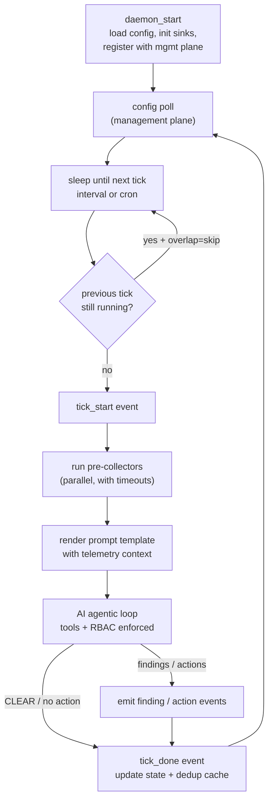
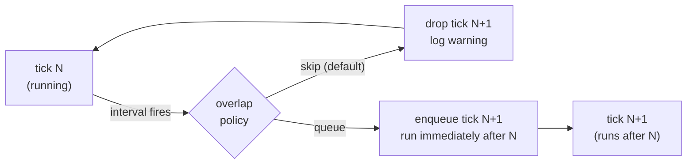
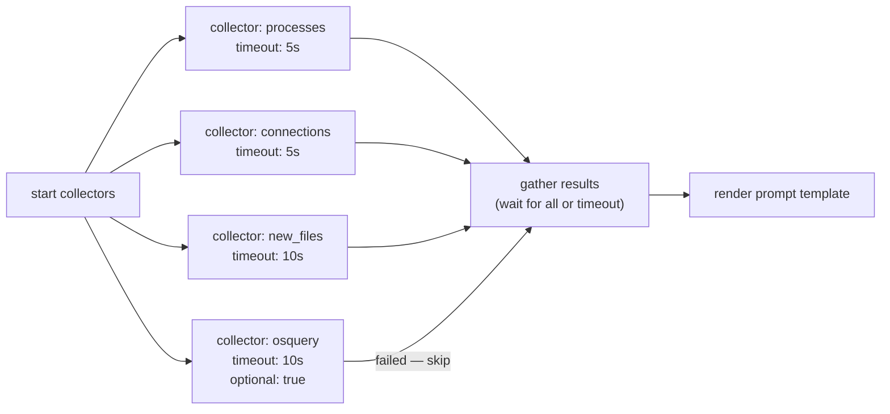
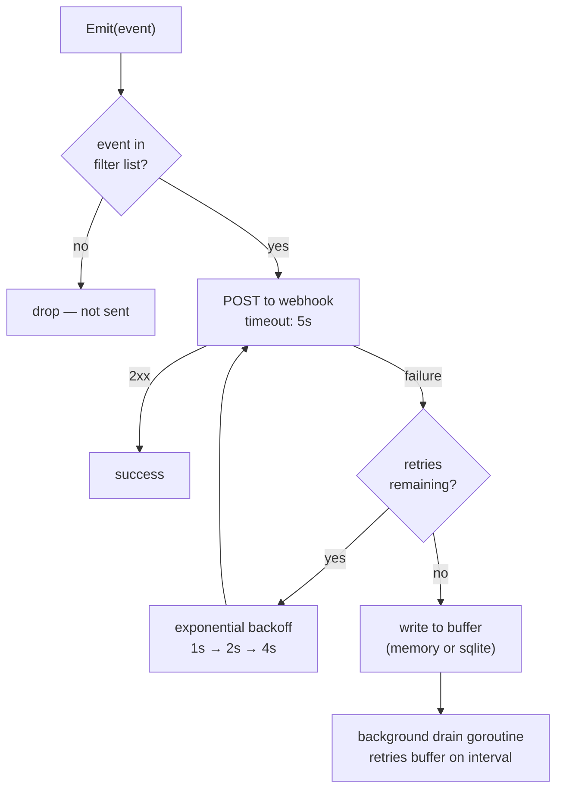
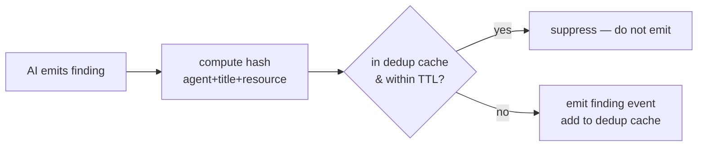
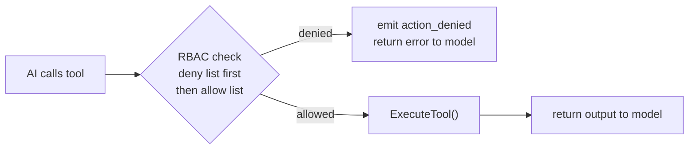
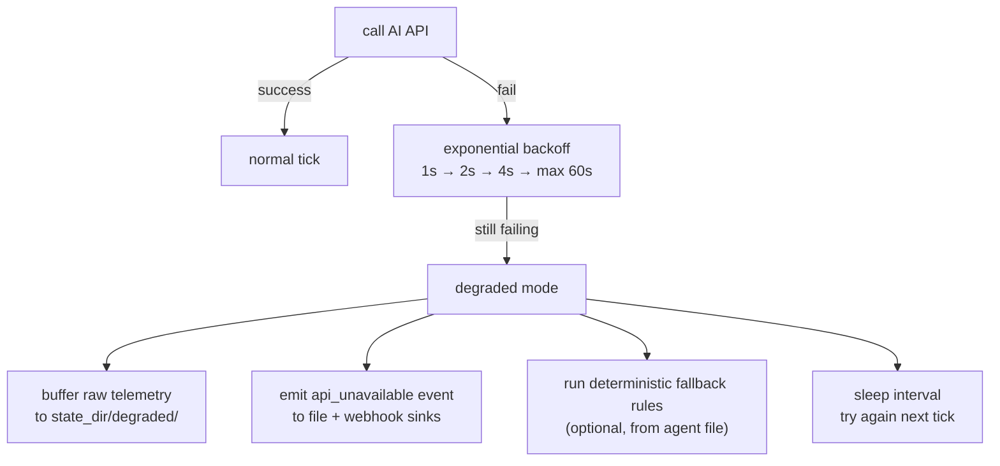
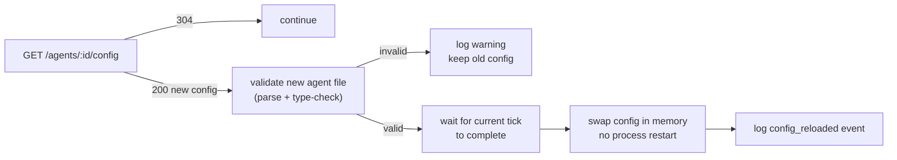

# Okesu Daemon Mode — Design Document

This document captures the full design discussion and architectural decisions for Okesu's daemon mode: a persistent, scheduled agentic loop intended for production deployment as an AV/EDR/SystemReporter and general-purpose autonomous agent daemon.

---

## Table of Contents

1. [Problem Statement](#1-problem-statement)
2. [Core Concepts](#2-core-concepts)
3. [Design Decisions](#3-design-decisions)
4. [Architecture](#4-architecture)
5. [Pre-Collector System](#5-pre-collector-system)
6. [Output Sink System](#6-output-sink-system)
7. [State & Deduplication](#7-state--deduplication)
8. [Action RBAC](#8-action-rbac)
9. [Graceful Degradation](#9-graceful-degradation)
10. [Management Plane Integration](#10-management-plane-integration)
11. [Agent File — Daemon Extensions](#11-agent-file--daemon-extensions)
12. [New Event Types](#12-new-event-types)
13. [Deployment — systemd](#13-deployment--systemd)
14. [File Layout](#14-file-layout)
15. [Build Phases](#15-build-phases)

---

## 1. Problem Statement

The current okesu execution model is **task-shaped**: one prompt in, agentic loop runs to completion, process exits. This covers interactive and one-shot use cases well.

A new class of use cases requires a **daemon-shaped** model: the agent wakes up on a schedule, collects telemetry, analyzes it, optionally acts, reports findings, then sleeps and repeats indefinitely. The primary driver is deploying autonomous security agents (AV, EDR, system reporter) on production cloud images, but the design must be generic enough to support any periodic autonomous workload.

### Requirements

- Runs continuously as a background process (systemd service or container sidecar)
- Wakes on a configurable schedule (fixed interval or cron expression)
- Collects predefined telemetry before the AI loop starts
- AI analyzes telemetry and decides whether to act or skip
- Findings and actions stream to multiple output destinations simultaneously
- Operates correctly under AI API unavailability
- Integrates with a central management plane for fleet-level control
- Ships as the same single Go binary — no additional runtime dependencies

---

## 2. Core Concepts

### 2.1 Task mode vs. Daemon mode

| Dimension | Task mode (`okesu claude`) | Daemon mode (`okesu daemon`) |
|---|---|---|
| Lifetime | Single run, exits when done | Runs forever until SIGTERM |
| Trigger | CLI invocation | Schedule (interval / cron) |
| Prompt | Provided by user | Assembled from telemetry each tick |
| State | None — stateless | Persistent state between ticks |
| Output | stdout JSONL | Multi-sink fanout |
| Context per run | Single growing context | Fresh context each tick |
| AI API failure | Fatal error | Degraded mode — continues collecting |

### 2.2 The tick

A **tick** is one execution cycle of the daemon. Each tick is a fully independent agentic run — fresh context, fresh tool calls, no memory of prior ticks beyond what is persisted to disk in the state directory. This is the correct choice: a single long-running agent context would hit context window limits and become unpredictable.

### 2.3 Pre-collectors

**Pre-collectors** are shell commands defined in the agent file that run automatically at the start of every tick, before the AI loop begins. Their output is assembled into a telemetry context and injected into the AI prompt via template substitution. The AI never decides what to collect — only what to do with what it received.

This separates two concerns cleanly:
- **What to observe** — defined statically in the agent file by the operator
- **What it means and what to do** — decided dynamically by the AI each tick

### 2.4 Sense → Analyze → Act

The daemon follows a structured execution pattern, not pure open-ended agentic behavior:

```
Collect telemetry (pre-collectors)
         ↓
Inject into prompt template
         ↓
AI analyzes — skip or investigate further
         ↓
If investigating: AI calls tools (RBAC enforced)
         ↓
AI emits findings
         ↓
Fanout to all output sinks
         ↓
Update state & dedup cache
         ↓
Sleep until next tick
```

---

## 3. Design Decisions

### 3.1 Collector output injection — Template substitution

**Decision:** Template substitution in the system prompt body.

The agent file system prompt contains Go template directives (`{{range .Collectors}}`, `{{.LastRunISO}}`, etc.). Before the AI loop starts each tick, okesu renders the template with live telemetry data. The rendered text becomes the system prompt for that tick.

**Why not inject as the user message?**
Template substitution was chosen because it gives the agent author full control over how telemetry is presented — they can add headers, context, formatting, conditional sections, and intersperse static instructions with dynamic data. It also keeps the agent file as a single self-contained document.

**Why not a fixed user message?**
A fixed user message (always "Here is your telemetry: ...") with a static system prompt would be cheaper (static system prompts are cached by the API) but less flexible. Flexibility wins for a generic daemon framework.

**Available template variables:**

| Variable | Type | Description |
|---|---|---|
| `{{.HostID}}` | string | Hostname of the machine |
| `{{.CloudRegion}}` | string | Cloud region (from metadata or env) |
| `{{.TickTime}}` | string | RFC3339 timestamp of this tick |
| `{{.LastRunISO}}` | string | ISO timestamp of the previous tick |
| `{{.LastRunFile}}` | string | Path to a file touched at last run (for `find -newer`) |
| `{{.AgentName}}` | string | Name field from agent frontmatter |
| `{{.Collectors}}` | []CollectorResult | Slice of collector outputs (see below) |
| `{{.Collectors.Name}}` | string | Collector name |
| `{{.Collectors.Output}}` | string | Raw stdout+stderr of the collector command |
| `{{.Collectors.Duration}}` | string | Execution time |
| `{{.Collectors.Error}}` | string | Non-empty if collector failed |

### 3.2 Webhook buffer — Both in-memory and SQLite

**Decision:** A `Buffer` interface with two implementations, selectable per output sink in the agent file.

- **`memory`** (default) — in-memory ring buffer of configurable size. Zero dependencies. Events lost on process crash. Suitable for most cases since the webhook endpoint is usually available.
- **`sqlite`** — SQLite-backed queue. Crash-safe. Events survive daemon restart. Required when losing a finding is unacceptable (security use cases).

```yaml
outputs:
  - type: webhook
    url: "${OKESU_WEBHOOK_URL}"
    buffer: sqlite        # or: memory
```

Both implement the same interface so the webhook sink code is identical regardless of buffer backend.

### 3.3 Process management — systemd

**Decision:** systemd template units for now. A built-in supervisor is deferred.

Running multiple daemons on a single host is handled by systemd template units:

```bash
systemctl start okesu-agent@edr
systemctl start okesu-agent@network-monitor
```

Each is an isolated process with its own restart policy, log routing via journald, and resource limits via cgroup. This is more operationally mature than a custom supervisor with no additional code in okesu.

A built-in supervisor (`okesu supervisor`) may be added later for environments without systemd (Docker containers, VMs without init systems).

### 3.4 Management plane auth — mTLS

**Decision:** mTLS with certificates stored in `/etc/okesu/`.

Token-based auth (`Authorization: Bearer`) is simpler to ship but inadequate for fleet-level production security. mTLS provides mutual authentication — the management plane verifies the agent's identity (not just that it has a token), and the agent verifies it is talking to the legitimate management plane.

Certificate layout:

```
/etc/okesu/
  client.crt    — agent's client certificate (unique per host or per role)
  client.key    — agent's private key
  ca.crt        — CA certificate used to verify the management plane's server cert
```

The operator provisions these during image build or at first boot via a PKI (e.g., Vault PKI, cert-manager, or manual CA). Hot rotation is supported — the management plane client re-reads certs from disk on each connection attempt, so cert rotation does not require a daemon restart.

---

## 4. Architecture

### 4.1 Daemon tick loop



### 4.2 Overlap handling



### 4.3 Signal handling

| Signal | Behavior |
|---|---|
| `SIGTERM` | Finish current tick, emit `daemon_stop`, exit 0 |
| `SIGINT` | Same as SIGTERM |
| `SIGHUP` | Reload agent file config without restarting (hot reload) |

---

## 5. Pre-Collector System

### 5.1 Collector definition

```yaml
collectors:
  - name: processes
    command: "ps aux --no-headers"
    timeout: 5s
    optional: false        # if false (default), failure aborts the tick

  - name: osquery
    command: "osqueryi --json 'SELECT pid,name,path FROM processes WHERE on_disk=0'"
    timeout: 10s
    optional: true         # if osquery not installed, skip silently

  - name: new_files
    command: "find /tmp /var/tmp -newer {{.LastRunFile}} -type f 2>/dev/null"
    timeout: 10s
    optional: true
```

### 5.2 Execution model

All collectors run in **parallel** with individual timeouts. A failed non-optional collector aborts the tick and emits an `error` event. A failed optional collector logs a warning and continues with the remaining collectors.



### 5.3 Template rendering

The system prompt body is a Go template. Before the AI loop starts, okesu renders it with a `TickContext`:

```go
type TickContext struct {
    HostID      string
    CloudRegion string
    AgentName   string
    TickTime    string
    LastRunISO  string
    LastRunFile string
    Collectors  []CollectorResult
}

type CollectorResult struct {
    Name     string
    Command  string
    Output   string
    Duration string
    Error    string
    Skipped  bool
}
```

Example agent file body using the template:

```markdown
You are an EDR agent on host {{.HostID}} in {{.CloudRegion}}.
Tick started at {{.TickTime}}. Last run: {{.LastRunISO}}.

## Telemetry

{{range .Collectors}}
### {{.Name}}{{if .Error}} (ERROR: {{.Error}}){{end}}
```
{{.Output}}
```
{{end}}

## Instructions

If all telemetry looks normal, respond with exactly: CLEAR
Do not call any tools if there is nothing to investigate.
...
```

### 5.4 External tool integration

Pre-collectors are just shell commands. This means any tool installed on the host can be a collector:

```yaml
collectors:
  - name: chkrootkit
    command: "chkrootkit -q 2>/dev/null"
    timeout: 60s
    optional: true

  - name: rkhunter
    command: "rkhunter --check --skip-keypress --quiet 2>/dev/null | tail -20"
    timeout: 60s
    optional: true

  - name: falco_recent
    command: "journalctl -u falco -n 50 --no-pager --since '{{.LastRunISO}}'"
    timeout: 5s
    optional: true

  - name: osquery_sockets
    command: "osqueryi --json 'SELECT pid,family,protocol,local_address,local_port,remote_address,remote_port,state FROM process_open_sockets WHERE state=\"ESTABLISHED\"'"
    timeout: 10s
    optional: true
```

The AI receives the raw output and decides what it means. No schema or parsing is required — the model handles unstructured text natively.

---

## 6. Output Sink System

### 6.1 Sink interface

All sinks implement a single interface:

```go
type Sink interface {
    Emit(event Event) error
    Close() error
}
```

The fanout router holds a slice of sinks and calls `Emit` on each, concurrently. Individual sink failures do not block other sinks.

### 6.2 Sink types

#### stdout
Existing behavior. Always-on unless explicitly disabled. Writes every event.

#### jsonl (file)
Appends one JSON line per event to a file. Supports rotation by size.

```yaml
- type: jsonl
  path: /var/log/okesu/edr.jsonl
  rotate: true
  max_size_mb: 100
```

On rotation, the current file is renamed to `edr.jsonl.1` and a new file is created. A log shipper (Fluentd, Vector, Filebeat) can tail the file for forwarding to a SIEM.

#### webhook
Posts events as JSON to an HTTP endpoint. Supports HMAC-SHA256 payload signing, event filtering, retry with exponential backoff, and a pluggable buffer for reliability.

```yaml
- type: webhook
  url: "${OKESU_WEBHOOK_URL}"
  secret: "${OKESU_WEBHOOK_SECRET}"
  events: [finding, action_taken, action_denied, error, api_unavailable]
  retry: 3
  timeout: 5s
  buffer: sqlite       # or: memory
```

### 6.3 Webhook payload signing

Every POST is signed with HMAC-SHA256 using the configured secret. The signature is included in the `X-Okesu-Signature` header:

```
X-Okesu-Signature: sha256=<hex-digest>
X-Okesu-Agent: edr-agent
X-Okesu-Host: prod-web-01
X-Okesu-Timestamp: 1745000000000
```

The management plane (or any receiver) verifies the signature before processing the payload. This prevents rogue or spoofed findings from being injected into the management plane.

### 6.4 Webhook retry and buffer



The drain goroutine runs continuously in the background, flushing buffered events to the webhook as soon as it becomes available.

### 6.5 Event filtering per sink

Each sink can filter which event types it receives:

```yaml
outputs:
  - type: stdout              # receives all events (no filter)
  - type: jsonl
    path: /var/log/okesu/edr.jsonl
    events: [finding, action_taken, action_denied, error]   # filtered
  - type: webhook
    url: "${OKESU_WEBHOOK_URL}"
    events: [finding, action_taken, action_denied]          # filtered — no tick noise
```

---

## 7. State & Deduplication

### 7.1 State files

Each agent maintains its own state directory:

```
/var/lib/okesu/<agent-name>/
  state.json          — last-run timestamp, tick counter, error counts
  baseline.json       — system snapshot from first run or last explicit baseline
  dedup.json          — finding hash → first-seen timestamp (TTL-based)
  buffer.db           — SQLite webhook buffer (if configured)
  findings/           — per-tick finding files written by the AI
  last_run            — empty file touched at end of each tick (for find -newer)
```

### 7.2 State struct

```go
type DaemonState struct {
    AgentName    string            `json:"agent_name"`
    LastRunAt    time.Time         `json:"last_run_at"`
    LastRunISO   string            `json:"last_run_iso"`
    TickCount    int64             `json:"tick_count"`
    ErrorCount   int64             `json:"error_count"`
    DedupeCache  map[string]int64  `json:"dedupe_cache"`  // hash → unix ms first-seen
}
```

### 7.3 Finding deduplication

When the AI emits a finding, okesu computes a hash of `(agent_name, finding_title, affected_resource)`. If that hash exists in the dedup cache and its first-seen timestamp is within `dedupe_ttl`, the finding is suppressed — it is not re-emitted to sinks. This prevents alert storms when a condition persists across many ticks.



Dedup cache entries expire after `dedupe_ttl`. Expired entries are pruned on each tick before the AI loop starts.

### 7.4 Baseline

On first run (or when invoked with `okesu baseline --agent <name>`), the daemon captures a baseline snapshot:

- Running process list
- Open network connections
- Listening ports
- Key file hashes (`/etc/passwd`, `/etc/shadow`, `/etc/sudoers`, `/usr/bin/*`)
- Installed packages (if package manager available)
- Cron jobs, systemd units

The baseline is written to `baseline.json` and can be injected into the AI prompt via `{{.Baseline}}` for delta comparison on each tick.

---

## 8. Action RBAC

### 8.1 Configuration

```yaml
actions:
  allow: [read_file, list_files, search, write_file, bash]
  deny:  []
```

`deny` takes precedence over `allow`. An empty `deny` list means deny nothing explicitly. An empty `allow` list means allow nothing (observe-only mode).

Planned future tiers:

```yaml
actions:
  allow:   [read_file, list_files, search]    # always allowed
  soft:    [write_file, bash]                 # allowed, logged with extra verbosity
  confirm: [kill_process, block_ip]           # requires management plane approval (future)
  deny:    [delete_file, format_disk]         # always denied
```

### 8.2 Enforcement

RBAC is enforced inside `ExecuteTool` before the tool runs. If a tool call is blocked:

1. An `action_denied` event is emitted to all sinks (including webhook)
2. The model receives an error string: `"action denied by RBAC policy: <tool_name>"`
3. The AI can adapt — it may try a different approach or report the limitation



### 8.3 Observe-only mode

Setting `allow: []` (empty) puts the agent in observe-only mode. The AI can read the telemetry, analyze it, write findings to the state directory via `write_file`, and report — but cannot execute any bash commands or modify the system.

```yaml
actions:
  allow: [read_file, list_files, search, write_file]
  deny: [bash]
```

This is the recommended starting configuration for new deployments until the agent's behavior is validated.

---

## 9. Graceful Degradation

### 9.1 AI API unavailability

When the AI API is unreachable:



Buffered telemetry from degraded ticks can be replayed (manually or automatically) when the API becomes available again.

### 9.2 Deterministic fallback rules (future)

An optional `fallback_rules` section in the agent file defines simple pattern matches on collector output that trigger alerts without AI involvement:

```yaml
fallback_rules:
  - name: root_shell_spawned
    collector: processes
    pattern: "^root.*bash$"
    severity: critical
    message: "Root bash process detected"

  - name: unusual_listening_port
    collector: connections
    pattern: "LISTEN.*:4444"
    severity: high
    message: "Unusual listening port 4444 detected"
```

These fire as `finding` events regardless of AI API availability — a deterministic safety net on top of the AI layer.

### 9.3 Partial collector failure

If one or more non-optional collectors fail (timeout, command not found, permission denied):

- The tick continues with the collectors that succeeded
- Failed collectors appear in the template with their error noted: `{{.Error}}`
- An `error` event is emitted for each failed collector
- The AI sees the failure and can factor it into its analysis

---

## 10. Management Plane Integration

### 10.1 Purpose

A central management plane provides:
- Fleet visibility — which agents are running, healthy, erroring
- Finding aggregation — all findings from all hosts in one place
- Config push — update agent files across the fleet without image rebuild
- Alert routing — deduplicate and route findings to on-call, SIEM, ticketing

### 10.2 mTLS transport

All management plane communication uses mTLS:

```
/etc/okesu/
  client.crt    — agent certificate (provisioned at image build or first boot)
  client.key    — agent private key
  ca.crt        — CA cert to verify the management plane's TLS certificate
```

The Go TLS client loads these on each new connection. Cert rotation does not require a daemon restart — the client re-reads from disk on reconnect.

### 10.3 API contract

| Direction | Endpoint | Payload | When |
|---|---|---|---|
| Agent → Plane | `POST /agents/register` | host ID, agent name, version, config hash | Daemon startup |
| Agent → Plane | `POST /agents/:id/heartbeat` | timestamp, last tick status, finding count | Every `heartbeat` interval |
| Agent → Plane | `GET /agents/:id/config` | — | Every `config_poll` interval |
| Plane → Agent | `200 + agent file body` | new agent file content | Config changed |
| Plane → Agent | `304 Not Modified` | — | Config unchanged |
| Agent → Plane | webhook POST | event payload | Every finding / action (via webhook sink) |

### 10.4 Hot config reload

When the config poll returns a new agent file (HTTP 200):



### 10.5 Agent file configuration

```yaml
management:
  url: "${OKESU_MGMT_URL}"
  cert: /etc/okesu/client.crt
  key:  /etc/okesu/client.key
  ca:   /etc/okesu/ca.crt
  heartbeat: 60s
  config_poll: 300s
```

Environment variable substitution in the agent file (`${VAR}`) is resolved at load time using the process environment (including values loaded from `~/.config/.env` or `/etc/okesu/.env`).

---

## 11. Agent File — Daemon Extensions

Complete daemon-mode agent file with all supported fields:

```yaml
---
name: edr-agent
description: Production EDR daemon for Linux cloud hosts.

# Execution mode
mode: daemon            # "task" (default) | "daemon"
interval: 30s           # fixed interval between ticks
# cron: "*/5 * * * *"  # alternative: cron expression (mutually exclusive with interval)
overlap: skip           # "skip" (default) | "queue"

# Provider config (same as task mode)
provider: claude
model: claude-opus-4-6
effort: low             # daemon ticks should be fast and cheap
maxTurns: 10            # hard cap — a tick that runs 10 turns is almost certainly stuck

# Tool access
tools: [bash, read_file, list_files, search, write_file]

# Pre-collectors — run before the AI loop every tick
collectors:
  - name: processes
    command: "ps aux --no-headers"
    timeout: 5s

  - name: connections
    command: "ss -tulnp"
    timeout: 5s

  - name: new_files
    command: "find /tmp /var/tmp -newer {{.LastRunFile}} -type f 2>/dev/null"
    timeout: 10s
    optional: true

  - name: auth_events
    command: "journalctl -n 200 --since '{{.LastRunISO}}' -p warning --no-pager 2>/dev/null"
    timeout: 5s
    optional: true

  - name: osquery_no_disk
    command: "osqueryi --json 'SELECT pid,name,path FROM processes WHERE on_disk=0'"
    timeout: 10s
    optional: true       # skip silently if osquery not installed

# Output sinks — all receive events simultaneously
outputs:
  - type: stdout

  - type: jsonl
    path: /var/log/okesu/edr.jsonl
    rotate: true
    max_size_mb: 100

  - type: webhook
    url: "${OKESU_WEBHOOK_URL}"
    secret: "${OKESU_WEBHOOK_SECRET}"
    events: [finding, action_taken, action_denied, error, api_unavailable]
    retry: 3
    timeout: 5s
    buffer: sqlite       # "memory" (default) | "sqlite"

# Action RBAC
actions:
  allow: [read_file, list_files, search, write_file, bash]
  deny:  []

# State & deduplication
state_dir: /var/lib/okesu/edr
dedupe_ttl: 1h

# Management plane
management:
  url: "${OKESU_MGMT_URL}"
  cert: /etc/okesu/client.crt
  key:  /etc/okesu/client.key
  ca:   /etc/okesu/ca.crt
  heartbeat: 60s
  config_poll: 300s
---

You are an EDR agent running on host {{.HostID}} in {{.CloudRegion}}.
This tick started at {{.TickTime}}. Previous tick: {{.LastRunISO}}.

## Telemetry collected this tick

{{range .Collectors}}
### {{.Name}}{{if .Error}} ⚠ ERROR: {{.Error}}{{end}}{{if .Skipped}} (skipped — optional){{end}}
```
{{.Output}}
```
{{end}}

## Instructions

Analyze the telemetry above for security concerns including:
- Unexpected processes or processes without a disk-backed executable
- Unusual network connections or listening ports
- Suspicious files in temporary directories
- Authentication failures, privilege escalation, or unusual login patterns

If everything looks normal, respond with exactly: CLEAR
Do not call any tools if there is nothing to investigate. Keep ticks fast.

If you identify a concern:
1. Use available tools to investigate further
2. Write a structured finding to {{.StateDir}}/findings/{{.TickTime}}.md
3. The finding must include: severity (CRITICAL/HIGH/MEDIUM/LOW), title,
   evidence (exact lines from telemetry), and recommended action
```

---

## 12. New Event Types

### Daemon lifecycle events

```jsonl
{"type":"daemon_start","agent":"edr-agent","host":"prod-web-01","version":"0.1.0","ts":1745000000000}
{"type":"daemon_stop","agent":"edr-agent","host":"prod-web-01","reason":"SIGTERM","ts":1745003600000}
```

### Tick events

```jsonl
{"type":"tick_start","agent":"edr-agent","tick":42,"scheduled_at":"2026-04-23T14:00:00Z","ts":1745000000000}
{"type":"collector_result","agent":"edr-agent","tick":42,"collector":"processes","duration":"0.12s","bytes":4821,"ts":1745000000120}
{"type":"collector_result","agent":"edr-agent","tick":42,"collector":"osquery","error":"osqueryi: not found","skipped":true,"ts":1745000000125}
{"type":"tick_done","agent":"edr-agent","tick":42,"result":"clear","duration":"1.4s","ts":1745000001400}
{"type":"tick_done","agent":"edr-agent","tick":43,"result":"acted","findings":1,"actions_taken":1,"duration":"8.2s","ts":1745000031200}
```

### Security events

```jsonl
{"type":"finding","agent":"edr-agent","host":"prod-web-01","tick":43,
  "severity":"HIGH","title":"Process without disk-backed executable",
  "evidence":"1337 python3 /memfd:exploit","resource":"pid:1337",
  "dedup_key":"a3f8c2d1","ts":1745000030000}

{"type":"action_taken","agent":"edr-agent","tick":43,
  "tool":"bash","command":"kill -9 1337","rationale":"memfd process",
  "ts":1745000030500}

{"type":"action_denied","agent":"edr-agent","tick":43,
  "tool":"bash","command":"iptables -j DROP -s 1.2.3.4",
  "reason":"tool bash: action 'iptables' not in allow list",
  "ts":1745000030600}
```

### Degradation events

```jsonl
{"type":"api_unavailable","agent":"edr-agent","provider":"claude",
  "error":"connection refused","retry_in":"60s","ts":1745000100000}
```

### Complete event type table

| Type | Description |
|---|---|
| `init` | existing — task mode session start |
| `text` | existing — streaming text delta |
| `tool_call` | existing — model invoking a tool |
| `tool_result` | existing — tool execution result |
| `done` | existing — task session complete |
| `error` | existing — fatal error |
| `daemon_start` | daemon process started |
| `daemon_stop` | daemon shutting down cleanly |
| `tick_start` | tick beginning |
| `collector_result` | one pre-collector completed |
| `tick_done` | tick complete (with result: clear/acted) |
| `finding` | AI identified a security concern |
| `action_taken` | a response action executed |
| `action_denied` | RBAC blocked an action |
| `api_unavailable` | AI API unreachable — degraded mode active |
| `config_reloaded` | management plane pushed a new agent file |

---

## 13. Deployment — systemd

### Unit file template

`/etc/systemd/system/okesu-agent@.service`:

```ini
[Unit]
Description=Okesu autonomous agent — %i
After=network-online.target
Wants=network-online.target
StartLimitIntervalSec=300
StartLimitBurst=5

[Service]
Type=simple
User=okesu
Group=okesu
ExecStart=/usr/local/bin/okesu daemon --agent %i
Restart=on-failure
RestartSec=10s

# Environment — API keys and management plane URL
EnvironmentFile=-/etc/okesu/env

# Logging
StandardOutput=journal
StandardError=journal
SyslogIdentifier=okesu-%i

# Hardening
NoNewPrivileges=true
PrivateTmp=true
ProtectSystem=strict
ReadWritePaths=/var/lib/okesu /var/log/okesu
CapabilityBoundingSet=

[Install]
WantedBy=multi-user.target
```

### Usage

```bash
# Enable and start the EDR agent
systemctl enable okesu-agent@edr
systemctl start  okesu-agent@edr

# Run multiple agents on the same host
systemctl enable okesu-agent@network-monitor
systemctl enable okesu-agent@system-reporter

# View live output
journalctl -fu okesu-agent@edr

# Reload agent config (SIGHUP — no restart)
systemctl kill -s HUP okesu-agent@edr

# Check status
systemctl status okesu-agent@edr
```

### Environment file

`/etc/okesu/env` (mode 0600, owned by okesu user):

```bash
ANTHROPIC_API_KEY=sk-ant-...
OKESU_WEBHOOK_URL=https://mgmt.internal/webhook
OKESU_WEBHOOK_SECRET=whsec_...
OKESU_MGMT_URL=https://mgmt.internal/api
```

---

## 14. File Layout

### Binary and config

```
/usr/local/bin/okesu            — the binary

/etc/okesu/
  agents/
    edr.md                      — EDR agent file
    network-monitor.md          — network monitor agent file
    system-reporter.md          — system reporter agent file
  client.crt                    — mTLS client certificate
  client.key                    — mTLS client private key
  ca.crt                        — CA cert for management plane verification
  env                           — environment variables (mode 0600)
```

### Runtime state

```
/var/lib/okesu/
  edr/
    state.json                  — last-run, tick counter, error counts
    baseline.json               — system baseline snapshot
    dedup.json                  — finding dedup cache
    buffer.db                   — SQLite webhook buffer (if configured)
    last_run                    — empty file touched at each tick end
    findings/
      2026-04-23T14:00:00Z.md   — per-tick finding files written by the AI
  network-monitor/
    ...
```

### Logs

```
/var/log/okesu/
  edr.jsonl                     — rotating JSONL event log
  edr.jsonl.1                   — previous rotation
  network-monitor.jsonl
```

---

## 15. Build Phases

### Phase 1 — Daemon loop core
**Files:** `agent/daemon.go`, `main.go` additions

- `DaemonConfig` struct (interval, cron, overlap, state_dir, dedupe_ttl)
- `RunDaemon(cfg Config, daemonCfg DaemonConfig)` — tick loop with sleep/wake
- Signal handling: SIGTERM → graceful shutdown, SIGHUP → config reload
- Overlap detection
- `okesu daemon` CLI command
- New lifecycle events: `daemon_start`, `daemon_stop`, `tick_start`, `tick_done`
- Agent file frontmatter parsing for `mode`, `interval`, `cron`, `overlap`

### Phase 2 — Pre-collectors
**Files:** `agent/collectors.go`

- `CollectorDef` and `CollectorResult` structs
- Parallel execution with per-collector timeouts
- Optional collector handling (failure = skip, not abort)
- `TickContext` struct and Go template rendering
- Template variable population: `.HostID`, `.LastRunISO`, `.LastRunFile`, etc.
- `collector_result` events
- Agent file frontmatter parsing for `collectors:` block

### Phase 3 — State & deduplication
**Files:** `agent/state.go`

- `DaemonState` struct with JSON persistence
- Last-run timestamp tracking and `last_run` sentinel file
- Finding dedup cache with TTL expiry
- Baseline capture and storage
- State directory initialization on first run

### Phase 4 — Output sinks
**Files:** `agent/sinks.go`, `agent/buffer.go`

- `Sink` interface
- `StdoutSink` (wraps existing `Emit`)
- `JSONLFileSink` with size-based rotation
- `WebhookSink` with HMAC-SHA256 signing, retry, exponential backoff, event filtering
- `Buffer` interface with `MemoryBuffer` (ring) and `SQLiteBuffer` implementations
- Fanout router — emits to all sinks concurrently
- Agent file frontmatter parsing for `outputs:` block
- New event types: `finding`, `action_taken`, `action_denied`, `api_unavailable`

### Phase 5 — Action RBAC
**Files:** `agent/tools.go` additions

- `RBACPolicy` struct (allow list, deny list)
- Pre-execution check in `ExecuteTool`
- `action_denied` event emission on block
- Error string returned to model on denial
- Agent file frontmatter parsing for `actions:` block

### Phase 6 — Management plane client
**Files:** `agent/mgmt.go`

- mTLS HTTP client (loads certs from `/etc/okesu/`)
- Registration on startup
- Heartbeat goroutine
- Config poll with ETag / If-None-Match for efficient 304 responses
- Hot config reload between ticks
- Agent file frontmatter parsing for `management:` block

### Phase 7 — systemd packaging
**Files:** `systemd/okesu-agent@.service`, install script

- Unit file template
- Install script (creates okesu user, directories, permissions)
- `okesu baseline` CLI command for initial baseline capture
