# Okesu Control Plane — Post-v1 Roadmap

Phases 1–6 shipped the core Control Plane. This document plans **Phases 7–13** —
the work between "feature-complete demo" and "production at fleet scale."

The **Settings page** (currently `/settings` shows as `soon` in the nav) is woven
through every phase as the home for new admin surfaces, not built as a single
chunk up-front.

```mermaid
gantt
    title Post-v1 phase ordering
    dateFormat  X
    axisFormat  P%d
    section Foundation
    Phase 7  Settings + Users           :p7,  0, 3
    section Deploy
    Phase 8  Deploy hardening           :p8,  after p7, 3
    section Ops
    Phase 9  Notifications + ingest     :p9,  after p8, 5
    section Polish
    Phase 10 Persistence + runs polish  :p10, after p7, 3
    section Ship
    Phase 11 Production packaging       :p11, after p9, 4
    section Findings UX
    Phase 12 Findings enrich + grouping :p12, after p11, 4
    section Triage Loop
    Phase 13 Triage feedback loop       :p13, after p12, 3
```



Phases 7 and 10 can run in parallel — they touch different code paths.
Phases 12 and 13 stack: 13's daemon feedback assumes 12's stable
fingerprints to key on.

---

## Settings page IA

The Settings page is a sectioned navigation, not a flat form. Sections are added
across phases:

| Section | Phase | Audience | Purpose |
|---|---|---|---|
| **Profile** | 7 | every user | Change password, view active sessions, sign out everywhere |
| **Users** | 7 | admin | List, invite, edit role, remove |
| **Audit log** | 7 | admin | Who did what when (logins, ack, deploys, config patches) |
| **Authentication** | 7 | admin | Read-only view of OIDC config + admin email + webhook secret rotation |
| **Deploy** | 8 | admin | Daemon binary inventory (per-arch), agent file library, known SSH host keys |
| **Notifications** | 9 | admin | Slack/email/webhook channels, routing rules by severity / agent / host |
| **Integrations** | 9 | admin | API tokens for external finding ingest, third-party connectors |
| **Database** | 10 | admin | DB size, oldest event, retention policy, vacuum button |
| **About** | 7 | every user | Version, build info, license, links to docs |

Visiting `/settings` lands on **Profile** — the only section every user can use.

---

## Phase 7 — Settings shell + User management

**Goal:** unblock multi-user operation. Today only the seeded `admin@local` and
OIDC-auto-provisioned users exist with no UI to manage them. After this phase
admins can invite teammates, assign roles, and audit access.

### Deliverables

**Backend:**

- New migration `005_audit_log.sql` — table for admin-action audit
- New endpoints (cookie-auth, RBAC enforced):
  - `POST /api/users` (admin) — create local-password user
  - `GET /api/users` (admin) — list
  - `PATCH /api/users/{id}` (admin) — change role or password
  - `DELETE /api/users/{id}` (admin) — remove
  - `POST /api/users/me/password` (any) — change own password
  - `GET /api/users/me/sessions` (any) — list active sessions
  - `DELETE /api/users/me/sessions` (any) — revoke all but current
  - `GET /api/audit` (admin) — paginated audit log
  - `GET /api/system/about` (any) — version, build time, feature flags
- Audit log emitter wrapped around mutation endpoints (login, ack, config
  patch, user CRUD, deploy, run start)

**Frontend:**

- `web/src/pages/Settings.tsx` — section nav + outlet
- `web/src/pages/settings/Profile.tsx`
- `web/src/pages/settings/Users.tsx`
- `web/src/pages/settings/AuditLog.tsx`
- `web/src/pages/settings/Authentication.tsx` (read-only)
- `web/src/pages/settings/About.tsx`
- Update `Layout.tsx` to enable the **Settings** nav item

**Files modified:**

- `controlplane/db/store.go` (user CRUD methods)
- `controlplane/api/users.go` *(new)*
- `controlplane/api/audit.go` *(new)*
- `controlplane/api/about.go` *(new)*
- `controlplane/server.go` (route wiring)
- `web/src/api.ts` (typed clients)

### Verification

- Create operator user via UI → operator user logs in → can ack findings but
  not edit users
- Admin demotes operator to viewer → next operator action returns 403
- Audit log shows the demotion with timestamp + admin email

---

## Phase 8 — Deploy hardening

**Goal:** make node deploys safe for production. Today every deploy uses the
same Mach-O / one-arch binary and trusts the target's host key on first connect.
This phase fixes both.

### Deliverables

**Backend:**

- `controlplane/db/migrations/006_known_hosts.sql` — `known_hosts(node_id, fingerprint, accepted_at)`
- `controlplane/db/migrations/007_daemon_binaries.sql` — `daemon_binaries(arch, os, path, sha256, uploaded_at)`
- Multi-arch deploy:
  - `Config.DaemonBinaryPath` becomes `Config.DaemonBinariesDir` — directory containing per-arch binaries
  - Naming: `okesu-<os>-<arch>` (e.g. `okesu-linux-amd64`)
  - Deploy: `uname -m` on the target → pick the matching binary → fail clearly if missing
- Host-key verification:
  - First connect captures the target's host key fingerprint
  - Stored in `known_hosts` table
  - Subsequent connects verify it matches; mismatch aborts with a clear error
  - Operator can view/clear known hosts in the UI (Settings → Deploy)
- New endpoints:
  - `GET /api/deploy/binaries` — list daemon binaries available
  - `POST /api/deploy/binaries` (admin, multipart upload) — drop a binary
  - `DELETE /api/deploy/binaries/{name}` (admin)
  - `GET /api/nodes/{id}/known-host` — fingerprint
  - `DELETE /api/nodes/{id}/known-host` (admin) — re-establish trust

**Frontend:**

- `web/src/pages/settings/Deploy.tsx` — binary inventory + host-key audit
- Deploy drawer: shows host-key fingerprint after first connect; on mismatch,
  blocks the deploy with a clear "host key changed" warning + admin-only override

**Files modified:**

- `controlplane/sshdeploy/deploy.go` (multi-arch + host-key verify)
- `controlplane/sshdeploy/client.go` (host key callback wired through)
- `controlplane/api/nodes.go` (deploy plumbing)
- `controlplane/api/deploy.go` *(new)*

### Verification

- Build `okesu-linux-amd64` and `okesu-linux-arm64` via `start.sh` → both deployable
- Modify the sshtarget's host key between deploys → second deploy aborts; admin
  clears the known_host → deploy succeeds again

---

## Phase 9 — Notifications + external ingestion

**Goal:** plug Okesu into the operations toolchain. Today findings end at
the dashboard. This phase routes them outward (Slack/email/webhook) and lets
non-okesu sources push findings in.

### Deliverables

**Backend:**

- `controlplane/db/migrations/008_notifications.sql` — `notification_channels`, `notification_rules`, `notification_deliveries`
- `controlplane/notify/` *(new package)*:
  - `slack.go` — Slack incoming-webhook delivery
  - `email.go` — SMTP via `net/smtp`
  - `webhook.go` — generic outbound webhook (HMAC option)
  - `worker.go` — background goroutine that consumes finding events and
    matches them against routing rules; queues deliveries with retry +
    exponential backoff (reuse `agent/sinks.go:WebhookSink` patterns)
- API tokens for external ingest:
  - `controlplane/db/migrations/009_api_tokens.sql` — `api_tokens(id, owner_user_id, prefix, hash, scopes, expires_at)`
  - Token verification middleware (alternative to cookie auth)
  - `POST /api/findings/ingest` (token-auth, scope=`findings:write`) — JSON body validated against the same finding schema
- New endpoints:
  - `GET/POST/PATCH/DELETE /api/notifications/channels` (admin)
  - `GET/POST/PATCH/DELETE /api/notifications/rules` (admin)
  - `GET /api/notifications/deliveries` (admin) — recent send attempts + status
  - `POST /api/notifications/test` (admin) — send a test message to a channel
  - `GET/POST/DELETE /api/tokens` (admin)

**Frontend:**

- `web/src/pages/settings/Notifications.tsx` — channels list, rule editor with
  severity threshold selector + agent/host filters, recent deliveries log
- `web/src/pages/settings/Integrations.tsx` — API token CRUD with one-time
  display of the token value at issuance

**Files modified:**

- `controlplane/api/webhook.go` — emit a "finding ingested" hook into the notify worker
- `controlplane/server.go` — start notify worker, wire token-auth alternative

### Verification

- Configure a Slack channel → ack threshold = HIGH+ → seed a CRITICAL finding →
  Slack message arrives
- Issue an API token → curl `/api/findings/ingest` with bearer token + finding
  body → finding appears on dashboard
- Disable a channel → no further deliveries; existing rules detached

---

## Phase 10 — Persistence + runs polish

**Goal:** make ad-hoc runs a first-class persisted object and add the missing
ergonomics (cancel, server-side filtering).

### Deliverables

**Backend:**

- `controlplane/db/migrations/010_runs.sql` — `runs(id, node_name, provider, model, prompt, status, started_at, finished_at, exit_code, error)` and `run_lines(run_id, ts, stream, data)`
- Migrate `controlplane/api/runs.go` from in-memory `RunRegistry` to SQLite
- Run cancellation:
  - Wire `tunnel.MsgCancel` end-to-end (already defined in proto; node already
    handles it on receive — just need the CP-side trigger)
  - `POST /api/runs/{id}/cancel` (operator+) — sends Cancel over the tunnel
- Server-side event filtering:
  - `GET /api/events/stream?type=finding,error&agent=X` — query-param filter
    applied on the publisher side, so the SSE stream pre-filters
- Settings → Database:
  - `GET /api/system/db/stats` — total events, oldest event ts, DB file size,
    sessions count
  - `POST /api/system/db/vacuum` (admin) — run `VACUUM`
  - Configurable retention: `OKESU_CP_EVENT_TTL_DAYS` env + nightly prune job

**Frontend:**

- `web/src/pages/Runs.tsx` — show full history (now durable across CP restarts)
- Add **Cancel** button to in-flight runs
- `web/src/pages/settings/Database.tsx` — DB stats, retention policy editor,
  vacuum button

**Files modified:**

- `controlplane/api/runs.go` (DB-backed)
- `controlplane/api/events.go` (server-side filter on SSE)
- `controlplane/server.go` (retention prune goroutine)
- `node/client.go` (verify cancel handling — already mostly there)

### Verification

- Start a long run → restart the CP → run still visible in history with status `cancelled` (CP shutdown counts as a cancel)
- Click **Cancel** mid-run → child process on the node terminates → exit event arrives
- `events?type=finding` SSE stream only delivers findings — confirmed via curl + jq

---

## Phase 11 — Production packaging

**Goal:** install in production without `go build`. Operators get a
container image, a Helm chart, and a one-command install script. Real OIDC
verified against Oracle Identity Domains.

### Deliverables

**Repo:**

- `Dockerfile.cp` — multi-stage build that includes `npm run build` for the UI
- `deploy/helm/okesu-cp/` — Helm chart with values for issuer URL, secrets, ingress
- `scripts/install-cp.sh` — non-Docker install (creates user, drops binary +
  systemd unit, generates self-signed cert if no real one provided)
- `scripts/cp-backup.sh` and `scripts/cp-restore.sh` — SQLite snapshot
  including CA + server certs
- `systemd/okesu-cp.service` *(new)* — companion to the existing `okesu-agent@.service`

**Verification:**

- Real OIDC e2e — point a CP instance at a real Oracle Identity Domain,
  log in, verify role mapping
- Build CP image, push to ghcr, deploy via Helm to a kind cluster, daemon agent
  in another cluster connects through cluster-external ingress
- Backup + restore round-trip preserves user accounts, certs, agents, findings

**Files modified:**

- `INSTALL.md` — add Helm + Docker sections; mark current "build from source"
  flow as developer-only
- `README.md` *(refresh — top-level)*

---

## Phase 12 — Findings enrichment & grouping

**Goal:** turn the findings table from a free-form event log into an
indexed, deduplicated, groupable issue tracker. Real fleets generate
thousands of findings/hour; without this, the dashboard is unusable
within 24 hours.

### Deliverables

**Backend:**

- `controlplane/db/migrations/011_finding_attributes.sql` — adds eight
  indexed columns to `findings`: `category`, `process_pid`,
  `process_name`, `path`, `network_endpoint`, `cve`, `tags`,
  `attributes` (JSON catch-all). Partial indexes for the common filter
  fields.
- `controlplane/db/migrations/012_agents_composite_key.sql` — rebuilds
  `agents` with `PRIMARY KEY (name, host)` so the same agent name on
  N hosts coexists as N rows. Heartbeat and registration handlers
  updated to key on the pair.
- **Schema migration tracker** — `schema_migrations(version PK)` table
  records applied versions; bootstrap probes detect existing-DB state
  by signature objects (e.g. `findings.category` exists → mark 011
  applied). Lets future migrations safely use `ALTER TABLE` and
  `DROP TABLE` without re-running on restart.
- `agent.NormalizeFindingTitle()` — server- and daemon-side regex that
  strips volatile prefixes ("PERSISTENT (TICK 87): ", "ONGOING — ",
  "[5+ ticks] ") and suffixes ("— 7th Consecutive Tick", "(N+ ticks)")
  from finding titles. Idempotent.
- **Stable fingerprint** — daemon-side hash of (severity +
  normalized-title + resource-root + process_pid + path + endpoint).
  Wired as the `dedup_key` on outbound JSONL so the CP's grouping
  query collapses LLM variants automatically. Resource root strips
  protocol / port / path so `host:api.example.com:443` and
  `host:api.example.com/health` hash the same.
- `GET /api/findings/grouped` — returns one row per distinct issue
  with `count`, `hosts[]`, `first_seen`, `last_seen`, `latest_id`.
- `POST /api/findings/group/acknowledge` — atomically acks every open
  finding sharing a group key.
- `FindingsSummary` extended with `by_agent[]`, `by_category[]`, and
  a 24-hour-by-hour `trend[]` for the dashboard sparkline.
- New filters on the list endpoints: `?category=`, `?tag=`.

**Daemon:**

- `agent/finding_harvest.go` — title normalization + fingerprint
  computation + auto-categorization from `resource` shapes
  (`pid:N` → process, `path:/...` → file, etc.) when the LLM
  doesn't provide structured fields.
- Three-layer dedup: harvester writes the fingerprint as `dedup_key`
  on the wire; `state.Dedup` cache uses fingerprint as key; PruneDedup
  honours the canonical `now+ttl` expiry convention. Fixes a bug
  where the cache was wiped every tick due to last-seen-vs-expiry
  semantics.

**Frontend:**

- Findings dashboard rebuilt with severity-bucketed sections (using
  the shared `SectionHeader` + `ListCard` primitives also used by
  Agents and Nodes for layout consistency), 7 severity cards including
  `INFO`, 24h sparkline, "Open by category" + "Open by agent" pill
  chip panels (clickable filters).
- Grouped view (default) collapses occurrences with `×N` count, host
  badges, agent name. Whole row is clickable; ack-all is a single
  inline icon button with `stopPropagation`.
- Recent view (the original flat list) toggles in via a view switcher.
- AgentDetail's Findings tab gets a top-categories + top-resources
  mini-summary computed client-side from the loaded list.

### Verification

- 1,000+ findings produced by a leaky agent collapse to ~10 groups
  in the dashboard, each with realistic occurrence counts.
- Same finding titled "PERSISTENT (TICK 87): X" and "X" in different
  ticks land in the same group.
- The same `edr` agent on three hosts produces three distinct rows in
  `/api/agents`, all heartbeating independently.

---

## Phase 13 — Triage feedback loop

**Goal:** close the loop. When an operator triages a finding, the
decision flows back to every daemon running that agent so repeat
occurrences are silently suppressed.

### Deliverables

**Backend:**

- `controlplane/db/migrations/013_finding_status.sql` — adds `status`
  (default `open`), `triage_note`, `triaged_at`, `triaged_by_user_id`,
  `triaged_by_email` to `findings`. Backfills existing
  `acknowledged=1` rows to `status='acknowledged'`. Legacy
  `acknowledged` boolean stays in sync via the API for backward compat.
- Status enum: `open | acknowledged | investigating | resolved |
  false_positive | wontfix`. `false_positive` suppresses forever; the
  rest suppress until reopened.
- `POST /api/findings/{id}/status` and `/group/status` — operator+
  endpoints. Setting `open` clears triage. Audit-logged.
- `GET /api/v1/agents/{name}/known-issues` — mTLS-protected daemon
  feed. Returns every non-open fingerprint emitted by THIS agent
  across all hosts in the last 7 days, with status + triage_note.
- `GET /api/v1/agents/{name}/findings/search?q=...` — backs the
  daemon's `lookup_findings` LLM tool. Coarse `LIKE` across title /
  resource / network_endpoint / path / process_name / dedup_key,
  scoped to the calling agent. Triaged matches surface above
  untriaged. Per-result fields truncated for token budget.

**Daemon:**

- `agent/mgmt.go` — `MgmtPlane.StartKnownIssuesPoller` runs alongside
  the config poller (60s default). In-memory map keyed by fingerprint.
  `harvester` consults the cache before emitting; non-`open` status
  → suppress silently and DO NOT add to local dedup (so an un-triage
  takes effect on the very next tick).
- New built-in tool `lookup_findings` registered when a CP is
  configured. Auto-included in the agent's allowed-tools list — no
  agent-file edit required. Calls
  `MgmtPlane.LookupFindings(query, limit)` over the existing mTLS
  client. Returns compact JSON for the LLM.
- System-prompt updates to all four fleet agents (~80 token block)
  teaching the model to call `lookup_findings` before reporting and
  to honour the returned `status` field.

**Frontend:**

- New `StatusPill` component (single source of truth for status
  visuals across drawer, list rows, agent detail).
- New `StatusMenu` component — dropdown with all statuses + optional
  note input. Used in:
  - The drawer footer (replaces single Acknowledge button).
  - Each grouped-row's right-side area (replaces single ack icon).
- Drawer shows a Triage section with current status pill, who set it,
  the note, and a hint about daemon behaviour ("daemons will pull
  this triage every ~60s; future occurrences are suppressed silently").

### Architecture

```
Operator triage          Daemon                    LLM
──────────────          ────────                  ──────

[click status                                     
 in drawer]                                       
   ↓                                              
POST /findings/{id}/                              
     status                                       
   ↓                                              
findings.status                                   
   ↓                                              
                ←──── GET /known-issues ──────    
                  (every 60s, mTLS)               
                        ↓                         
                  in-memory cache                 
                        ↓                         
                  harvester checks                
                        ↓                         
   suppressed silently if status != "open"        
                                                  ↑
                                                  │
                  GET /findings/search   ←──  lookup_findings(query)
                  (LLM-driven, on demand)         (RAG-style, only
                                                   when LLM needs it)
```

### Three layers of suppression

| Layer | Cost | Catches |
|---|---|---|
| Local fingerprint cache (Phase 12) | free | repeats within `dedupeTtl` |
| Pulled known-issues cache (Phase 13) | one tiny GET / 60s | operator-triaged, fleet-wide |
| `lookup_findings` LLM tool (Phase 13) | one tool call when LLM asks | semantic neighbours, related context |

Each layer reduces the problem the next has to solve. Triage notes
are NOT auto-injected into the system prompt — they surface only when
the LLM explicitly looks them up, keeping daemon prompts compact.

### Verification

- Mark a recurring finding `false_positive` in the UI. Daemons keep
  writing the same finding to disk every 30s. CP receives **zero**
  new findings until the operator reopens.
- Reopen the finding (`status=open`). Next tick (within 30-60s),
  the finding lands again.
- LLM, prompted, calls `lookup_findings("api.example.com")` and gets
  back the matching triaged result with status=false_positive — emits
  no new finding, references the triage note in the tick summary.

---

## Cross-cutting work (folded into the phases above)

These aren't standalone phases — they're things that show up in multiple phases
and need consistent handling:

| Concern | Lives in |
|---|---|
| **Audit logging** | New in Phase 7; called from every mutation endpoint Phases 7–13 |
| **API tokens** | Phase 9 introduces them; Phase 10 reuses for the runs API |
| **Settings page nav** | Started in Phase 7; new sections added per phase |
| **`/api/system/about`** | Phase 7 baseline; Phases 8–11 add fields (deploy capabilities, notification channel count, db stats) |
| **Schema migration tracker** | Phase 12. Required because Phase 12 introduces the first `ALTER TABLE` migrations |
| **Shared list primitives (SectionHeader / ListCard)** | Extracted in Phase 12 when Findings + Nodes were brought into line with Agents |
| **i18n** | Deferred — English-only through Phase 13. Add only if a real customer asks |
| **Mobile responsive** | Light pass per phase. The CP is an operator console, so desktop-first is fine |

---

## Effort + sequencing

Rough estimate. Real effort depends on test coverage standards.

| Phase | Estimate | Blocks | Blocked by |
|---|---|---|---|
| 7  Settings + Users | 2–3 days | 8, 9, 10 | nothing |
| 8  Deploy hardening | 2–3 days | 11 | 7 (Settings shell) |
| 9  Notifications + ingest | 4–5 days | 11 | 7 |
| 10 Persistence + runs | 2–3 days | 11 | 7 |
| 11 Production packaging | 3–4 days | — | 8, 9, 10 |
| 12 Findings enrich + grouping | 3–4 days | 13 | nothing (parallels 11) |
| 13 Triage feedback loop | 2–3 days | — | 12 (needs stable fingerprints) |
| **Total** | **18–25 days** | | |

Phases 7, 8, 10 are independent enough to parallelize across two engineers.
Phase 9 has the biggest scope and most external surface (SMTP, Slack, ingest
API) — schedule it when you have time for solid integration testing.
Phase 12 is mechanically large but architecturally simple; Phase 13 is
small in code but high-value in operator UX.

---

## What this leaves out

Conscious omissions — call out before starting these:

- **Multi-tenant CP.** A single CP today owns one fleet of agents/nodes. Multi-tenancy
  (separate orgs sharing one CP) is a bigger design exercise — separate roadmap.
- **gRPC for the tunnel.** WebSocket+JSON has been adequate; switching to gRPC adds
  a protoc toolchain dependency. Defer unless we hit a typed-RPC need.
- **Mobile app.** Not on the roadmap; the operator console is a desktop tool.
- **Per-agent fine-grained RBAC.** Currently roles are global. Per-agent
  ownership would require a tags/labels system — defer to a "compliance v2" phase.
- **SOC2 Type II artifacts.** Audit log (Phase 7) is the foundation; the rest is
  process/policy work outside the codebase.
